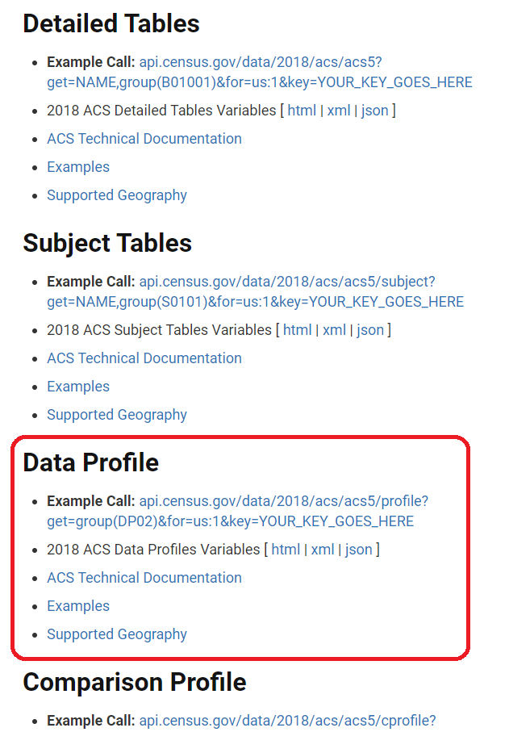

<br>

### Overview

Open data has been defined as [“data and content [that] can be freely used, modified, and shared by anyone for any purpose”](https://opendefinition.org) and the number of open data initiatives undertaken by local governments in the United States has [increased dramatically](http://us-cities.survey.okfn.org) over the past decade. 

In addition to serving as a key source of data for staff and those internal to local government, these public-facing repositories are also being leveraged by a variety of users from [civic hackers](https://nationaltoday.com/national-civic-day-hacking), to non-profit organizations, businesses, and individual residents. 

Open data portals typically use one of three dominant platforms&mdash;ArcGIS Open Data, CKAN, and Socrata. Of these, CKAN is open source and free, while ArcGIS Open Data is part of ESRI's suite of programs that many local governments already use for mapping and [Socrata](https://www.tylertech.com/products/socrata/open-data-citizen-engagement) is billed as a "data as a service" platform with a tiered pricing system. 

The majority of city open data portals in the U.S. use Socrata in part because it is "off the shelf" software. As a result, we can access data from a variety of these open data portals through the Socrata platform's application programming interface of API. An API is essentially a program running on a remote server that standardizes information and requests in a way that servers can understand and manage efficiently. A standard definition of an API is a set of protocols and tools that allow interaction between two different applications. 

Please watch the short video below, then proceed with the exercise.  
  


<br>
<center><iframe width="560" height="315" src="https://www.youtube.com/embed/s7wmiS2mSXY" frameborder="0" allow="accelerometer; autoplay; encrypted-media; gyroscope; picture-in-picture" allowfullscreen data-external="1"></iframe></center>
<br>

The [working directory](https://intro2r.com/work-d.html) is the default location where R stores files (output) and looks for files (input) and is typically only relevant when one is not operating within an [R Project](https://support.rstudio.com/hc/en-us/articles/200526207-Using-RStudio-Projects) environment. This is where your datasets, scripts, etc. are found and the working directory can be any folder. In order to check which folder has been designated as the working directory, enter `getwd()` in the Console or click the Files tab in the lower right RStudio panel followed by the More button. If we are working in an R Script, we can set the working directory programmatically use the `setwd` function, or we can use the RStudio Files tab as described in the preceding sentence. 

<br>

Note that for pathnames, you may use a forward slash `/` **or** you may use double back slashes `\\` otherwise, you will get an error message. This is because the the back slash is special character that is used in [string matching](https://r4ds.had.co.nz/strings.html) and so in order to distinguish is use as a special character versus its use as a regular old `\` we use two in order to "escape" its interpretation as a special character. More on regular expressions in a few weeks though...
<br>  

### State of Emergency in San Francisco

On December 17, 2021 the mayor of San Francisco [declared a State of Emergency](https://sfmayor.org/article/mayor-london-breed-declares-state-emergency-tenderloin) in the city's [Tenderloin district](https://www.google.com/maps/place/Tenderloin,+San+Francisco,+CA/@37.7836255,-122.4240208,15z/data=!3m1!4b1!4m5!3m4!1s0x8085809068ae37cb:0xb65a70d852b4620a!8m2!3d37.7846598!4d-122.4145058). This step was taken in response to longstanding issues with public drug use, overdose deaths, and crime in the neighborhood that had recently intensified. From a legal perspective, the declaration reduces bureaucratic hurdles that might slow the implementation of the mayor's *Tenderloin Emergency Intervention Plan*.

<br> 

<center> {width=300px}</center>

<br>

San Francisco is widely viewed as a tech hub and the city has been among the leaders in the U.S. in opening up its data resources. This lab exercise asks you to apply what we have learned to date to explore the underlying issues that led to the State of Emergency declaration. 

<br>

### Taking Inventory of the Repository  

In the code chunk below, we will install and load a few packages to help us access data from the City of San Francisco's open data portal. We will also specify which of the [CRAN Mirror sites](https://cran.r-project.org/mirrors.html) to download packages programmatically. In this example, I am pointing to the site hosted at Oak Ridge National Laboratory in Tennessee, but any of these sites will work (i.e., they are _**mirrors**_ with the same content). 

<br> 

Note that inside the curly brackets of the code chunk I have set the `message` and `warning` options to `FALSE` which means that this kind of output generated by executing this code chunk will be displayed in the **Console** rather than appearing in the output document (in our case, an HTML file). You can also set the [code chunk options](https://yihui.org/knitr/options) by clicking the gear icon in the upper right corner of the code chunk.  

<br>

```{r label="Set Package Repos and Load RSocrata Package", cache=FALSE, message=FALSE, warning=FALSE}

options(repos=c(CRAN="https://mirrors.nics.utk.edu/cran/")) 
install.packages("RSocrata")
install.packages("janitor")
library(RSocrata)
library(jsonlite)
library(tidyverse)
library(janitor)

```
<br> 

As was mentioned earlier, Socrata is a platform that is used by many local governments to publish open data. The Socrata Open Data API (SODA API) allows us to access these data resources from an R script or notebook in a standardized way. In the video you watched, the API was likened to a waiter or liaison who carries requests and responses back and forth between a client computer (i.e., you) and server computer (i.e., the open data portal). The documentation for the SODA API can be [found here](https://dev.socrata.com/docs/endpoints.html) and begins with API endpoints, which are essentially Uniform Resource Locators (URLs) that provide access to data. Without getting into too much detail at the moment, we use the [Hypertext Transfer Protocol](https://techterms.com/definition/http) (HTTP) to send requests and receive responses. Most often, we are using the [GET method](https://dev.socrata.com/docs/verbs.html) to send queries and retrieve data. For a quick refresher, take another look at this portion of [the  assigned reading](https://info201.github.io/apis.html) for this week.  

<br>

In some cases, an R package exists that allows us to interact with an API without having to construct queries that conform to the requirements of the API, and then pass them using a package like `httr` (this is what the ungraded exercise that we started in class last time asked you to do from your web browser). The RSocrata package that we installed and loaded above does this "dirty work" of formatting the underlying HTTP queries that allow us to interact with [open data portals that use the Socrata platform](https://www.opendatanetwork.com)... and there are a **LOT** of them out there. 

<br>

Let's take a closer look...
<br>

```{r label="Inspect RSocrata Documentation"}

help(package="RSocrata")

```

<br>

The "Inspect RSocrata Documentation" code chunk simply opens a page with seven functions that are included in this package. Take a look at this page (i.e., in the **Help** tab in the lower-right corner), then proceed to Exercise 1 below. 
<br>

### Exercise 1 
<br>

Review the documentation page that appears after running the code chunk above. 

1. Identify the function you would use to list datasets that exist on the City of San Francisco's [open data portal](https://data.sfgov.org)
   + Review the usage, arguments, and examples for that function 
2. Insert a new code chunk below this text (or at the very end of this .Rmd if you prefer)
   + Write and execute a line of code that retrieves a list of all datasets on the portal
   + **Hint:** You will need this URL `https://data.sfgov.org`
3. Save the information returned by the function in 1. to an object (e.g., sf_data) using the assignment operator `<-`
   + What kind of object is this? 
   + How many rows and columns are there? 
   + What are the names of those columns? 
   + **Hint:** Write a few sentences answering these questions in a Markdown section underneath your new code chunk
<br> 

There are more detailed instructions on what to submit and how at the end of this notebook, but you essentially you should add code chunks and text chunks (i.e., Markdown sections) to this R Notebook that you have saved locally that perform the tasks and that answer the questions posed above.
<br> 

### Exploring the Inventory
<br>

Next, return to the documentation page for the RSocrata package. The `read.socrata` function can be used to retrieve a dataset from the San Francisco open data portal. In addition to indexing objects like lists or data frames [by their positions using bracket notation](https://r4ds.had.co.nz/vectors.html#vector-subsetting), we can also refer to variable names, if they exist using the `$` operator. Let's sort the inventory and peruse the types of information available. The `table` function provides a count of instances within each category. 
<br>

```{r label="Get List of Datasets", message=FALSE, warning=FALSE, results="hide"}

sf_contents <- ls.socrata("https://data.sfgov.org/limitTo=datasets")
names(sf_contents)
head(sf_contents)

sort(sf_contents$title)
table(sf_contents$theme)

sf_contents %>% dplyr::select(title) %>% dplyr::arrange(title) 
janitor::tabyl(sf_contents$theme)

```
<br>

How many datasets are there on the San Francisco portal right now? How many are related to Public Safety? Recall that the default behavior is for the output of a code chunk to appear below it, and the tabular results of the four functions that are executed after the **sf_contents** data frame object is created can be viewed there too. The `names` function displays the column or attribute names while the `head` function displays the first six rows of the **sf_contents** data frame object. The `sort` function places the contents of the specified column or attributes in alphabetical order. The last two lines simply demonstrate how you might do the same thing while avoiding base R functions like `sort` and `table`. 

<br> 

Tables are nice, but there must be a better way to present this information. Let's create create a barchart of the portal's contents with the **ggplot2** package that we used in a practice exercise last week (we will begin formally working with **tidyverse** packages next week). Take a look at the arguments for the `geom_bar` function. The code chunk below also makes use of the `ggsave` function to export the barchart to a .png file.   

```{r label="Make Barchart with ggplot2"}

ggplot(data = sf_contents) + 
  geom_bar(stat = "count", aes(x = as_factor(theme)), fill = "dodgerblue") + 
  labs(x="", y = "Number of Datasets") + 
  theme(axis.text.x = element_text(size = 8, angle = 90))

ggsave("Datasets By Theme.png", units = "in", width = 16, height = 8)


```
<br> 

Now that we have a sense of what types of datasets are available, we can use what we have learned about subsetting to extract only those datasets related to Public Safety from the larger **sf_contents** data frame object that represents the holdings of the entire data portal. The line of code below creates a new data frame object where only the contents of the San Francisco data portals that are tagged as **Public Safety** are included. Insert a new code chunk or type it directly into the **Console** to try it yourself.

`pubsaf_contents <- sf_contents[sf_contents["theme"] == "Public Safety", ]`

`sort(pubsaf_contents$title)`

Again the `sort`` function just places things in alphabetical order. Do any of these datasets look like they might be relevant to the State of Emergency in the Tenderloin? 

The code chunk below demonstrates how you might pull down a specific dataset of interest included in the inventory using bracket subsetting and the **dplyr** package (your choice).  
<br> 

```{r label="Get Info for Incident Reports Dataset"}

police_calls_brackets <- sf_contents[sf_contents$title == "Police Department Incident Reports: 2018 to Present", ]

str(police_calls_brackets)
class(police_calls_brackets)


police_calls_tidyverse <- sf_contents %>% 
  filter(title == "Police Department Incident Reports: 2018 to Present")

str(police_calls_tidyverse)
class(police_calls_tidyverse)

```
<br>  

We can see that the data frame object from above is fairly complex and consists of lists, vectors, and data frames. Because I spent some time looking at the API documentation, [the dataset itself](https://data.sfgov.org/Public-Safety/Police-Department-Incident-Reports-2018-to-Present/wg3w-h783), and the results of the `str` function above, I know that the JSON endpoint is `https://data.sfgov.org/resource/wg3w-h783.json` and I can use the `fromJSON` function to pull this data into my R Notebook directly from the internet. 

```{r label="Get the Data in JSON and Store in Tibble", cache=TRUE}

police_calls_1 <- fromJSON("https://data.sfgov.org/resource/wg3w-h783.json")

police_calls_tb <- as_tibble(police_calls_1)

str(police_calls_tb)

```

<br>  
We now have 1,000 records (recall that this is the default limit for some APIs) in a tibble format. If we wanted to write our own API query we could use the `$limit` parameter to [retrieve more than the default](https://dev.socrata.com/docs/queries/limit.html) 1,000 records, but this is okay for our purposes.  Let's explore the number and timing of police calls to the Tenderloin neighborhood. 

<br> 

### Exercise 2 
<br>
Execute the code chunk above and make sure you understand the code, then proceed with the tasks below: 

1. Insert a new code chunk (or at the very end of this .Rmd if you prefer) then and write and execute code that creates a new object that _only_ contains police calls to the Tenderloin:
   + You will want to use the **analysis_neighborhood** attribute
2. Write and execute code to create and export to .png format a barchart that shows **at least** one of the following:
   + Year
   + Day of the week
3. Choose another neighborhood `tabyl(police_calls_tb$analysis_neighborhood)` and compare it with the Tenderloin in terms of police calls.
   + Generate a barchart for this comparison neighborhood
   + Interpret your findings in a Markdown section underneath your newly added code chunk
  
<br>

Take some time to reflect on this portion of the exercise, then proceed. 

<br> 

### The Census API

Rather than downloading data from the [official U.S. Census Bureau website](https://data.census.gov/cedsci/), we can also access data programmatically from R. The first step is to take a quick look at the [API documentation](https://www.census.gov/data/developers/guidance/api-user-guide.html), then request an API key by [visiting this site](https://api.census.gov/data/key_signup.html). You should receive a response in a few minutes, but be sure to safeguard your API key because it it tied to each individual user. 

In order to get a sense for how API queries work, open a web browser and type the following into the search bar, inserting your own personal Census API key where indicated:   

`https://api.census.gov/data/2021/acs/acs5?get=B01003_001E&for=zip%20code%20tabulation%20area:94114,94110&key=YOUR_KEY_GOES_HERE`


The resulting browser window should contain the results of the query above in JavaScript Object Notation (JSON) format. This is a compact way to store and transmit information over the internet that we will return to later in the semester. For now, we just need to know that the response there tells us: 

* That there 70,859 people living in [zip code tabulation area](https://www.census.gov/programs-surveys/geography/guidance/geo-areas/zctas.html) 94110 and 34,474 people in San Francisco's 94114 zip code tabulation area

So, we can send queries to the Census API for the [2021 ACS 5-Year Estimates](https://www.census.gov/data/developers/data-sets/acs-5year.html) directly from a web browser, but it is more efficient to do this from R. But first of all, what are the different components of the query we just executed? 

* The `https://api.census.gov/data/2021/acs/acs5?` component is the base URL. It tells the Census servers that it we are interested in 5-Year ACS data that ends in 2021 (i.e., ACS 2016-2021)
* The `get=B01003_001E` is the variable name (Total population). For a full list, [see here](https://api.census.gov/data/2021/acs/acs5/variables.html).
* The `for=zip%20code%20tabulation%20area:94114,94110` bit says retrieve values for the census geography ZCTA for the Castro/Noe Valley (94114) and Inner Mission/Bernal Heights (94110) areas of San Francisco. Note that these areas are generally southwest of the Tenderloin.  The `%20` is a hexademical representation of the space character. There are quite a few special characters that need to be [properly encoded](https://www.w3schools.com/tags/ref_urlencode.asp), if they are being passed to the server.
* The `key=YOUR_KEY_GOES_HERE` component is the unique identifier for the client (i.e., your browser/script) that is making the request
* Finally, note that the all the arguments are concatenated using `&`.

This structure is unique to [Census APIs](https://www.census.gov/content/dam/Census/library/publications/2020/acs/acs_api_handbook_2020_ch02.pdf) and endpoints. If you want to interact with other APIs, you will first have to refer to their documentation and understand how to properly format a query. It is also possible that APIs change over time causing your code to stop working. Luckily, it is usually not onerous to make the necessary tweaks, once you understand how the API has changed. 
<br>

### Exercise 3 
<br>
Still using a web browser, practice what we have learned here by constructing the proper API query in the search bar to: 

1. Retrieve the total population of the same two San Francisco ZCTAs based on the [2014-2018 ACS 5-Year Estimates](https://www.census.gov/data/developers/data-sets/acs-5year.2018.html)
2. Retrieve the unemployment rate for residents of the same two San Francisco ZCTAs based on the [2014-2018 ACS 5-Year Estimates](https://www.census.gov/data/developers/data-sets/acs-5year.2018.html)
   + *Hint*: Take a look at variable `"DP03_0005PE"` which is located in a **different API** with a slightly **different base URL** [here](https://api.census.gov/data/2018/acs/acs5/profile/variables.html)
3. Now change geographies and retrieve the unemployment rate for the city as a whole
   + *Hint*: Try `&for=place:67000&in=state:06`

<br> 

<center> {height=65%} </center>

<br> 

Take some time to experiment with one or more of the other variables, then proceed with the exercise. 
<br> 

Using the examples provided by the [Census](https://api.census.gov/data/2018/acs/acs5/examples.html), we can write some code that retrieves a variety of variables for the **City of San Francisco** as opposed to specific **zip code tabulation areas**.

```{r label="Download Data from Census API", messages=FALSE, cache=TRUE}

# install.packages("httr")
library(httr)
library(jsonlite)

baseurl <- "https://api.census.gov/data/2018/acs/acs5?"
param1 <- "get="
param2 <- "&for=place:"
param3 <- "&in=state:06"
key <- "&key=f9f31e09fed0f44d23a8a354469e461df98f34cb"

# These are the place FIPS codes for San Francisco, Oakland, and Berkeley
places_list <- paste("67000", "53000", "06000", sep = ",")
vars_list <- c("B00001_001E", "B19013_001E")
vars_names <- c("Total population", "Median household income")

# Use a simple for loop to download two data elements rather than one
for (i in 1:length(vars_list)) {
  
req <- httr::GET(paste0(baseurl, param1, vars_list[i],
                        param2, places_list, param3, key))
req_json <- fromJSON(content(req, "text"), flatten=TRUE)
req_tibble <- as_tibble(req_json[2: dim(req_json)[1], ])
colnames(req_tibble) <- req_json[1,]

name <- paste0("these_results_", i)
assign(name, req_tibble)

}

# Combine the resulting data frame objects
merged_tibble <- inner_join(these_results_1, these_results_2, by = c("place", "state"))   
merged_tibble

```

<br>

The code chunk above uses the `httr` package to manually construct HTTP queries to retrieve desired pieces of information from the Census API. The `httr::GET` function is analogous to your web browser in that it sends the fully formatted request to the API. The `paste0` function concatenates strings (e.g., baseurl, param1, etc.) and the `httr::GET` function "sends it over". The `jsonlite::fromJSON` function helps us to take the very messy HTTP response and easily convert it to an R object (e.g., data frame, tibble, etc.) that we can work with. The `assign` function is part of base R and allows us to assign names to objects created inside a loop based on the counter `i` which increments each time we make our way through the code. Finally, the `inner_join` function from **dplyr** allows us to combine or join the tibble objects created by the loop into a single tibble object where we use the *place* and the *state* attributes as unique identifiers to do the joining.

<br>

### Work Products

Please submit an R notebook and knitted HTML file that shows your work and responses for each of the **Exercises** included in this lab exercise (the code chunk directly above is an example and not a formal exercise). Also, briefly comment on your experience with R during this lab exercise. Please **upload your report to Collab** by **5:00 pm on Thursday February 9th**.  

<br>

### Assessment Rubric  

This Lab Exercise will be graded on a 100-point scale according to the rubric below:  

**Length and formatting (10 pts)**  

* Are the Lab Exercise responses provided in an acceptable format (e.g., R Notebook, rendered HTML file, etc.)?
* Is there enough explanatory text to evaluate the work? 

**Clarity of writing and attention to detail (20 pts)**  

* Is the text component clearly written? Please do not rely too heavily on bulleted lists. 
* Are there more than one or two grammatical or typographical errors? Please perform a spelling/grammar check prior to submission.  

**Technical Content  (45 pts)** 

* Are the requested graphics, tables, etc. included and intelligible?
* Does the submission explicitly and thoroughly respond to any questions posed?   
* Please explain why you reached the conclusions you did when responding to the questions posed.

**Reflective Content  (25 pts)** 

* Does the response reflect on the procedures used (i.e., what am I clicking and why?)?
* Is there evidence that the student understands how the substance of the Lab Exercise relates to concepts from the lectures/readings and/or how the substance of the Lab Exercise might be applied in the work planners (or you personally) do? 

<br>
<center> <font size="2"> © Bev Wilson 2023 | Department of Urban + Environmental Planning | University of Virginia </font> </center>
<br>


