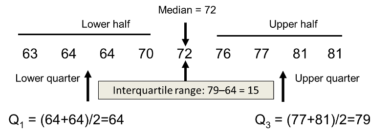

<br>

### Overview

<br>

This week's Lab Exercise is designed to help you apply some of the tools available within the [tidyverse](https://www.tidyverse.org) for data wrangling. This particular exercise focuses on the  [dplyr](https://dplyr.tidyverse.org/index.html) package and the [ggplot2](https://ggplot2.tidyverse.org) package. It also begins to engage with data visualization best practices by demonstrating how to create and interpret a variety of graphics with the *ggplot2* package. Exploratory data analysis (EDA) is a phase of a larger data science workflow&mdash;or perhaps a philosophy&mdash;that emphasizes getting to know the data before rushing to analyze it using this more rigid approaches like hypothesis tests. EDA relies heavily on the creation and interpretation of graphics in order to build familiarity and gain fundamental insights that can inform more sophisticated analyses later on. Data visualization is arguably the most important tool for exploratory data analysis because the information conveyed by graphical display can be very quickly absorbed and because it is generally easy to recognize patterns in a graphical display. There are several overarching goals of exploratory data analysis, including:

1. To determine if there are any problems with your dataset.

2. To determine whether the question you are asking can be answered by the data that you have.

3. To begin formulating an answer to your question.   

<br> 

---

Descriptive statistics are also central to exploratory data analysis and are typically classified as: 

+ Measures of frequency
+ Measures of central tendency
+ Measures of dispersion
+ Cross-tabulations

A frequency distribution tells us how often a particular value occurs within a single variable or column of interest. Visual representations like histograms (`geom_histogram`), boxplots (`geom_boxplot`), and density plots (`geom_density`) are well-suited for exploring this aspect of your data. 

Central tendency measures provide insight into which values are **typical** (`mean`, `median`) and are usually coupled with measures of dispersion like the standard deviation (`sd`) or interquartile range (`IQR`). The standard deviation is [derived from the variance](https://www.wikihow.com/Calculate-Variance) of the data of interest and us how much or how little the values deviate from the mean value. Stated differently, a low standard deviation means that the values tend to be very close to the mean, while a high standard deviation indicates that the values are more spread out relative to the mean. The **mean** is more susceptible to the influence of outlier values than the **median** and for this reason, some analysts prefer to report the latter. 

Percentiles are also used to communicate the amount of dispersion or spread in the data. The **pth** percentile is simply the number or value where **p%** of the data are **less than** this number. The 25th, 50th, and 75th percentiles are often referred to as the 1st, 2nd, and 3rd **quartiles**. You will sometimes see these denoted as Q1, Q2, and Q3. Finally, the median is the 50th percentile which is also the 2nd quartile and Q2. 

The interquartile range is the difference between the first and third quartiles and represents the **middle 50 percent** of the values. It is calculated slightly differently if the sample size is an even (top image) versus an odd (bottom image) number (see below):    

<center> {width=450px}</center>   <br><br>
<center> {width=450px}
<br>
<font size="1">    Source: Sullivan & LaMorte (2016)</font></center>  

<br> 

Quantiles are a more generalized version of percentiles in that **q-quantiles** are a set of break points that divide the data into **q** groups of approximately equal size. 

A cross-tabulation allows us to summarize the relationship between two **categorical variables** while a correlation is used to summarize the relationship between two **continuous variables**. As explained in [further detail here](https://stats.oarc.ucla.edu/other/mult-pkg/whatstat/what-is-the-difference-between-categorical-ordinal-and-interval-variables), a categorical variable has no inherent order and instead record some characteristic for each of the observations in the dataset. Continuous variables are numeric variables that have an infinite number of values between any two values. A logical vector is a type of categorical variable where the possible values are `TRUE` and `FALSE`. An integer vector can be categorical if&mdash;for example&mdash;the numbers represent some condition or characteristic (e.g., a binary indicator). We can also have a categorical variable where the set of possible values are character strings (e.g., a list of U.S. state names). The distinction is important, because the type of variables we are working with determines the kind of analyses we can perform. 


```{r label="Set Package Repository and Load R Packages", message=FALSE, warning=FALSE, include=FALSE}

options(repos=c(CRAN="https://mirrors.nics.utk.edu/cran/")) 

install.packages("DataExplorer")
install.packages("GGally")
install.packages("corrr")

library(tidyverse)
library(jsonlite)
library(janitor)
library(ggpubr)
library(DataExplorer)
library(fmsb)
library(scales)
library(corrr)
library(emo)
library(GGally)

```

### Exploring Variation **Within** Variables   

When done well, exploratory data analysis is guided by the <span style="color: green;">**question(s)**</span> you are trying to answer. The central question we are exploring in this Lab Exercise is: "What factors or characteristics are most closely associated with the presence of contaminants in drinking water that comes from wells?" The data represent water sample test results from homes in Central Virginia that use wells as their primary drinking water source and you will explore these data to first determine if there are problems with the dataset then to decide if you can answer your <span style="color: green;">**question(s)**</span> with this dataset. The attributes (columns) are briefly described below:

+ SampleID: unique identifier
+ County: county or independent city of residence
+ Well_Depth: depth of well in feet
+ Year_Constructed: year that well was built, if known
+ Pipe_Copper: residence has pipes made of copper
+ Pipe_Lead: residence has pipes made of lead
+ Pipe_Steel: residence has pipes made of steel
+ Pipe_Plastic: residence has pipes made of plastic
+ Pipe_Unknown: residence has pipes made of unknown material
+ Flush-[Hardness](https://www.usgs.gov/special-topics/water-science-school/science/hardness-water#:~:text=Measures%20of%20water%20hardness&text=General%20guidelines%20for%20classification%20of,Some%20content%20may%20have%20restrictions.): water hardness after five minutes of flushing (mg/L) 
+ Flush-Pb: lead concentration after five minutes of flushing (mg/L)
+ Manual - [pH](https://www.usgs.gov/media/images/ph-scale-0): measure of the acidity or basicity 
+ Flush-Cu: copper concentration after five minutes of flushing (mg/L)
+ Flush-Fe: iron concentration after five minutes of flushing (mg/L)
+ Flush-Ni: nickel concentration after five minutes of flushing (mg/L)
+ Sandstone_Aquifer: residence is located over a sandstone aquifer

<br> 

The code chunk below creates a boxplot using example code from the last class session. A boxplot is a very commonly used EDA tool that allows us to quickly visualize the distribution of a single variable or column of data if we are working with a data frame or tibble object. Note that we are using what should now be familiar conventions to construct the graphic beginning with the `ggplot` function, then adding more features with the `+` operator and other functions [listed in the package reference](https://ggplot2.tidyverse.org/reference/index.html). Recall that the layers are called **geoms** and once the base setup is done layers can be added or even appended one on top of the other. The `theme` function is used here to adjust the size of the labels while the `labs` function sets the labels. Because the legend is showing the **fill** component of the plot, we use the **fill** argument in the `labs` function to set the name of the legend itself.

<br>
Note that the backtick is used because some of the column (attribute) names in our dataset have special characters (e.g., `-`) in them and if we **do not enclose it in backticks** we will get an error message. Further, the U.S. Environmental Protection Agency has [set the safety threshold](https://www.epa.gov/dwreginfo/lead-and-copper-rule) for lead in drinking water at 15 ppb (i.e., 0.015 mg/L). Primary risk factors for lead contamination in drinking water are lead pipes in the housing unit combined with acidic water (low pH) and/or soft water (low hardness). The code below adds a horizontal line to indicate where this threshold falls on the plot. As an aside, the linetype argument can be specified as a number or as a name&mdash;to view the latter use `ggpubr::show_line_types()`

<br> 

<center> {width=500px} 
<br>
<font size="1">    Source: Chang, W. (2021). [R Graphics Cookbook](http://www.cookbook-r.com/Graphs/Shapes_and_line_types).</font> </center>

<br>


```{r fig.height=10, fig.width=16, label = "Lead Concentration Boxplot", message=FALSE}

water_testing <- read_csv("./data/water_quality_testing.csv")

# How many rows and columns are there? 
dim(water_testing)
print(str_c("There are", nrow(water_testing), "rows and", ncol(water_testing), "columns in our dataset.", sep = " "))

# Are there any missing data values? 
str(water_testing, give.attr = FALSE)
water_testing %>%
  summarise(count = sum(is.na(Well_Depth)))

# Let's take a quick look at a sample of the data...
glimpse(water_testing)
slice_head(water_testing, n = 8)
slice_tail(water_testing, n = 4)

# How many observations per county? 
water_testing %>% 
  tabyl(County)
  
# Summarize housing unit age by county 
water_testing %>% 
  group_by(County) %>%
  summarize(Median_Age = (2023 - median(Year_Constructed)))


# Now build a boxplot...
ggplot(data = water_testing) +
  geom_boxplot(aes(x = County, y = `Flush-Pb`, fill = County), outlier.size = 5) + scale_fill_brewer(palette="Spectral") +
  theme(text = element_text(size = 16)) + 
  labs(title = "", x = "County", y = "Lead (mg/L)", fill = "Lead Concentration")

# Now polish that boxplot...
ggplot(data = water_testing) +
  geom_boxplot(aes(x = County, y = `Flush-Pb`, fill = County), outlier.size = 2) + 
  scale_fill_brewer(palette="Spectral") +
  theme(text = element_text(size = 16),
        axis.text.x = element_text(size = 16),
        axis.text.y = element_text(size = 16)) + 
  labs(title = "", x = "County", y = "Lead (mg/L)", fill = "Lead Concentration",
       caption="Dashed line is EPA action threshold.") +
  geom_hline(yintercept = 0.015, color = "purple", linetype = 2)


```

<br>

But what insights can we take away from this graphic? By comparing the 50th percentile (the horizontal line inside each box) we can see that the majority of water samples tested had a lead concentration fairly close to zero, which is good from a health perspective. The relative size of the boxes themselves give us an indication how closely around the median lead concentration level the values in the dataset are concentrated&mdash;the degree of dispersion or spread. The vertical lines are called whiskers and extend upward and downward to the lowest values that are not candidates for **outlier** status. An outlier is an unusual value that could potentially influence the results of an analysis. These are indicated with dots in the boxplot. Sometimes outliers are the result of data collection or data entry errors, but they can also be legitimate values. Like **missing data** outliers require the exercise of judgment on the part of the analyst and may be removed or excluded from the analysis or imputed. There are a variety of criteria that have been offered for when to remove or how to impute outlying data values, but we will return to this question in a few weeks when we introduce linear methods.   

<br>  

We can create **cross-tabulations** or **contingency tables** as a complement to visual EDA tools like boxplots, histograms, and density plots. An easy way to do this is to use existing functions in the *dplyr* package. A brief demonstration is given in the code chunk below. 

```{r label = "Cross-Tabulation-dplyr", message=FALSE}

water_testing %>%
count(County, Pipe_Lead)


water_testing %>% 
  group_by(County, Pipe_Lead) %>% 
  tally()


```

<br> 

We can also make use of the `tabyl` function in the *janitor* package to do this. There are several R packages out there that are designed to produce more polished tabular output and descriptive statistics. Another option is the *vtable* package which is easy to use and explained in greater [detail here](https://nickch-k.github.io/vtable).

<br>

```{r label = "Cross-Tabulation-janitor", message=FALSE}

water_testing %>%
  tabyl(County, Pipe_Lead) %>%
  adorn_totals("row")


water_testing %>%
  tabyl(County, Pipe_Lead) %>%
  adorn_totals("col")

```

<br> 


### Exercise 1  
<br>

Insert a new code chunk and R Markdown section below this one to "catch" your responses. Take a few moments to "kick the tires" of the tibble object, then proceed with the questions below. 

1. Which of the variables (columns) are continuous and which are categorical (e.g., factor)?  
   + **Hint:** Recall that a variable is categorical if it can only take one of a small set of values and continuous if it can take any of an infinite set of ordered values. 
   + Which function or approach did you use to answer this question?
2. Are there variables (columns) with missing data values?
   + Which function or approach did you use to answer this question?
3. Create a graphic that contrasts the distribution of lead with the distribution of copper in the water quality sample dataset. 
   + **Hint:** you may want to refer to the [R Graph Gallery](https://www.r-graph-gallery.com) or the Required Practice from last session
   + **Hint:** you may want to take a look at the `ggarrange` arrange function from the *ggpubr* package because it allows you to created side-by-side or multi-paneled graphics
   + Interpret the graphic(s) you have created and include this text explanation in your submission (i.e., in an RMarkdown section)
4. Create a cross-tabulation that shows the distribution of samples based on: (a) the presence of copper pipes and (b) location over a sandstone aquifer. Both of these variables are considered risk factors for copper contamination 
   + Include and interpret a screen capture of this tabular output with your submission.


<br> 

---

### Exploring Variation **Between** Variables  

We are often interested in bivariate relationships or how two variables relate to one another. However, the approach that we take is determined by the types of variables involved. For example, the [Pearson correlation](https://www.statstutor.ac.uk/resources/uploaded/pearsons.pdf) coefficient measures the strength of a linear association between two continuous variables and ranges from +1 (total positive linear correlation) to −1 (is total negative linear correlation) with values close to 0 indicating a lack of association between the variables considered. 

Scatterplots are often used to visualize the association between two continuous variables. They can reveal much about the [nature of the relationship](https://www.jmp.com/en_hk/statistics-knowledge-portal/exploratory-data-analysis/scatter-plot.html) between two variables. Let's begin by creating a scatterplot of copper contamination and water acidity. The column **Manual - pH** in the dataset gives us information on how basic (values above 7) or acidic (values below 7) the water is in homes where these samples were taken. Key risk factors for copper contamination in drinking water include copper pipes in the housing unit combined with acidic water (i.e., low pH). 

```{r fig.height=10, fig.width=16, message=FALSE, label="Scatterplot-Copper"}


ggplot(water_testing, aes(x = `Manual - pH`, y = `Flush-Cu`)) + 
  geom_point(size = 3, color="red", shape = 21) +
  theme_minimal() +
  labs(title = "", x = "pH", y = "Copper (mg/L)", fill = "") +
  theme_classic()


```

<br> 

What can we say about the hypothesized relationship between copper levels and the acidity of the water itself? As we move from left to right along the y-axis (i.e., as acidity decreases), the amount of copper measured in these samples also appears to decrease. Let's add a linear regression line to the plot to better visualize this trend. 

<br> 

There are two main reasons why we want to engage in visual EDA. By generating a plot of the data we can *check for deviations from what we expected* and we can *formulate new expectations* as well. 

<br>

```{r fig.height=10, fig.width=16, message=FALSE, label="Scatterplot-Copper-Regline"}

lin_reg_line <- lm(data = water_testing, `Flush-Cu` ~ `Manual - pH`)
r_squared <- summary(lin_reg_line)$r.squared

ggplot(water_testing, aes(x = `Manual - pH`, y = `Flush-Cu`)) + 
  geom_point(size = 3, color="red", shape = 21) +
  geom_smooth(method = lm, se = FALSE, color = "purple", linetype = "dotted", size = 1.5) +
  theme_minimal() +
  labs(title = "", x = "pH", y = "Copper (mg/L)", fill = "") + 
  geom_text(x = 8, y = 9, label = paste("The R-squared value \n for this line is: ",  round(r_squared, 2)))


# What about the trend for individual counties?
for_wrapping <- ggplot(data = water_testing, aes(x = `Manual - pH`, y = `Flush-Cu`, color = County)) + 
  geom_point(size = 5, shape = 21) +
  geom_smooth(inherit.aes = TRUE, method = lm, 
              formula = str(lin_reg_line$call), 
              se = FALSE, aes(color = County), linetype = "dashed", size = 1.5) +
  theme_minimal() +
  labs(title = "", x = "pH", y = "Copper (mg/L)", fill = "") 

for_wrapping + facet_wrap( ~ County)


```

<br> 

As a complement to the scatterplot, we can use the base R `cor` function to calculate the (Pearson by default, see the documentation for other options) correlation between copper and water acidity, as well as the correlation between all continuous variables in the dataset. The *DataExplorer* package is [an example](https://cran.r-project.org/web/packages/DataExplorer/vignettes/dataexplorer-intro.html) of "niche" R packages (the *corrr* package is another) designed to help us quickly understand patterns in our data (i.e., to perform exploratory data analysis). If you are unfamiliar with reading a correlation matrix, the values range between -1 and 1 where:

+ -1 indicates a perfectly negative linear correlation between two variables
+ 0 indicates no linear correlation between two variables
+ 1 indicates a perfectly positive linear correlation between two variables

As a result, the farther away the correlation coefficient is from zero, the stronger the relationship between the two variables. Similarly, a histogram helps us to visualize patterns by dividing the data set into groups (or bins) of equal length, then communicating how many or what proportion of the observations fall within each of those "bins". Often, the correlation between continuous numeric variables will be color-coded as well, which is what we see in the two latter plots in the code chunk below. 

<br>

```{r fig.height=10, fig.width=16, label="Correlation-Matrix"}


stats::cor(water_testing[ , c(3,4, 10:15)], use = "complete.obs")

DataExplorer::plot_histogram(water_testing[ , c(3,4, 10:15)])

DataExplorer::plot_correlation(na.omit(water_testing[ , c(3,4, 10:15)]))


wq_cor <- water_testing %>%
  select(c(4, 10:15)) %>%
  mutate(Well_Age = 2023 - Year_Constructed) %>%
  select(-Year_Constructed) %>%
  corrr::correlate()

corrr::rplot(wq_cor, .order = "alphabet")


# You can also use the GGally package if you like it more...
p_ <- GGally::print_if_interactive

water_testing %>%
     select(County, Year_Constructed) %>%
     GGally::ggpairs(aes(color = County), columnLabels = c("County", "Year Constructed"))


```
<br> 

But what can we do if we are interested in statistical associations between categorical variables? The typical approach is to use a chi-squared test (see the `chisq.test` function in the base R *stats* package) in conjunction with visual tools like barcharts. A chi-squared test tells us **whether there is a statistically significant relationship** but we need to calculate phi or Cramer's V  to quantify the **strength of that relationship** which can be done using the *sjstats* [package](https://cran.r-project.org/web/packages/sjstats/index.html) (just FYI...). 

<br>

----

Scatterplots created with the **ggplot2** package can be quite useful for EDA because we can introduce additional variables and represent them using other elements of the plot. The geologic characteristics of sandstone aquifers increase the potential for corrosion of pipes delivering water&mdash;and by extension&mdash;the threat of elevated copper levels. Let's bring this variable into the existing scatterplot as well as the presence of copper pipes. Note how we combine what would otherwise be two separate legends into a single, unified legend.

```{r message=FALSE, label="Scatterplot-Copper-Sandstone"}

ggplot(water_testing, aes(x = `Manual - pH`, y = `Flush-Cu`, shape = as_factor(Pipe_Copper), color = as.logical(Sandstone_Aquifer))) + 
  geom_point(size = 4) +
  theme_minimal() +
  scale_color_manual(values = c("dodgerblue", "red")) +
  labs(shape = "Copper Pipes", color = "Sandstone Aquifer",
       title = "", x = "pH", y = "Copper (mg/L)")


water_testing %>%
  mutate(aquifer_copper_pipe = case_when(
    Sandstone_Aquifer == 0 & Pipe_Copper == 0 ~ "No Risk Factors", 
    Sandstone_Aquifer == 1 & Pipe_Copper == 0 ~ "Aquifer Risk Factor", 
    Sandstone_Aquifer == 0 & Pipe_Copper == 1 ~ "Pipes Risk Factor", 
    Sandstone_Aquifer == 1 & Pipe_Copper == 1 ~ "Both Risk Factors")
    ) %>%
ggplot(aes(x = `Manual - pH`, y = `Flush-Cu`, shape = aquifer_copper_pipe, fill = aquifer_copper_pipe)) + 
  geom_point(size = 4, inherit.aes = TRUE, alpha = 0.5) +
  scale_shape_manual(name = "Risk Factors", values = c(21, 24, 22, 25), 
                     labels = c("No Risk Factors", "Aquifer Risk Factor", "Pipes Risk Factor", "Both Risk Factors")) +
  scale_fill_manual(name = "Risk Factors", values = c("dodgerblue", "green4", "firebrick", "orange"),
                     labels = c("No Risk Factors", "Aquifer Risk Factor", "Pipes Risk Factor", "Both Risk Factors")) +
  theme_minimal() +
  labs(title = "", x = "pH", y = "Copper (mg/L)") 


# Filter out extreme observations so we can see the data better...
water_testing %>%
  filter(`Flush-Cu` < 3) %>%
  mutate(aquifer_copper_pipe = case_when(
    Sandstone_Aquifer == 0 & Pipe_Copper == 0 ~ "No Risk Factors", 
    Sandstone_Aquifer == 1 & Pipe_Copper == 0 ~ "Aquifer Risk Factor", 
    Sandstone_Aquifer == 0 & Pipe_Copper == 1 ~ "Pipes Risk Factor", 
    Sandstone_Aquifer == 1 & Pipe_Copper == 1 ~ "Both Risk Factors")
    ) %>%
ggplot(aes(x = `Manual - pH`, y = `Flush-Cu`, shape = aquifer_copper_pipe, fill = aquifer_copper_pipe)) + 
  geom_point(size = 4, inherit.aes = TRUE, alpha = 0.5) +
  scale_shape_manual(name = "Risk Factors", values = c(21, 24, 22, 25), 
                     labels = c("No Risk Factors", "Aquifer Risk Factor", "Pipes Risk Factor", "Both Risk Factors")) +
  scale_fill_manual(name = "Risk Factors", values = c("dodgerblue", "green4", "firebrick", "orange"),
                     labels = c("No Risk Factors", "Aquifer Risk Factor", "Pipes Risk Factor", "Both Risk Factors")) +
  geom_hline(yintercept = 1.2, color = "purple", linetype = 2) +
  theme_minimal() +
  labs(title = "", x = "pH", y = "Copper (mg/L)", caption = "Regulatory limit indicated with purple dotted line.") 


```

According to the U.S. Environmental Protection Agency, copper levels above 1.3 mg/L can be harmful. Let's create a new categorical variable that reflects whether each sample exceeds this guideline or not, then add this information to the scatterplot to further refine our EDA. Below, we use color (i.e., fill) to add the presence or absence of the sandstone aquifer into the scatterplot as **another piece of information** to help reformulate our hypotheses, similar to how copper pipes were integrated above.  


```{r fig.height=10, fig.width=16, message=FALSE, label="Scatterplot-Copper-EPA"}

water_testing <- water_testing %>%
  mutate(Copper_Exceed = if_else((`Flush-Cu` > 1.3), 1, 0))


ggplot(water_testing, aes(x = `Manual - pH`, y = `Flush-Cu`, color = as_factor(Sandstone_Aquifer))) + 
  geom_point(size = 4, shape = 21) +
  theme_minimal() +
  scale_color_manual(values = c("dodgerblue", "red"), labels = c("Absent", "Present")) +
  labs(color  = "Sandstone Aquifer",
       title = "", x = "pH", y = "Copper (mg/L)")


water_testing %>%
    mutate(aquifer_copper_exceed = case_when(
    Sandstone_Aquifer == 0 & Copper_Exceed == 0 ~ "No Sandstone Or Contamination", 
    Sandstone_Aquifer == 1 & Copper_Exceed == 0 ~ "Sandstone Without Contamination", 
    Sandstone_Aquifer == 0 & Copper_Exceed == 1 ~ "Contamination Without Sandstone", 
    Sandstone_Aquifer == 1 & Copper_Exceed == 1 ~ "Co-occurrence")
    ) %>%
ggplot(aes(x = `Manual - pH`, y = `Flush-Cu`, fill = aquifer_copper_exceed, shape = aquifer_copper_exceed)) +   
  geom_point(size = 4, alpha = 0.7) +
  theme_minimal() +
  scale_shape_manual(name = "Association", values = c(21, 24, 22, 25), 
                     labels = c("No Sandstone Or Contamination", "Sandstone Without Contamination", "Contamination Without Sandstone", "Co-occurrence")) +
  scale_fill_manual(name = "Association", values = c("yellow", "violet", "cyan", "salmon"),
                     labels = c("No Sandstone Or Contamination", "Sandstone Without Contamination", "Contamination Without Sandstone", "Co-occurrence")) +
  labs(title = "", x = "pH", y = "Copper (mg/L)")


```

<br> 


### Exercise 2 
<br>

Take a few minutes to review the scatterplot that was just created above, then proceed with the questions below. 

1. What can we say about the relationship between copper levels and water acidity now, given the introduction of these additional variables (e.g., sandstone aquifer)? 
   + Does leveraging the the color and shape elements of the plot spark new insights into copper contamination in the groundwater samples we are analyzing? 
   + What about showing where the samples that exceed the EPA limit are in the overall distribution? 
   + Are there other pieces of information that you wish you had?
2. The depth of a well is also expected to affect the level of contaminants detected in tap samples. Generally speaking, a deeper well is more robust to changes in water quality. However, our dataset has several missing values for the **Well_Depth** variable. 
   + Remove the observations (records) that have missing values for this variable
   + **Hint:** one option would be the `drop_na` function from the **tidyr** package
   + Using this constrained sample (N = 35), create one or more graphics that bring the depth of the well into the analysis.
   + **Hint:** which parameter controls the transparency level of points in a scatterplot?
3. Which variables (see code chunk "Correlation-Matrix" above) are mostly highly correlated with copper and lead levels? 
   + Does your answer change if you look at the constrained sample with well depth information (N = 35) rather than the full dataset (N = 109)? 
   
<br>

Take some time to reflect on this portion of the exercise, then proceed. 
<br> 

----

The lollipop chart is essentially a gimmicky barchart, but the code chunk below demonstrates how you might create one. Similarly, a [radar chart](https://www.r-graph-gallery.com/spider-or-radar-chart.html) is not something that can be easily generated with *ggplot2* but "niche" packages like *fmsb* [are up to](https://www.datanovia.com/en/blog/beautiful-radar-chart-in-r-using-fmsb-and-ggplot-packages) the task, provided we generate the necessary input data in the (rather rigid) required format. 

<br> 

Note that the [radar chart](https://www.datanovia.com/en/blog/beautiful-radar-chart-in-r-using-fmsb-and-ggplot-packages) (see the help page for `fmsb::radarchart`) <span style="color: purple;">**requires a data frame object**</span> as input, the observations must be organized as individual rows and the variables as columns. Also, **the first and second rows** must contain the maximum and minimum values for the data we want to display. 

<br> 

```{r label="Lollipop and Radar Chart", message=FALSE, warning=FALSE}

# Prepare data for lollipop chart...
mean_copper <- water_testing %>%
  group_by(County) %>%
  summarize(avg_cu = mean(`Flush-Cu`))


ggplot(data = mean_copper, aes(x = County, y = avg_cu)) +
  geom_segment( aes(x = County, xend = County, y = 0, yend = avg_cu)) +
  geom_point( size = 5, color = "red", fill = alpha("orange", 0.3), alpha = 0.7, shape = 21, stroke = 2) +
  labs(x = "",  y = "Mean Copper (mg/L)") + 
  theme_minimal()
  


# Prepare data for radar chart...
mean_pollutants <- water_testing %>%
  group_by(County) %>%
  summarize(avg_cu = mean(`Flush-Cu`),
            avg_pb = mean(`Flush-Pb`),
            avg_ni = mean(`Flush-Ni`), 
            avg_fe = mean(`Flush-Fe`))

# Assign county identifiers to rownames of the data frame and drop the County attribute
mean_pollutants_df <- as.data.frame(mean_pollutants)
rownames(mean_pollutants_df) <- mean_pollutants_df$County

mean_pollutants_df <- mean_pollutants_df %>%
  select(-County)


# Insert the maximum and minimum values into the first and second rows
mean_pollutants_df <- rbind(rep(x = max(mean_pollutants_df), times = dim(mean_pollutants_df)[2]), 
                            rep(x = 0, times = dim(mean_pollutants_df)[2]), 
                            mean_pollutants_df)
mean_pollutants_df

# If we want to have some transparency in the filled areas, we have to use a function 
# that specifies color and alpha at once... sigh...
colors_with_alpha <- c(rgb(1, 0, 0, 0.25),
                       rgb(0, 1, 0, 0.25),
                       rgb(0, 0, 1, 0.25),
                       rgb(0.5, 0, 1, 0.25))

# After jumping through all these hoops, we can plot the thing...
fmsb::radarchart(mean_pollutants_df,
            cglty = 1,                                                            # Grid line type
            cglcol = "gray",                                                      # Grid line color
            cglwd = 1,                                                            # Line width of the grid
            pcol = c("red", "green", "blue", "purple"),                           # Color of the lines
            plwd = 2,                                                             # Width of the line
            plty = 1,                                                             # Linetype of the line
            vlabels = c("Mean Copper","Mean Lead", "Mean Nickel", "Mean Iron"),   # Variable labels
            pfcol = colors_with_alpha)                                            # Shading for the areas


```

<br>

Radar charts come will many of the same caveats as pie charts and these are explained in [greater detail here](https://www.data-to-viz.com/caveat/spider.html). Again, the [R Graph Gallery](https://www.r-graph-gallery.com/index.html) is a great resource for building familiarity with *ggplot2* because it provides quick access to code that can be modified and adapted to your purposes.  


### Exercise 3 
<br>

Refer to the Required Practice from last session to refresh your memory on how to format the elements of graphics in *ggplot2*, then proceed with the final portion of this Lab Exercise:

1. Add a **Well_Age** variable to the **water_testing** object
   + **Hint:** We did this in the "Correlation-Matrix" chunk
   + Create a scatterplot the shows how <span style="color: purple;">iron concentrations</span> in the water samples varies with well age 
   + Use the tricks from this exercise (e.g., using the size or shape aesthetics) to highlight and discuss (in a Markdown section) what you see in this plot
2. Try your hand at creating a [lollipop](https://www.r-graph-gallery.com/lollipop-plot.html), [bubble](https://www.r-graph-gallery.com/bubble-chart.html), or some other type of graphic that strikes your fancy
   + Format this graphic by modifying the defaults (e.g., axis labels) and adding a title to make it more legible to other
   + Discuss what you would like others to see or notice in the graphic you have created (i.e., what is the takeaway?)
3. Add [text labels](https://www.r-graph-gallery.com/275-add-text-labels-with-ggplot2.html) to the graphic you just generated 
   + Practice exporting graphics by saving this one to the hard disk in .jpg format
   + **Hint:** Take another look at the `ggsave` function

<br>

### Work Products

Please submit an R notebook and knitted HTML file that shows your work and responses for each of the **Exercises** included in this lab exercise (the code chunk directly above is an example and not a formal exercise). Also, briefly comment on your experience with R during this lab exercise. Please **upload your report to Collab** by **5:00 pm on Friday February 24th**.  

<br>

### Assessment Rubric  

This Lab Exercise will be graded on a 100-point scale according to the rubric below:  

**Length and formatting (10 pts)**  

* Are the Lab Exercise responses provided in an acceptable format (e.g., R Notebook, rendered HTML file, etc.)?
* Is there enough explanatory text to evaluate the work? 

**Clarity of writing and attention to detail (20 pts)**  

* Is the text component clearly written? Please do not rely too heavily on bulleted lists. 
* Are there more than one or two grammatical or typographical errors? Please perform a spelling/grammar check prior to submission.  

**Technical Content  (45 pts)** 

* Are the requested graphics, tables, etc. included and intelligible?
* Does the submission explicitly and thoroughly respond to any questions posed?   
* Please explain why you reached the conclusions you did when responding to the questions posed.

**Reflective Content  (25 pts)** 

* Does the response reflect on the procedures used (i.e., what am I clicking and why?)?
* Is there evidence that the student understands how the substance of the Lab Exercise relates to concepts from the lectures/readings and/or how the substance of the Lab Exercise might be applied in the work planners (or you personally) do? 

<br>
<center> <font size="2"> © Bev Wilson 2023 | Department of Urban + Environmental Planning | University of Virginia </font> </center>
<br>


