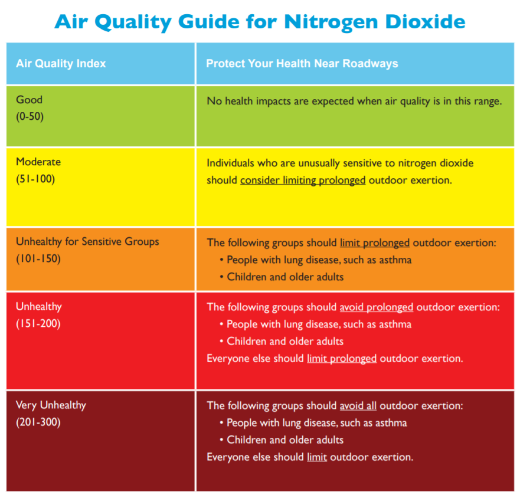

<br>

```{r label="Set Package Repository and Load R Packages", message=FALSE, warning=FALSE, include=FALSE}

options(repos=c(CRAN="https://mirrors.nics.utk.edu/cran/")) 
library(tidyverse)
library(jsonlite)
library(janitor)
library(ggpubr)
library(DataExplorer)
library(fmsb)
library(scales)
library(corrr)
library(emo)
library(lubridate)

```

### Overview

<br>

Debugging is always important when you’re doing any kind of programming. It can be tedious, but it gets easier with experience. A basic strategy is to use `print` statements inserted into your code to help pinpoint where the problem is. Note that in the second part of the code chunk below, the `paste0` function is used to concatenate text with the value of the numeric scalar called **i**&mdash;a scalar data structure is the most basic data type that holds only a single atomic value at a time (i.e., one value). Using a letter as the index for iteration is common practice, but you could just as easily substitute a different letter, word, etc. Please note that `stringr::str_c` produces the same result as the base R function `paste0`. 

```{r label="Yes, Virginia, There Are Print Statements"}

my.informative.message <- "We have entered the else component of the loop."
print(my.informative.message)

i <- 33

print(paste0("The loop has been successfully executed ", i, " times!"))

print(str_c("The loop has been successfully executed ", i, " times!"))

```
In the code chunk above, I created a simple statement that I can pass to the `print` function as an argument as part of the code that is executed inside the **else** component of a standard if/else loop as shown below.   

<br>
<center> {width=350px}</center>  

<br>
While inserting informative print statements at key places within your code is a time-honored approach to testing and debugging, it can be slow and when the code is done, we typically want to go back and remove these `print` statements.  

Now that we are adding some more sophisticated techniques to our repertoire (e.g., creating graphics with *ggplot2*, writing our own functions), it becomes more important to understand how to debug the code. Fortunately, RStudio has some built-in tools that can help. 

## Making Use of the Debug Tools in RStudio

Most debugging tools function in a similar way. Typically they allow users to step through a script or program, examines objects, and evaluate expressions to verify that the code is actually doing what we would like it to do. There are some differences to note here at the outset. If you are working in an R Script, you can make use of what are called editor breakpoints. A [breakpoint](https://support.rstudio.com/hc/en-us/articles/205612627-Debugging-with-the-RStudio-IDE#entering-debug-mode-stopping) is simply a place in the code where execution stops (pauses) to allow the user to examine the vale of variables or the characteristics of objects that have been created. Clicking just to the left of the line of code of interest should cause a red dot to appear, which indicates the presence of a breakpoint. In the image below, I have set a breakpoint.  

<br>
<center> {width=750px}</center>  
<br> 

For a more detailed overview of how debugging works if you are working in an R Script, take a look at the short video below. **Note:** this video is different from the one shown in class and only four minutes long. 

<br>
<center><iframe width="672" height="378" src="https://www.youtube.com/embed/q_v2C0KHWSI" frameborder="0" allow="accelerometer; autoplay; encrypted-media; gyroscope; picture-in-picture" allowfullscreen data-external="1"></iframe></center>
<br>

If you are working in an R Notebook, you can access the debugging tools through the `browser` function. A brief example is given in the code chunk below. The `browser` function suspends the execution of the code and allows us to inspect the value of **i** by typing it at the **Browse[1]>** prompt in the **Console**.  

```{r label="Yes, Virginia, There Are Print Statements with Browser"}

i <- 33

print(paste0("The loop has been successfully executed ", i, " times!"))

browser()

```

You can exit the browser mode by typing `c` at the **Browse[1]>** prompt.

```{r label="Yes, Virginia, There Are Print Statements with Browser Part Deux"}

i <- i + 1

browser()

```

In the R environment, the **call stack** is the sequence of R commands that led to the error that has been generated. The `traceback` function can be useful identifying where things went astray. Run the chunk below, then type `traceback()` at the **Browse[1]>** prompt. 

```{r label="Demonstrating Traceback"}

fcn <- function(x, y){
  z <- x * y
  return(z * exp(z))
}

fcn(2, 1.3)

browser()
  
```

It doesn't do anything because there is no error to investigate `r emo::ji("deadpan")` However, what happens if we replace one of the value in the function call above with a text string? (e.g., fcn(2, "abc"))

`fcn(2, "abc")`

We can build in more informative warnings and error messages, but I typically find that RStudio provides enough information for me to locate and fix any problems. Note that the `purrr::is_numeric` function is now deprecated, so the code below uses `base::is.numeric` instead `r emo::ji("rolling")`  


```{r label="Demonstrating Warning"}

fcn_smart <- function(x, y){
  if (is.numeric(x) == TRUE & is.numeric(y) == TRUE) {
      z <- x * y
      return(z * exp(z))
  } else {
    warning("Please provide two numeric arguments.")
  }
}


fcn_smart(2, "Friday")

```


More detailed instructions on how to debug your code are available in the [RStudio documentation](https://support.rstudio.com/hc/en-us/articles/205612627-Debugging-with-RStudio), but this brief introduction will hopefully assist us as we move forward. 


## Exploring Nested Lists 

Sometimes lists are embedded within another list and we are interested in accessing the nested list’s elements. To explore how this works, we will retrieve some data air quality data from [OpenAQ](https://openaq.org), which is a "non-profit organization empowering communities around the globe to clean their air by harmonizing, sharing, and using open air quality data". Although air pollution is on the rise in many cities around the world, New Delhi is among the most visible examples of urban areas [grappling with this issue](https://www.hindustantimes.com/cities/delhi-news/new-policy-in-march-to-combat-delhi-ncr-s-pollution-problem-101644795723635.html). By referring to the [API documentation](https://docs.openaq.org), we can determine how to further focus our query to return data for Delhi. The map below shows the administrative districts within the Delhi, which is not a state, but rather a [union territory](https://en.wikipedia.org/wiki/Union_territory) similar to Washington D.C. in that the latter is a federally administered area of the United States. 

<br>
<center> {width=750px}</center>  
<br>  

The [API documentation](https://docs.openaq.org) gives us important insight into how to construct calls that will return the information we want. Let's install and load the *jsonlite* package and begin exploring this data.  

```{r label="Get Air Quality Data"}

india <- fromJSON("https://api.openaq.org/v1/locations?country=IN&limit=1500", flatten = TRUE)
str(india, max.level = 1)

india[[2]]["city"] %>%
  n_distinct()

```

<br>

As shown in the above code chunk, the data come down to us in [JSON](https://www.w3schools.com/whatis/whatis_json.asp) format and consist of **list object** with two components: **meta** and **results**. We can use the `glimpse` function to further inspect the **results** component of the list object. Take a few moments to do that now. We also know that there are 200 cities in India where some air quality data are being collected. 

<br> 

Let's be more targeted in our API call and pull down information on the collections of air quality data for all locations within Delhi. **Note:** the use of the **limit** parameter to push the default of no more than 100 results returned, higher. 

<br>

```{r label="Get Air Quality Data Overview for Delhi"}

delhi <- fromJSON("https://api.openaq.org/v1/locations?country=IN&city=Delhi&limit=500")

str(delhi, max.level = 1)
str(delhi$results, max.level = 1)

```
<br> 

We now have a nested list (called **delhi**) of data for air quality monitoring stations in Delhi, India. A nested list is simply a list object is stored as an element of another list (see below). 

<br>
<center> {width=750px} </center>  
<br>
<center><font size="1">    Source: [Wickham (2021)](https://r4ds.had.co.nz/vectors.html)</font></center>  
<br>

Notice that the `locations` column of the **results** data frame object is a list of length 125. By specifying the **max.level** argument of the structure function (`str`) we can get a sense of how the data returned by this call are arranged. The `glimpse` function would produce a similar display, but the using `str` with the **max.level** argument ensures that the display only show the top level of nesting in the data (a smaller and more intelligible output display). 

<br> 

To access an element from a nested list we first access, the top level object (e.g., data frame, list, etc.) in which it is stored, then we drill down to the item of interest. 

    `delhi[[2]][[6]]`

The line of code above uses the double brackets `[[` approach that we read and talked about during Week 2 of the course. The first set of double brackets accesses the second element of the **delhi** list object. We know from above when we executed `str(delhi, max.level = 1)` that there are two elements in the **delhi** list object&mdash;a list called **meta** and a data frame called **results**. Typing `delhi[[2]]` into the **Console** displays this data frame in all its messy glory. Adding the second set of brackets `[[` drills down further into the ninth element of the **results** data frame. **Note:** that the double brackets `[[` form allows only a single element to be selected using integer or character indices but the single brackets `[` form allows [indexing](https://cran.r-project.org/doc/manuals/R-lang.html#Indexing) by vectors. 

    `locations_ls <- delhi[[2]][[5]]`
    `locations_df <- delhi[[2]][c(5, 14)]`

    `class(locations_ls)`
    `class(locations_df)`

However, let's not stray too far into the weeds `r emo::ji("plant")`. We can also use the `listviewer::jsonedit` function to view the structure of the data in a more intuitive way. 

<br>

```{r "Demonstrate Listviewer Function"}

#install.packages("listviewer", repos = "http://cran.wustl.edu")
library(listviewer)

jsonedit(delhi)

```

If you expand **results** then expand **countsByMeasurement** you will notice that the latter is actually a list with 125 elements stored inside the  data frame object (i.e., delhi$results) which is in turn part of another list (i.e., delhi). If we wanted to extract this component of the returned results, one approach would be to use the `pluck` function from the *purrr* package. 

<br>

```{r label="Begin Parsing the Results"}

cbm <- purrr::pluck(delhi$results, "countsByMeasurement")

class(cbm)

str(cbm, max.level = 1, list.len = 10)

```
<br> 

This list (i.e., `delhi$results$countsByMeasurement`) corresponds to the 125 locations within Delhi that have available air quality data. For each of those 125 locations, there is a data frame that contains the air pollutant measured there as well as the number of measurements that are available. We can type `delhi[[2]][c(5, 14)]` into the **Console** to view only the `delhi$results$location` and `delhi$results$countsByMeasurement` columns. 

<br>

We can extract the measurement count information for a particular station and pollutant by using brackets to access information within the nested hierarchy. First, let's locate the position in the hierarchy for a the **Bawana, Delhi - DPCC** monitoring station located in the northwest area of Delhi, them demonstrate how to extract that information using brackets <span style="color: red;">and</span> also using our *dplyr* skills. 

<br>

```{r label="Continue Parsing the Results"}

which(delhi[[2]][5] == "Bawana, Delhi - DPCC")

delhi[[2]][c(22,59), ]

delhi[[2]][] %>% 
  filter(locations == "Bawana, Delhi - DPCC")


delhi %>% 
  pluck(2) %>%
  filter(locations == "Bawana, Delhi - DPCC") %>%
  pluck("countsByMeasurement") 


delhi %>% 
  pluck(2) %>%
  filter(locations == "Bawana, Delhi - DPCC") %>%
  pluck("countsByMeasurement") 

```
<br> 

In the above code chunk, we are using the `[[` to extract a single component from original list. The first line of code above drills down and returns all the contents of of **locations** list, while the second line of code returns the information stored at position **22 or 59** in that list (i.e., two monitoring stations near the same site, although the second has no lat/lon information). You can think about the combination of brackets as mirroring the nesting structure shown in the `jsonedit(delhi)` widget. Keep in mind that `[` extracts a sub-list and will always result a list object. On the other hand, the `[[` will return a vector. 


We now know that this particular monitoring station collects Ozone (o3), Nitrogen Dioxide (no2), Carbon Monoxide (co), Particulate Matter 10 (pm10), and Particulate Matter 2.5 (pm25). We also know that there are more measurements available here for PM 2.5 than for carbon monoxide. 

If we wanted to see which pollutants are measured at the **Bawana, Delhi - DPCC** monitoring station, we could also type one of these equivalent lines into the **Console**: 

    `delhi$results[["parameters"]][[22]]`
    
    `delhi[[2]][["parameters"]][[22]]`

<br> 

Now let's shift gears and retrieve actual air quality measurements. Nitrogen dioxide is generally associated with emissions from vehicles and point sources like industrial operations. NO_2 is commonly measured because it contributes to the formation of ozone and particulate matter as well as acid rain. For this, we will move on to a different endpoint in the same API called [**latest**](https://docs.openaq.org/#api-Latest) which is part of the same API but gives us access to the most recent measurements for the each of the monitored pollutants (see **parameters** in the preceding code chunks). The image below shows the different fields we can use to filter the data we are retrieving: 

<br>
<center> {width=750px}</center>  
<br> 


```{r label="Grab NO2 Data for Delhi Stations"}

delhi_no2 <- fromJSON("https://api.openaq.org/v1/latest?country=IN&city=Delhi&parameter=no2&limit=1500") 
str(delhi_no2, max.level = 1)
str(delhi_no2$results, max.level = 1)

```

We now have a list object that only contains nitrogen dioxide data for stations in Delhi, but the structure is complex. The data we want are stored in the **results** data frame as before. Apparently, these data have some imperfections, and specifically, there are well over 1,000 identical observations for one particular station. We will remove that station in the code chunk below and use the `unnest` function from the *tidyr* package to move the data into a  **tibble object** where each row contains the most recent nitrogen dioxide measurement for each of the remaining stations in Delhi. 


```{r label="Unnest NO2 Data for Delhi Stations and Fix Date"}

delhi_no2_unnested <- unnest(delhi_no2$results, col = measurements) 


# delhi_no2_unnested <- delhi_no2_unnested %>%
#   filter(location != "Burari Crossing, Delhi - IMD")

str(delhi_no2_unnested)

delhi_no2_unnested <- delhi_no2_unnested %>% 
  mutate("LastDate" = ymd_hms(lastUpdated,
  quiet = FALSE,
  tz = "Asia/Kolkata",
  locale = Sys.getlocale("LC_TIME"),
  truncated = 0))


delhi_no2_unnested$Month <- month(delhi_no2_unnested$LastDate)
delhi_no2_unnested$Year <- year(delhi_no2_unnested$LastDate)


delhi_no2_unnested %>% 
  count(Year)


delhi_no2_unnested %>%
  select(location) %>%
  n_distinct()


delhi_no2_unnested %>%
  filter(Year == 2022) %>%
  select(location) %>%
  n_distinct()


active_delhi_stations <- delhi_no2_unnested %>%
  filter(parameter == "no2" & Year == 2022) %>%
  select(location) %>%
  distinct()

print(active_delhi_stations, n = Inf)


```

As you can can see in the tibble, only 40 of the 54 stations have a **most recent** data measurement (from the [**latest** endpoint](https://docs.openaq.org/#api-Latest)) that are from 2022. 

<br> 

### Exercise 1  
<br>

Drawing upon the work you did with the Required Practice examples from last session, write a custom function that meets the following specifications.  

1. Your function accepts three input arguments:   
   + Argument `the_pollutant` which is a character string enclosed in quotes that reflects the codes used in the source data (i.e., `unique(unlist(delhi$results$parameters))`) 
   + Argument `the_start_date` which is a YYYY-MM-DD date string that is enclosed in double quotation marks. 
   + Argument `the_end_date` which is a YYYY-MM-DD date string that is enclosed in double quotation marks. 
   **Hint:** Your function should use the `paste0` function to construct the query URL such that it looks something like this `https://api.openaq.org/v1/measurements?country=IN&city=Delhi&parameter=so2&date_from=2020-03-01&date_to=2020-05-01&limit=5000`
   + If you encounter problems, consider using the techniques from the first part of this exercise (e.g., the "Demonstrating Traceback" chunk) to fix them. If you do this, please briefly reflect on it in your write-up. 
2. Your function uses the `jsonlite::fromJSON` function to retrieve the data for the arguments supplied and filters out values that are less than zero.
   + Use your custom function to retrieve Nitrogen Dioxide (`no2`) measurements for all stations in Delhi. Report the minimum, maximum, and mean values for the month of January 2022 (if there are missing data, simply report what the API returns for January 2022) and include this in your submission.
   + Explain the code you wrote for this step (it can be brief) and include this in your submission (i.e., what are the different components and what do they do?) as a Markdown section
   
<br> 

<br>

----


## Adding Iteration to Our Toolkit

One of the topics you read about this week was **iteration** which involves automation of of tasks or recursively apply one or more functions. The lecture introduced **if/else** statements, **for loops**, and **while loops** as commonly used tools for iterating over a vector or collection of objects. We can also make use of the `map` function in the **purrr package** as an alternative to writing a **for loop** like the one you created during the last session. As described in the [reference page](https://purrr.tidyverse.org/reference/map.html), the `map` function takes as input a list and a function. It **iteratively** applies the function to the elements of the list. In the code chunk below, we [create a custom function](https://www.datamentor.io/r-programming/function), then we iterate over the list of air quality stations in Delhi with nitrogen dioxide measurements by passing that list and the name of our newly created function to `map`, which generates the output. The colors used for the lines are taken from the default *viridis* palette that can be viewed by typing `show_col(viridis_pal()(20))` into the **Console** `r emo::ji("thumb")`  

<br>

The code chunk below also superimposes on each linechart the U.S. EPA threshold which is 100 parts per billion [or 188 micrograms per cubic meter](https://www.breeze-technologies.de/blog/air-pollution-how-to-convert-between-mgm3-%C2%B5gm3-ppm-ppb) which reflects the units of the data we have. 

<br>
<center> {width=500px} </center>  
<br>
<center><font size="1">    Source: [U.S. EPA (2018)](https://www.airnow.gov/sites/default/files/2018-06/no2.pdf)</font></center>  
<br>

**Note:** the code in the chunk below is commented out so that it will knit properly without you having inserted your code from Exercise 1 above. 

<br>

```{r label="Create Air Quality Plotting Function and Apply With map", warning=FALSE, message=FALSE, results=FALSE}


# make_aq_plot <- function (x) {
#   
#     the_data <- no2_prior_month %>% 
#       filter(location == x)
#     
#     the_colors <- c("Mean" = "#39568CFF", "Minimum or Maximum" = "#55C667FF", "Health Impacts Threshold" = "#DCE319FF")
#     
#     the_data %>%
#         group_by(measure_date, location) %>%
#         summarize(mean_no2 = mean(value),
#                   max_no2 = max(value), 
#                   min_no2 = min(value)) %>%
#         ggplot(aes(x = as_date(measure_date), y = mean_no2)) +
#         geom_line(aes(color = "Mean"), size = 1.25) + 
#         geom_line(size = 0.75, linetype = "dashed", aes(color = "Minimum or Maximum", x = as_date(measure_date), y = max_no2)) +
#         geom_line(size = 0.75, linetype = "dashed", aes(color = "Minimum or Maximum", x = as_date(measure_date), y = min_no2)) +
#         geom_point(aes(x = as_date(measure_date), y = mean_no2), color = "#481568FF", size = 3, shape = 16) +
#         scale_x_date(date_labels = "%b %d") + 
#         ylim(0, 600) +
#         scale_color_manual(values = the_colors) +
#         geom_hline(yintercept = 188, color = "#DCE319FF", size = 0.75) +
#         labs(x = " ", y = "(\u00b5g/m\u00b3)", title = "Nitrogen Dioxide Over the Past Month", 
#                     subtitle = paste0(x, " Station in Delhi"), color ="") +
#       theme_bw() +
#       theme(legend.position="bottom") 
#     
#     ggsave(filename = paste0("./plots/Delhi NO2 Chart for ", x, ".png"), plot = last_plot(),
#            units = "in", width = 16, height = 8)
#   }
#   
# purrr::map(as_vector(active_delhi_stations), make_aq_plot)

```

If you cannot locate the output from the preceding code chunks, look first in your current working directory, then check in the folder where this R Notebook is saved. Please make sure you understand what is happening in the above code chunk, then proceed.

<br> 

The code chunk below outlines some components of a function to genericize (if that is a word `r emo::ji("wink")`) the code from "Create Air Quality Plotting Function and Apply With map" and integrate the custom function you wrote for Exercise 1 above. The final aspect of this week's Lab Exercise asks you to take this foundation and flesh it out to generate nine new line charts. For each of the three selected air quality monitoring locations, we will retrieve and plot mean, minimum, and maximum recorded concentrations of Ozone (o3), Particulate Matter 2.5 (pm25), and Nitrogen Dioxide (no2). Finally, we will use the `purrr::map2` to iterate over to lists. 

<br>


```{r label="Fill In The Blanks"}


selected_locations <- list(c("Jawaharlal Nehru Stadium, Delhi - DPCC", "IGI Airport (T3), Delhi - IMD", "Chandni Chowk, Delhi - IITM"), 
                           c("Jawaharlal Nehru Stadium, Delhi - DPCC", "IGI Airport (T3), Delhi - IMD", "Chandni Chowk, Delhi - IITM"), 
                           c("Jawaharlal Nehru Stadium, Delhi - DPCC", "IGI Airport (T3), Delhi - IMD", "Chandni Chowk, Delhi - IITM")) 


selected_pollutants <- list(c("o3", "o3", "o3"),
                            c("pm25", "pm25", "pm25"), 
                            c("no2", "no2", "no2"))


# make_aq_plot_multi <- function (x, y) {
#   
# 
#         the_colors <- c("Mean" = "#39568CFF", "Minimum or Maximum" = "#55C667FF")
#
#         scale_color_manual(values = the_colors) +
#        labs(x = " ", y = "(\u00b5g/m\u00b3)", title = paste0(y, " Over the Past Month"), 
#                    subtitle = paste0(x, " Station in Delhi"), color ="") +
#
#
#     ggsave(filename = paste0("./plots/Alternate ", y, " Chart for ", x, ".png"), plot = last_plot(),
#            units = "in", width = 16, height = 8)
#   }
#   
# 
# purrr::map2(as_vector(selected_locations), as_vector(selected_pollutants), make_aq_plot_multi)

```

### Exercise 2  

<br>

This exercise component is simple. Your task is to fill in the missing code between the curly braces `{}` above, then successfully execute the "Fill In The Blanks" code chunk. Here are some pointers to get you started.

1. The custom function you wrote to retrieve air quality data for **Exercise 1** should work fine here. We just need to feed the **y** argument of the `make_aq_plot_multi` function into it to return a data frame for measurements for a selected month in 2022 (e.g., "2022-02-01" to "2022-03-01") for the specified air pollutant (i.e., **y**).   
   + You will need to massage the date attribute using `lubridate::as_date`
   + **Hint:** consider using the `jsonedit` function to see how the date field is structured
   + Use *dplyr* to filter this data frame object inside the `make_aq_plot_multi` function so that it only contains records (rows) for the location of interest (i.e., the **x** argument)
2. You will need to generate the mean, minimum, and maximum values by day, then write *ggplot2* code to create a figure similar to the one shown below  
3. When you are done, execute the code and include **all nine** of the charts it produces with your submission for this Lab Exercise

   
<br> 

<br>
<center> {width=1600px} </center>  
<br>


<br>

### Work Products

Please submit an R notebook and knitted HTML file that shows your work and responses for each of the **Exercises** included in this lab exercise. Also, briefly comment on your experience with R during this lab exercise. Please **upload your report to Collab** by **5:00 pm on Friday March 3rd**.  

<br>

### Assessment Rubric  

This Lab Exercise will be graded on a 100-point scale according to the rubric below:  

**Length and formatting (10 pts)**  

* Are the Lab Exercise responses provided in an acceptable format (e.g., R Notebook, rendered HTML file, etc.)?
* Is there enough explanatory text to evaluate the work? 

**Clarity of writing and attention to detail (20 pts)**  

* Is the text component clearly written? Please do not rely too heavily on bulleted lists. 
* Are there more than one or two grammatical or typographical errors? Please perform a spelling/grammar check prior to submission.  

**Technical Content  (45 pts)** 

* Are the requested graphics, tables, etc. included and intelligible?
* Does the submission explicitly and thoroughly respond to any questions posed?   
* Please explain why you reached the conclusions you did when responding to the questions posed.

**Reflective Content  (25 pts)** 

* Does the response reflect on the procedures used (i.e., what am I clicking and why?)?
* Is there evidence that the student understands how the substance of the Lab Exercise relates to concepts from the lectures/readings and/or how the substance of the Lab Exercise might be applied in the work planners (or you personally) do? 

<br>
<center> <font size="2"> © Bev Wilson 2023 | Department of Urban + Environmental Planning | University of Virginia </font> </center>
<br>
