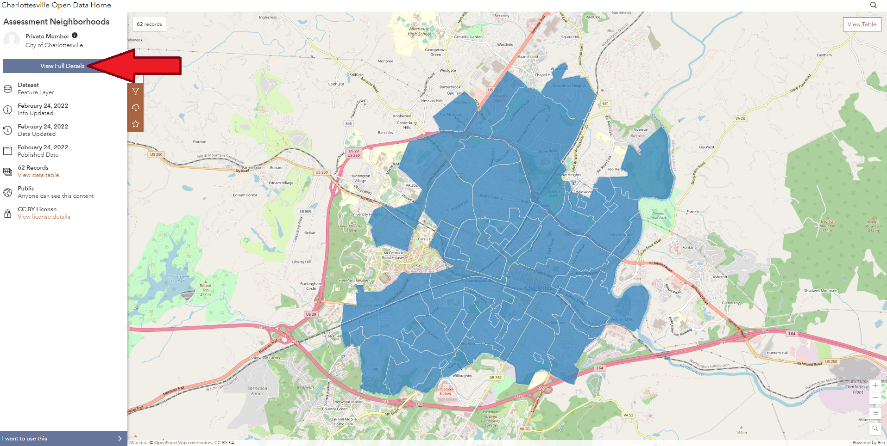
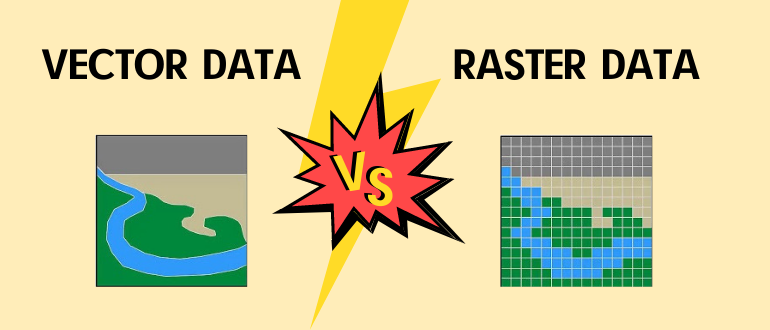

<br>

```{r label="Set Package Repository and Load R Packages", message=FALSE, warning=FALSE, include=FALSE}

options(repos=c(CRAN="https://mirrors.nics.utk.edu/cran/")) 
install.packages("rgdal")
# devtools::install_github("hadley/emo")
library(tidyverse)
library(jsonlite)
library(janitor)
library(ggpubr)
library(DataExplorer)
library(fmsb)
library(scales)
library(corrr)
library(devtools)
library(emo)
library(lubridate)
library(sf)
library(viridis)
library(raster)
library(rgeos)
library(RColorBrewer)
library(rgdal)

```

### Overview

<br>

This week we are beginning to work with geospatial data in the R environment. As discussed in class, geospatial data are characterized by geometry that typically corresponds to actual locations in the real world. Maps are a two-dimensional abstraction of the three-dimensional space we all inhabit. The good news is that we can create maps using the *ggplot2* package in much the same way that we have used it to generate barcharts, boxplots, and scatterplots... `r emo::ji("wink")`
<br>

<center> {width=500px} </center>  
<br>

<center><font size="1">    Source: [Healy (2019)](https://socviz.co/makeplot.html)</font></center>  
<br>

The general structure will remain the same and the graphics are constructed in an additive way. The `ggplot` functions opens or initializes a new plot while the `aes` of aesthetic mappings function outlines **which attributes or columns of the data** will be **represented by different elements of the plot** we are creating. The `aes` function is often nested within the `ggplot` function but it may also appear in the `geom_*` function. Recall that in *ggplot2* graphics are constructed in an additive way and the components are linked together using the `+` operator. If there is no `geom_*` function, then you will not see anything in the output. The `geom_*` determines the type of graphic we are creating (e.g., geom_point, geom_bar, geom_sf, etc.). 

<br> 

Take a moment now to refresh you memory by inspecting the help documentation page for the `ggplot`, `aes`, and `geom_sf` functions, paying close attention the list of **Arguments** and the **Examples** for each one. 

<br> 

Recall that `scale_*_*` functions are used to modify and/or control way that the attributes in the aesthetic mappings from the `aes` function are translated to visual properties of the graphic being created. These will be **specific to the component of the graphic** and to the **nature of the data attribute** we are displaying. For example, if we are displaying mean recorded NO_2 values at the neighborhood scale using the [**fill** argument](https://ggplot2.tidyverse.org/articles/ggplot2-specs.html) of the `aes` function, we would use `scale_fill_continuous` or perhaps `scale_fill_gradient` or `scale_fill_viridis` because we want to target the attribute we have mapped to the shading (or fill) of the neighborhood polygons **AND** because the attribute from our data is continuous rather than discrete (categorical). This means that `scale_fill_brewer` and `scale_fill_discrete` are likely to throw an error. Similarly, using `scale_colour_continuous` or `scale_size_continuous` will not work properly because we want to control the shading (i.e., fill) of the polygons rather than the color of the polygon boundary or the size of points that may be displayed in our graphic. 

<br> 

Just to round out this discussion, the `scale_fill_gradient` function creates a two color gradient (i.e., from low to high), the `scale_fill_gradient2` function creates a diverging color gradient (i.e., from low to mid to high), and the `scale_fill_gradientn` function creates a n-color gradient. This page has more information on colors using the [*viridis* package](https://www.thinkingondata.com/something-about-viridis-library/) and this page focuses on the [*RColorBrewer* package](https://www.r-graph-gallery.com/38-rcolorbrewers-palettes.html). 

<br> 

Enough already... `r emo::ji("tired")` Let's make some maps using data from the [Charlottesville Open Data Portal](https://opendata.charlottesville.org)!

<br> 

### Mapping Vector Data   

```{r fig.height=10, fig.width=16, message=FALSE, warning=FALSE, label="Get Cville Vector Data"}


neighborhoods_0 <- st_read("https://opendata.arcgis.com/datasets/5fb42d80700b4bcd97990db16f2cc1c0_97.geojson")
st_crs(neighborhoods_0)


a <- ggplot() + 
  geom_sf(data = neighborhoods_0, aes(fill = NeighHood), show.legend = FALSE) + 
  theme_void() + 
  scale_fill_viridis(discrete = TRUE) + 
  labs(fill = "Cville Neighborhoods") + 
  coord_sf(crs = "ESRI:54004") +
  ggtitle("Mercator", subtitle = "Shape and Direction Preserving Projection")


b <- ggplot() + 
  geom_sf(data = neighborhoods_0, aes(fill = NeighHood), show.legend = FALSE) + 
  theme_void() + 
  scale_fill_viridis(discrete = TRUE) + 
  labs(fill = "Cville Neighborhoods") + 
  coord_sf(crs = "ESRI:54009") +
  ggtitle("Mollweide", subtitle="Equal Area Projection")


c <- ggplot() + 
  geom_sf(data = neighborhoods_0, aes(fill = NeighHood), show.legend = FALSE) + 
  theme_void() + 
  scale_fill_viridis(discrete = TRUE) + 
  labs(fill = "Cville Neighborhoods") + 
  coord_sf(crs = "ESRI:102003") +
  ggtitle("Albers", subtitle = "Equal Area Projection")
  


d <- ggplot() + 
  geom_sf(data = neighborhoods_0, aes(fill = NeighHood), show.legend = FALSE) + 
  theme_void() + 
  scale_fill_viridis(discrete = TRUE) + 
  labs(fill = "Cville Neighborhoods") + 
  coord_sf(crs = "ESRI:54032") +
  ggtitle("Azimuthal Equidistant", subtitle = "Distance Preserving Projection")


e <- ggplot() + 
  geom_sf(data = neighborhoods_0, aes(fill = NeighHood), show.legend = FALSE) + 
  theme_void() + 
  scale_fill_viridis(discrete = TRUE) + 
  labs(fill = "Cville Neighborhoods") + 
  coord_sf(crs = "ESRI:102747") +
  ggtitle("Virginia State Plane South NAD83 Feet", subtitle = "Shape and Distance Preserving Projection")


f <- ggplot() + 
  geom_sf(data = neighborhoods_0, aes(fill = NeighHood), show.legend = FALSE) + 
  theme_void() + 
  scale_fill_viridis(discrete = TRUE) + 
  labs(fill = "Cville Neighborhoods") + 
  coord_sf(crs = "EPSG:32617") +
  ggtitle("UTM Zone 17 North WGS84", subtitle = "Shape Preserving Projection")


ggarrange(a, b, c, d, e, f, nrow = 2, ncol = 3)


```

<br> 

The screen captures below show how we located [the URL used](https://opendata.charlottesville.org/datasets/assessment-neighborhoods/explore?location=38.040039%2C-78.485150%2C14.00) in the code chunk above to access the neighborhoods data layer using the `st_read` function. 

<br>
<center> {width=900px} </center>  
<br>
<br>
<center> {width=1000px} </center>  
<br>

<br>
<center> {width=1200px} </center>  
<br>

In the code chunk, we use `st_crs` to display the coordinate system of the data layer we downloaded and it is the standard Web Mercator coordinate system that many data portals use. this is an a geographic coordinate system, which means its unit are degrees and that those units are not uniform at all locations on the Earth. Typically we want to perform calculations with geospatial data that have had a [map projection](https://desktop.arcgis.com/en/arcmap/latest/map/projections/list-of-supported-map-projections.htm) applied. The `ggpubr::ggarrange` function is used to display several selected plots using different map projections in a paneled layout. **Note:** the `coord_sf` function allows us to display the data layer in a different coordinate system **without having to change the actual data object** itself. Recall that the `st_transform` function allows us to actually **change the coordinate system of the data object** itself. 


```{r label="Multiple Layers With fill Argument", message=FALSE, warning=FALSE}

# Get the parks data layer for Charlottesville...
parks_0 <- st_read("https://opendata.arcgis.com/datasets/a13bdf43fff04168b724a64f7dca234d_19.geojson")
st_crs(parks_0)

# Municipal boundary too...
city_limits_0 <- st_read("https://opendata.arcgis.com/datasets/43253262b4da436bbac25d8cdb2f043b_44.geojson")
city_limits_stateplane_ft <- st_transform(city_limits_0, crs = "ESRI:102747")


# Change its coordinate system (i.e., project it)
parks_stateplane_ft <- st_transform(parks_0, crs = "ESRI:102747")
nhoods_stateplane_ft <- st_transform(neighborhoods_0, crs = st_crs(parks_stateplane_ft))


# Make a map with both layers...
ggplot() +
  geom_sf(data = nhoods_stateplane_ft, aes(fill = "white")) + 
  theme_void() + 
  theme(legend.position = "left") +
  geom_sf(data = parks_stateplane_ft, aes(fill = "green4"), alpha = 0.6) +
  scale_fill_manual(name = "Legend",
                        values = c("green4", "white"), labels = c("Parks", "Neighborhoods"))


```

<br> 

In the above code chunk, we download the [Park Area](https://opendata.charlottesville.org/datasets/park-area/explore?location=38.044452%2C-78.462081%2C12.98) data layer and display it on the map along with the neighborhood boundaries. Things get a little complicated because these are both polygon layers and we want to shade them via the **fill** argument. *ggplot2* does not expect there to be multiple layers using the same aesthetic mapping argument, so we work around this by leveraging the `scale_fill_manual` function which allows us to override the default legend that would have been otherwise created `r emo::ji("grin")`

<br> 

Recall that if arguments are specified **inside the `aes` function** a legend will be displayed by default. Also recall that the **alpha** argument is how we set the transparency of the `geom_*` we are mapping and the values range from 0 (completely transparent) to 1 (completely solid). Adding map elements like a north arrow and scale bar are more difficult in R than in a dedicated GIS software package, but if you feel the need to do so, here are a few options: 

  + The [*mapsf* package](https://riatelab.github.io/mapsf)
  + The [*ggsn* package](http://oswaldosantos.github.io/ggsn)

Explore these as your own time and interest dictate.
<br> 

### Exercise 1  

<br>

This exercise asks you to practice some of what we have learned about mapping geospatial data with *ggplot2* and explores some of the geometric (topological) functionality available in the *sf* package. Using what the preceding portions of this R Notebook have demonstrated (i.e., read the Markdown sections of this document), please try your hand `r emo::ji("joy")` at the following: 


1. Access the **Tree Inventory Point** layer stored on the [City of Charlottesville open data portal](https://opendata.charlottesville.org):   
   + First, locate the dataset in the portal
   + Then, find the GeoJSON endpoint as shown in the preceding Markdown section with the neighborhoods layer screen captures
   + Use the `st_read` function to bring it down from the interwebs `r emo::ji("thumb")`
   + Apply a map projection so that it has the same coordinate system as **nhoods_stateplane_ft**
2. Create at least one map that shows the location of **neighborhood boundaries**, **parks**, and **street trees** along with a legend entry for each:
   + You may want to set the **color** argument of street trees point layer
   + Draw inspiration from the `scale_fill_manual` line of code from the preceding chunk
   + Explain the code you wrote in your submission (i.e., what are the different components and what do they do?) as a Markdown section
3. Remove all the park polygons that extend beyond the spatial extent of neighborhoods data layer:    
   + Use the `st_join` function to create a new *sf* object where the **x** argument is the projected parks layer, the **y** argument is the projected city limits layer, the **join** argument is **st_intersects** and the **left** argument is `TRUE`
   + Add this new  *sf* object to a map
   + Include and interpret this map in your submitted materials
4. Count the street trees within each neighborhood polygon using this line of code `nhoods_stateplane_ft <- nhoods_stateplane_ft %>% mutate(NumStreetTrees = lengths(st_intersects(nhoods_stateplane_ft, street_trees_stateplane_ft)))`
   + Make sure you understand how this line of code works (i.e., look at the documentation for `st_intersects` and for `lengths`)
   + Create a [choropleth map](https://en.wikipedia.org/wiki/Choropleth_map) that shows the distribution of street trees (i.e., the number of trees) by neighborhood
   + Include and interpret this map in your submitted materials
   
<br> 


----


### Mapping Raster Data  

We have seen how to interact with vector data (e.g., points, lines, polygons) in the R environment from the in-class script we began during the last class session and we continued that exploration in the first portion of this Lab Assignment. Now, we will demonstrate how to interact with raster (e.g., grid cells, pixels) datasets, The *sf* package only handles vector data and the primary package for working with raster data in R is (appropriately) called *raster* `r emo::ji("laugh")`  At some point in the the future the *terra* package will succeed the *raster* package, but they are very similar in their form and function, as described in greater detail here. 

<br>

<center> {width=500px} </center>  
<br>

<center><font size="1">    Source: [101GIS](https://101gis.com/vector-data-vs-raster-data)</font></center>  
<br>

Again, raster data [differ from vector data](https://gisgeography.com/spatial-data-types-vector-raster) and the R functions that we use are (therefore) different. For example, the `st_crs` function displays the coordinate system of a vector *sf* object and for *raster* objects, but if we want to change the coordinate system we use `raster::projectRaster` as shown in the code chunk below. The links below provide an overview of the functions available in the *raster* and *terra* packages for handling raster data: 

  + Function overview for [*raster* package](https://rdrr.io/cran/raster/man/raster-package.html)
  + Function overview for [*terra* package](https://rdrr.io/cran/terra/man/terra-package.html)

In the code chunk below, we use `raster::extract` to calculate the mean and standard deviation of grid cells that fall within the boundaries of each neighborhood polygon. The data are from a local heat mapping initiative where the Charlottesville Office of Sustainability organized volunteers to collect temperature data from bikes and automobiles on August 24, 2021. These data are now available for download on the [City's website](https://www.charlottesville.gov/1469/Urban-Heat-Island-Mapping-Campaign) and from the OSF repository. The details of the data collection are [available in this report](https://mfr.osf.io/render?url=https://osf.io/bkrwq/?direct%26mode=render%26action=download%26mode=render) and the machine learning methods used to generate the rasters are described in these publications: 

 * Shandas, V., Voelkel, J., Williams, J., & Hoffman, J., (2019). Integrating Satellite and Ground Measurements for Predicting Locations of Extreme Urban Heat. Climate, 7(1), 5. [https://doi.org/10.3390/cli7010005](https://doi.org/10.3390/cli7010005)
 * Voelkel, J., & Shandas, V. (2017). Towards Systematic Prediction of Urban Heat Islands: Grounding Measurements, Assessing Modeling Techniques. Climate, 5(2), 41. [https://doi.org/10.3390/cli5020041](https://doi.org/10.3390/cli5020041)

Basically the raster layers represent estimates of air temperature across the city based on the data that these volunteers collected (after an interpolation process documented on the journal articles above).

<br>

```{r message=FALSE, warning=FALSE, cache=TRUE, label="Read and Process CAPA Heat Watch Raster"}

# Create a unique identifier for use later...
nhoods_stateplane_ft <- nhoods_stateplane_ft %>%
  mutate(ID = FID + 1)

# Read in and apply the map projection to the raster data layer...
pm_rast_0 <- raster::raster("./data/rasters_chw_charlottesville_010622/pm_t_f.tif")
pm_rast <- projectRaster(pm_rast_0, crs = "ESRI:102747")


# Use the extract function to calculate mean and standard deviation of grid cells (i.e. estimated temp)
# for each of the neighborhood polygons...
mean_temps <- extract(pm_rast, nhoods_stateplane_ft, fun = mean, na.rm = TRUE, df = TRUE)
colnames(mean_temps) <- c("ID", "MeanTemp")

std_dev_temps <- extract(pm_rast, nhoods_stateplane_ft, fun = sd, na.rm = TRUE, df = TRUE)
colnames(std_dev_temps) <- c("ID", "StdDevTemp")

# Combine these attributes, them link back to the sf object with the polygon geometry
# so we can map it...
nhoods_summ_stats <- inner_join(mean_temps, std_dev_temps, by = "ID")

nhoods_stateplane_ft_temps <- left_join(nhoods_stateplane_ft, nhoods_summ_stats, by = "ID")


# We could also have produced the same summary statistics using a for loop as given 
# below, but the raster::extract function means less typing...

output <- tibble()

for (i in seq_along(nhoods_stateplane_ft$NeighHood)) {
  
    this_nhood <- mask(pm_rast, nhoods_stateplane_ft[i,], fun = mean, na.rm = TRUE, df = TRUE)
    the_nhood_name <- nhoods_stateplane_ft$NeighHood[i]
    the_mean_temp <- mean(getValues(this_nhood), na.rm = TRUE)
    the_sd_temp <- sd(getValues(this_nhood), na.rm = TRUE)
    
    this_record <- cbind(i, the_nhood_name, the_mean_temp, the_sd_temp)
  
    colnames(this_record) <- c("ID", "Neighborhood", "MeanTemp", "StdDevTemp")
    output <- rbind(output, this_record)
}

write_csv(output, "./data/Mean_Std_Deviation_Temp_By_Nhood_Using_For_Loop.csv")

```

<br> 

One of the less awesome `r emo::ji("meh")` things about *ggplot2* is that if we want to map raster data, we must first convert it to a **data frame** object. The code chunk below demonstrates how we might accomplish this.

<br>

Ultimately, we want to be able to say something about exposure to heat as an increasingly important climate change impact. For example, [this news story](https://www.cvilletomorrow.org/articles/what-are-the-hottest-charlottesville-neighborhoods-the-city-is-creating-a-heat-map-that-could-inform-climate-policies-for-years) from last fall asks: 

> Which Charlottesville neighborhoods are the hottest? 

The equity implications of heat exposure are receiving more attention, [especially within urban planning](https://www.tandfonline.com/doi/full/10.1080/01944363.2020.1759127). Increasing vegetated cover along with strategies like albedo modification are most often considered as tools for increasing heat resilience. Street trees can be part of the solution, but local governments (like the City of Charlottesville) can only plant trees on public property or in public right-of-ways. As a result, private property rights make urban greening efforts slower and more challenging to implement. 

<br>

```{r label="Create-Raster-Heat-Map"}

# Coerce the existing raster object to a data frame, while removing the NA values...
pm_rast_df <- pm_rast %>%
  as.data.frame(xy = TRUE) %>%
  drop_na(pm_t_f)


# Plot the estimated temperatures from the raster layer with the neighborhood
# boundaries overlaid...
capa_heat <- ggplot() +
  geom_raster(data = pm_rast_df, aes(x = x, y = y, fill = pm_t_f)) +
  scale_fill_gradientn(colors = brewer.pal(n = 8, name = "RdYlBu"), trans = "reverse") +
  labs(fill = paste("Temp. ", intToUtf8(176), "F"), 
       title ="Late Afternoon Temperature - CAPA Heat Watch", subtitle = "24 August 2021") +
  geom_sf(data = nhoods_stateplane_ft_temps, colour = "purple", fill = NA, alpha = 0.2, size = 1.25) + 
  theme_void()

capa_heat

ggsave("./plots/CAPA_Temperature_Estimates.png", units = "in", width = 16, height = 8)

# Create a histogram of estimated temperature values...
ggplot() +
  geom_histogram(data = pm_rast_df, aes(x = pm_t_f), color="grey20", fill="dodgerblue", bins = 40) + 
    theme_minimal() +
  labs(x = paste("Temp. ", intToUtf8(176), "F"), 
       y = "") 


# Create a histogram of estimated temperature values with mean shown...
ggplot(data = pm_rast_df) +
  geom_histogram( aes(x = pm_t_f), color="grey20", fill="dodgerblue", alpha = 0.4, bins = 40) + 
  geom_vline(aes(xintercept = mean(pm_t_f)), color = "firebrick", linetype="dashed", size = 2) +
    theme_minimal() +
  labs(x = str_c("Temp. ", intToUtf8(176), "F"),
       y = "") 


```

<br>

### Exercise 2  
<br>

This component of the exercise asks you visualize the temperature data we have derived. Take a few moments to explore the documentation for the `ggarrange` function in the *ggpubr* package, then proceed with the questions below. 

1. Visualize temperature variation in Charlottesville at the neighborhood scale:
   + Create a map that shows the variation in mean temperature by neighborhood using the **nhoods_stateplane_ft_temps** *sf* object (i.e., choropleth map of mean temperature values)
   + Create a second map that shows the standard deviation of temperature values by neighborhood using the **nhoods_stateplane_ft_temps** *sf* object (i.e., choropleth map of **StdDevTemp** attribute) 
   + Use `ggpubr::ggarrange` to display these maps together, then include and interpret this map in your submitted materials (i.e.,  comment on the spatial distribution of high and low values in each map and what they might tell us about heat stress in our fair city `r emo::ji("wink")`)
2. Create a scatterplot (see **Lab Exercise 2** for example code) that shows the relationship between mean temperature by neighborhood **AND** the number of street trees by neighborhood. Include and interpret this scatterplot in your submitted materials.
   
<br> 

---


<br>

### Work Products

Please submit an R notebook and knitted HTML file that shows your work and responses for each of the **Exercises** included in this lab exercise. Also, briefly comment on your experience with R during this lab exercise. Please **upload your report to Collab** by **5:00 pm on Friday March 17th**.  

<br>

### Assessment Rubric  

This Lab Exercise will be graded on a 100-point scale according to the rubric below:  

**Length and formatting (10 pts)**  

* Are the Lab Exercise responses provided in an acceptable format (e.g., R Notebook, rendered HTML file, etc.)?
* Is there enough explanatory text to evaluate the work? 

**Clarity of writing and attention to detail (20 pts)**  

* Is the text component clearly written? Please do not rely too heavily on bulleted lists. 
* Are there more than one or two grammatical or typographical errors? Please perform a spelling/grammar check prior to submission.  

**Technical Content  (45 pts)** 

* Are the requested graphics, tables, etc. included and intelligible?
* Does the submission explicitly and thoroughly respond to any questions posed?   
* Please explain why you reached the conclusions you did when responding to the questions posed.

**Reflective Content  (25 pts)** 

* Does the response reflect on the procedures used (i.e., what am I clicking and why?)?
* Is there evidence that the student understands how the substance of the Lab Exercise relates to concepts from the lectures/readings and/or how the substance of the Lab Exercise might be applied in the work planners (or you personally) do? 

<br>
<center> <font size="2"> © Bev Wilson 2022 | Department of Urban + Environmental Planning | University of Virginia </font> </center>
<br>
