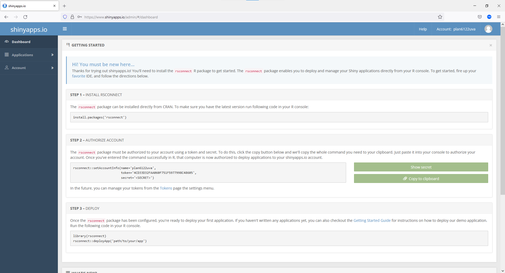
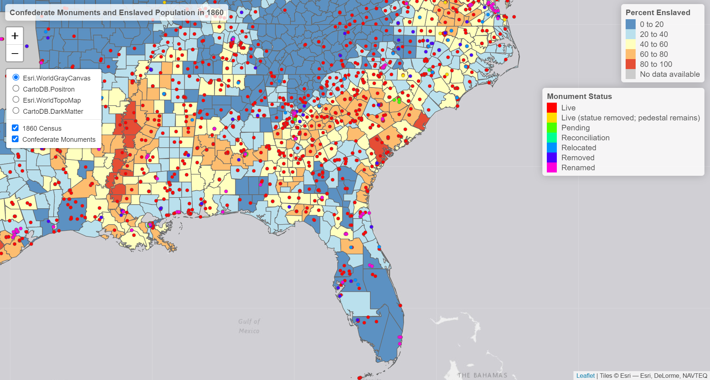

<br>

This week's Lab Assignment focuses on creating interactive graphics and maps with both the *plotly* and *tmap* packages. The first part of the Lab Assignment uses the [*flexdashboard* package](https://rmarkdown.rstudio.com/flexdashboard) because it leverages **R Markdown** which we have already built some familiarity with this semester (i.e., used in R Notebooks like these). 

Cities are increasing creating public-facing dashboards as a means of tracking performance indicators and communicating basic information to the public. However, the use of these tools has faced criticism  `r emo::ji("unhappy")` exemplified by this [recently published](https://www.tandfonline.com/doi/full/10.1080/10630732.2020.1759994?journalCode=cjut20) journal article. Here are a few examples of dashboards maintained by local governments: 

  + [SAR of Hong Kong](https://www.smartcity.gov.hk/dashboards.html)
  + [City of Austin, TX](https://austin.maps.arcgis.com/apps/opsdashboard/index.html#/39e4f8d4acb0433baae6d15a931fa984)
  + [City of Alexandria, VA](https://www.alexandriava.gov/performance/info/dashboard.aspx?id=101066)

Let's begin by accessing a dataset to work with. Most cities in the United States collect and publish information related to 311 calls. As [described here](https://www.govtech.com/dc/articles/What-is-311.html), "311 is a non-emergency phone number that people can call in many cities to find information about services, make complaints, or report problems like graffiti or road damage." We will access 311 service call data from the City of Chicago Open Data Portal for this Lab Assignment.  

### Creating A Dashboard for 311 Service Calls   

This portion of the Lab Assignment walks through the acquisition, preparation, and visualization of 311 service call data using *flexdashboard*. The function reference is [available here](https://pkgs.rstudio.com/flexdashboard/reference/index.html). The first thing that we will need to do is to create a new **R Markdown** document that will serve as the basis for our dashboard. 

From **RStudio**, click File `->` New File `->` R Markdown as shown in the image below: 

<br>
<center> {width=750px}</center>  
<br> 

Then, in the window that appears (see image below), click From Template and Flex Dashboard as shown.

<br>
<center> {width=450px}</center>  
<br>

An in-depth discussion of how [web-applications are created with *shiny*](https://shiny.rstudio.com) is beyond the scope of this course, but the main thing we need to do to achieve our goals is to modify the [YAML header](https://r4ds.had.co.nz/r-markdown.html) of the [**R Markdown** document](https://rmarkdown.rstudio.com/lesson-1.html) we have used to create the static version of the dashboard. As shown below, we have added an option called `runtime` and set it to **shiny**, which adds reactivity (e.g., the underlying data shown in the dashboard is refreshed each time the dashboard is loaded). 

We can [control the layout](https://rmarkdown.rstudio.com/flexdashboard/layouts.html) of the dashboard using the `orientation` option and Level 2 Markdown headers `---------------` are used to define the rows or columns that make up the dashboard "panes". The `vertical_layout` option can be set to **scroll** or **fill** (the default), but the former is only recommended if there are many charts or plots to view. 

Setting the `source_code` option to **embed** makes it possible for viewers of the dashboard to access the source code directly from a web browser. We can also change the look-and-feel by adding the `theme` option and [specifying one of the alternatives shown here](https://bootswatch.com). 

<br>

```
---
title: "Dynamic Dashboard"
runtime: shiny
output: 
  flexdashboard::flex_dashboard:
    orientation: rows
    vertical_layout: scroll
    source_code: embed
    theme: cosmo
---
```

<br>

Please change the new **R Markdown** document you just opened so that the header looks something like what you see above. Just FYI, replacing `orientation: columns` with `orientation: rows` means we arrange the plots within our dashboard in rows rather than columns. Also, changing the `vertical_layout:` portion of the header from `fill` to `scroll` allows users to scroll down the dashboard if there are many plots to view.

<br>


If you are uncomfortable hard-coding your Mapbox API token into your dashboard (and you should be...), you can read in the token, save it to an RData file, and upload that with your code instead `r emo::ji("voltage")`  (more on that part later in this document). Alternatively, **if you do not have a Mapbox API token** you can create maps for this dashboard using the *tmap* package rather than the *plotly* package. We will see how to do that shortly `r emo::ji("clock")`

If you are using *plotly* for the dashboard map and have a Mapbox API token, you only need to run the commented out code below once and it should be done in the RStudio **Console**.


```{r label="Export-Mapbox-Token", message=FALSE, warning=FALSE}

# library(tidyverse)
# 
# my.token <- read_lines("./bevs_api_key.txt")
# Sys.setenv("MAPBOX_TOKEN" = my.token)
# 
# saveRDS(my.token, file = "bevs_mapbox_token.rds")

```

<br> 

Afterwards, you could delete the above code chunk altogether. The first real code chunk in this R Notebook is where we will load all the packages and API tokens we will need. Modify the code chunk **immediately after the YAML header** in your new **R Markdown** document by inserting the code below **AFTER** `r emo::ji("weary")` you have exported your Mapbox token if you are taking that route:  


```{r setup, include=FALSE, label = "Load-Packages-and-Token"}

library(flexdashboard)
library(tidyverse)
library(sf)
library(lubridate)
library(jsonlite)
library(plotly)
library(hablar)
library(RColorBrewer)
# devtools::install_github("hadley/emo")
library(emo)
library(tmap)

my.token <- readRDS("bevs_mapbox_token.rds")
Sys.setenv("MAPBOX_TOKEN" = my.token)

```

<br> 

Ultimately, we want to create an interactive map that shows the location of 311 service calls and so we will write the code to generate it inside a code chunk that is situated within one of dividers that breaks the dashboard into panes (refer to [these diagrams](https://pkgs.rstudio.com/flexdashboard/articles/layouts.html) for more detail.)

<br>

Add a new code chunk below the one that loads the packages and Mapbox token, then modify it to match the code chunk shown below. First, we retrieve the current date using `Sys.Date` because we want to [fetch data from the API](https://data.cityofchicago.org/Service-Requests/311-Service-Requests/v6vf-nfxy) that was collected for the previous week only. Next, we find the date that corresponds to one week prior by simply subtracting seven days as shown. 

After perusing the API documentation for this dataset, we craft the `baseurl` shown below which allows us to filter out calls that were made just to ask a question and also to limit the results to only calls for service made within the prior week. 

The data are returned in [JSON format](https://blog.exploratory.io/working-with-json-data-in-very-simple-way-ad7ebcc0bb89), but we can process it using a function from the *jsonlite* package. After removing records with missing data and converting the coordinates to numeric format, we are ready to create the interactive map. **Note** that [a bug in the plotly.js JavaScript library](https://github.com/ropensci/plotly/issues/1722) that we are accessing from the R environment prevents us from using other symbols in the **scattermapbox** mode for the time being `r emo::ji("fear")` .

```{r label = "Fetch-Data"}

current.date <- Sys.Date()
prev.week <- (current.date - 7)

baseurl <- "https://data.cityofchicago.org/resource/v6vf-nfxy.json?$where=sr_type!='311 INFORMATION ONLY CALL' AND created_date > "

# Define a function that will fetch the 311 Service Calls data 
# each time the dashboard page is loaded in a web browser...
load_remote_data <- function() {
  
    fromJSON(readLines(URLencode(paste(baseurl, "'", prev.week, "'", "&$limit=50000",  sep = "", collapse=""))))

}

df <- load_remote_data()

# Convert coordinates to numeric...
df <- df %>%
  hablar::convert(
    dbl(latitude),
    dbl(longitude)
  )

# Remove missing values...
df <- df %>%
  filter(is.na(latitude) == FALSE)

```

<br> 

In order to make the dashboard fully dynamic we included code (in the above chunk) that fetches the most recent 311 Service Calls data from the City of Chicago Open Data Portal **each time** the dashboard is loaded in a web browser. Although the dashboard was created using the [*flexdashboard* package](https://rmarkdown.rstudio.com/flexdashboard), we can leverage some of the functionality of *shiny* in order to make our dashboard an [interactive document](https://bookdown.org/yihui/rmarkdown/shiny-documents.html). 

<br> 
The important point about the `load_remote_data` function is that it retrieves the 311 Service Calls data from the Chicago Open Data Portal in real-time. The `URLencode` function helps to properly format the http query we use to access the data. As described in the [documentation page](http://127.0.0.1:12926/help/library/utils/html/URLencode.html) for this function, "*Characters in a URL other than the English alphanumeric characters and - _ . ~ should be encoded as % plus a two-digit hexadecimal representation*".
<br>

Now, insert **one of the two** pieces of code below into the existing chunk under the **Chart A** header. 

```{r label- "Create-The-Map"}

# Create the map using plotly...
plot_mapbox(df, lat = ~latitude, lon = ~longitude, mode = 'scattermapbox')  %>% 
  add_markers(text  = ~paste(sr_type, "\n", status),
            color = ~status, colors = c("purple", "green", "red"), 
            size = 3000, hoverinfo = "text", alpha = 0.5) %>%
  layout(
    mapbox = list(zoom = 10, center = list(lat = ~median(df$latitude), 
                                     lon = ~median(df$longitude))),
    legend = list(orientation = 'h',
              font = list(size = 8)))

# Create the map using tmap if you don't have a Mapbox API token...
calls_sf <- st_as_sf(df, coords = c("longitude","latitude"))
st_crs(calls_sf) <- 4326

tmap_mode("view") 

tm_shape(calls_sf, name = "Calls") + 
 tm_dots(col = "status", id = "sr_number", 
          palette = c("Completed" = "green4", "Open" = "red", "Canceled" = "yellow"),
          alpha = 0.5,
          popup.vars = c(
              "This call was about: " = "sr_type", 
              "This call is now: " = "status"),
          colorNA = "white",
          textNA = "No complaints documented",
          title = "Call Status") +
tm_layout(title = "311 Calls - Past 7 Days")


```


The end result is that the top pane of the dashboard is populated with an interactive map created with either *plotly* or with *tmap*. Next, we will turn our attention to the other panes!

------

In the code chunk below, we filter the dataset to only include calls that were made today, then we select the top ten types of calls to display as a donut chart...

<br>
<center> {width=350px}</center>  
<br> 

Please move the donut chart code chunk into one of the dashboard panes in your dashboard layout (e.g., under the **Chart B** header). 

<br>

```{r label = "Create-Donut-Chart"}
df.today <- df %>%
  filter(lubridate::date(created_date) == as.character(current.date))

df.counts.today <- df.today %>%
  count(sr_type) 

df.counts.top.ten.today <- df.counts.today %>%
  arrange(desc(n)) %>%
  slice_head(n = 10)

df.counts.top.ten.today %>% plot_ly(labels = ~sr_type, values = ~n) %>% 
  add_pie(hole = 0.6) %>% 
  layout(title = "",  showlegend = FALSE,
                      xaxis = list(showgrid = FALSE, zeroline = FALSE, showticklabels = FALSE),
                      yaxis = list(showgrid = FALSE, zeroline = FALSE, showticklabels = FALSE))

```

Now, let's demonstrate how to generate a line chart showing call volume by day over the past week. First, we will need to wrangle the data a little using familiar **dplyr** functions.


```{r label = "Create-Line-Chart"}

# Remove time component of the date...
df <- df %>%
  mutate(created_date_only = lubridate::date(created_date))

# Count the number of calls by day...
created.date <- df %>%
  group_by(created_date_only) %>%
  count() 

# Convert to a data frame object because
# this is what plot_ly is expecting...
created.date.df <- as.data.frame(created.date)

# Ungroup the data so that the lines show up
# properly...
created.date <- created.date %>%
  ungroup()

# At long last... create the chart...
plot_ly(data = created.date.df, x = ~created_date_only, y = ~n, name = "311 Calls", type = "scatter", mode = "lines", colors = "red") %>%
  add_trace( x = ~created_date_only, y = ~n, mode = "markers", colors = "orange") %>%
  layout(title = "",
         yaxis = list(title = "Number"),
         xaxis = list(title = "Day", zeroline = TRUE),
         showlegend = FALSE)

```

Finally, we will add a third plot underneath the map in the bottom row of the dashboard panes. This will be a bar chart showing the number of calls by [Community Area](https://en.wikipedia.org/wiki/Community_areas_in_Chicago) over the previous week. Community Areas have been used for research and planning purposes in Chicago for over 100 years. First, we count the number of calls by Community Area, use `inner_join` from the **dplyr** package to connect the call tallies to the Community Area boundary polygons, then generate the chart. If you have had it with barcharts, feel free to explore [some of the other options](https://plotly.com/r/basic-charts) and use those in your dashboard instead. 


```{r message = FALSE, warning = FALSE, echo = FALSE, label = "Create-Bar-Chart"}

# Count the number of calls by community area...
df.community.area <- df %>%
  group_by(community_area) %>%
  count(sr_type == "Restaurant Complaint") 

# Download the Community Area boundaries so that 
# we can use them for mapping...

ca.polys <- st_read("http://data.cityofchicago.org/api/geospatial/cauq-8yn6?method=export&format=GeoJSON", quiet = TRUE)

# Use an inner join from dplyr to link the 311 
# call tallys to the polygons...
ca.polys.tb <- inner_join(df.community.area, ca.polys,by = c("community_area" = "area_numbe"))

# Create the bar chart!
plot_ly(data = ca.polys.tb, x = ~community_area, y = ~n, type = 'bar', 
        name = 'Calls By CCA', 
        text = ~paste("Total of ", n, "calls this week in", stringr::str_to_title(ca.polys.tb$community)), 
                     color = I("orange")) %>% 
layout(title = "All The Data",
       xaxis = list(title = "", showticklabels = FALSE),
       yaxis = list(title = ""))


# Remove outliers if you like...
ca.polys.tb.filtered <- ca.polys.tb %>%
  filter(n < 1000)

plot_ly(data = ca.polys.tb.filtered , x = ~community_area, y = ~n, type = 'bar', 
        name = 'Calls By CCA', 
        text = ~paste("Total of ", n, "calls this week in", stringr::str_to_title(ca.polys.tb.filtered$community)), 
                     color = I("orange")) %>% 
layout(title = "Outliers Removed",
       xaxis = list(title = "", showticklabels = FALSE),
       yaxis = list(title = ""))


```

Now, if you would like to modify text around the panes of the dashboard, feel free to do so (e.g., change **Chart B** to **Top Ten 311 Calls By Type**). You can also tailor the charts a bit more, if you like.  For example, the code below gives you a sense of the categories of calls in this dataset and you could revise the map and/or barchart to focus on a single City department or 311 call type (remove the backticks before running it): 

    `View(df %>% group_by(owner_department) %>% count(sr_type))`

<br>

### Publishing Your Real-Time Dashboard  

In order for the reactive elements to work properly, we need to publish our dashboard to a platform like [shinyapps.io](https://www.shinyapps.io). You can sign up for a [free account here](https://www.shinyapps.io/admin/#/signup). However, in order to publish to it from RStudio, you may also need to connect to your account. 

<br> 

After entering an email address and a password, you need to choose a short identifier for your **shinyapps.io** account. This is be part of the URL for everything you share on that platform, so using your NetID may make sense. 

<br>
<center> {width=750px}</center>  
<br>

Next, you simply need to follow the direction on the screen below. You will need to `install.packages('rsconnect')`, copy and paste code shown in **Step 2 – Authorize Account** into the RStudio **Console**, then use the `library` function to make sure the *rsconnect* package is loaded into memory. 

<br>
<center> {width=750px}</center>  
<br>

You will only get the option to publish to **shinyapps.io** if you have knitted a dashboard or web app that has *shiny* type functionality. First, knit your finished dashboard and once the output appears in the RStudio **Viewer** pane,click the Publish icon {width=30px}. 

For now, we just want to make sure there is a connection to your **shinyapps.io** account. Next, click **Publishing** in the left navigation panel of the window shown below, highlight the entry for **shinyapps.io**, and click the **Connect** button. 

<br>
<center> {width=400px}</center>  
<br> 

In the window that appears, select **shinyApps.io** as shown below: 

<br>
<center> {width=400px}</center>  
<br> 

You may need to authorize RStudio to publish your **shinyapps.io** account once more at this stage. If you see a window like the one show below, 

<br>
<center> {width=400px}</center>  
<br> 

If you have decided NOT to hard-code your Mapbox API token (recommended), you should put the R Markdown file that contains your dashboard code AND the .rds file that contains your Mapbox token into a folder (there should be nothing else in that folder). 

Open the the R Markdown file that contains your dashboard code that is stored inside that folder, knit it, then click the Publish icon {width=30px} once more. You should then see a window similar to the one shown below: 

<br>
<center> {width=400px}</center>  
<br> 

You only need to public the .Rmd file (dashboard) and the .rds file (Mapbox token). The progress of moving the dashboard to **shinyapps.io** should now be displayed in the RStudio Deploy tab in the lower left corner. **Be patient** because this will likely take a few minutes! 

<br>
<center> {width=350px}</center>  
<br> 
<center> {width=600px}</center>  
<br> 

Eventually, you should see messages like the ones shown above. You can then [visit the dashboard](https://plan6122uva.shinyapps.io/bevs_cool_dashboard) by entering the URL into a web browser. **Please note** that if you click the **</> Source Code** link at the upper right corner, you can view the underlying code, but not my Mapbox API token! **Celebrate!** `r emo::ji("wow")` 

---

A few other things to know about **shinyapps.io**:

* You can view usage statistics at the admin page after logging into your account
* A application must be archived before it can be deleted (from the admin page)
* The default timeout is 15 minutes (to avoid unexpected charges)

---

### Exercise 1  

<br>

This exercise asks you to practice some of what we have learned about creating interactive graphics with *plotly*.  

1. Revisit the "Create-Donut-Chart" code chunk above. 
    + Instead of a donut chart showing the ten most common 311 call types today, create an alternate donut chart that shows the same information, but for the entire week. 
    + Replace the existing donut chart in the dashboard with this new one. 
2. Create a different graphic that highlights some aspect of the 311 call data that you find interesting and integrate it into the dashboard (e.g., replace either the line chart or the bar chart with this one) **OR** add another map using  *plotly* or *tmap*. 
3. Publish your revised dashboard to **shinyapps.io** and **include the link** in your submission for this Lab Assignment.

<br> 

---

### Publishing Interactive Maps with tmap 

We began working with the *tmap* package in class last time. The function reference is [available here](https://r-tmap.github.io/tmap/reference/index.html). As was mentioned, its strength is creating standalone interactive maps that can be exported to HTML or displayed within a R Notebook. For this portion of the Lab Assignment, we will create a web map that contains a point layer showing the location on Confederate monuments and memorials in the United States as well as a polygon layer showing the percent of the population enslaved in 1860 (i.e., just prior to the beginning of the American Civil War). The former are compiled and monitored by the Southern Poverty Law Center and you can [read more here](https://www.splcenter.org/20190201/whose-heritage-public-symbols-confederacy).   

  * Mullen, L. (2021). "The Spread of U.S. Slavery, 1790–1860," interactive map, https://lincolnmullen.com/projects/slavery/, doi: 10.5281/zenodo.9825.
  * Minnesota Population Center. (2011). *National Historical Geographic Information System: Version 2.0* (Minneapolis, MN: University of Minnesota, 2011), http://www.nhgis.org.

 
The task here is fairly open-ended. Here is an example of a [visualization that shows the expansion of the institution of slavery](https://lincolnmullen.com/projects/slavery) in the United States. Given population data from this site and the historical county and state boundaries [from here](https://geo.btaa.org/catalog/harvard-nhgis-pop1860), use the *tmap* package to create a dynamic web map that looks and functions approximately like this: 

<br>
<center> {width=600px}</center>  
<br> 
<center> {width=600px}</center>  
<br> 
<center> {width=600px}</center>  
<br> 
<br> 

### Exercise 2  

Create an interactive map with the *tmap* package similar to the example above that draws upon the sample code from last class. This part of the Lab Assignment asks you to manipulate the data provided, generate an interactive map with *tmap*, and send it to **RPubs**. 

1. Create a new points *sf* object from the "Whose Heritage.csv" file:   
   + Use `read_csv` to import the data, then remove all rows where the latitude column is missing
   + Use the `st_as_sf` function to convert the tibble to an *sf* object (assume the crs is 4326)
2. Import and process the Census data: 
   +  Use `read_csv` to import the data, then use `filter` to extract rows where the year is 1860
3. Import and process the shapefile with the county and state boundaries: 
   + Use `st_read` to import the "NHGIS_POP1860.shp" dataset
   + Use the `st_make_valid` function to ensure the geometry is correct **BEFORE** plotting
   + Use `left_join` to link the county and state boundaries to the 1860 Census data
   + Use `st_simplify` to reduce the complexity of the geometry (shapes) to that it does not take days for the map to render
4. Create the map: 
   + You will have an initial `tm_shape` line paired with a `tm_polygons` line to visualize the "slavePercentage" attribute 
   + You will have a second `tm_shape` line paired with a `tm_dots` line to visualize the "Tracking Status" attribute from the points *sf* object
   + The rest is (formatting) gravy...
5. Publish your map to **RPubs** and include the link in your submission for this Lab Assignment.
   + Comment on the map. Over the past two years calls have increased to remove these symbols citing the timing of their establishment as a [tool for intimidation and  repression that has been linked to violence](https://batten.virginia.edu/about/news/new-uva-study-finds-correlation-between-lynchings-and-confederate-monuments). Are there any obvious connections between the distribution of the enslaved population in 1860 and where these monuments were erected?
   + For those monuments and memorials with a date of establishment included, when were the most recent ones dedicated? 
   + Are there any obvious patterns in where these symbols are being removed or renamed (e.g., are there states that are leading this effort)?
<br>

---

### Work Products

Please submit an R Notebook and knitted HTML file that shows your work and responses for each of the **Exercises** included in this lab exercise. Also, briefly comment on your experience with R during this lab exercise. Please **upload your report to Collab** by **5:00 pm on Friday March 31st**.  
<br>

### Assessment Rubric  

This Lab Exercise will be graded on a 100-point scale according to the rubric below:  

**Length and formatting (10 pts)**  

* Are the Lab Exercise responses provided in an acceptable format (e.g., R Notebook, rendered HTML file, etc.)?
* Is there enough explanatory text to evaluate the work? 

**Clarity of writing and attention to detail (20 pts)**  

* Is the text component clearly written? Please do not rely too heavily on bulleted lists. 
* Are there more than one or two grammatical or typographical errors? Please perform a spelling/grammar check prior to submission.  

**Technical Content  (45 pts)** 

* Are the requested graphics, tables, etc. included and intelligible?
* Does the submission explicitly and thoroughly respond to any questions posed?   
* Please explain why you reached the conclusions you did when responding to the questions posed.

**Reflective Content  (25 pts)** 

* Does the response reflect on the procedures used (i.e., what am I clicking and why?)?
* Is there evidence that the student understands how the substance of the Lab Exercise relates to concepts from the lectures/readings and/or how the substance of the Lab Exercise might be applied in the work planners (or you personally) do? 

<br>
<center> <font size="2"> © Bev Wilson 2023 | Department of Urban + Environmental Planning | University of Virginia </font> </center>
<br>


