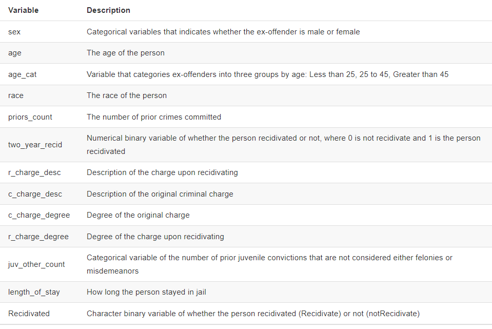

<br>

This week's Lab Assignment is built upon the Steif (2021) chapter that you read and the code that we started walking through last time. That code and commentary is reproduced below with a single exercise for you to complete&mdash;exploring the model training process and varying the algorithm we use. The assigned readings/materials for this week are available here and may be useful as you make your way through this Lab Exercise: 

 + Steif (2021) [People-Based ML Models: Algorithmic Fairness](https://urbanspatial.github.io/PublicPolicyAnalytics/people-based-ml-models-algorithmic-fairness.html)
 + Starmer (2018) [Machine Learning Fundamentals: Bias and Variance](https://www.youtube.com/watch?v=EuBBz3bI-aA)
 + Starmer (2018) [Machine Learning Fundamentals: Cross Validation](https://www.youtube.com/watch?v=fSytzGwwBVw)
 + Starmer (2018) [Support Vector Machines Part 1 (of 3): Main Ideas](https://www.youtube.com/watch?v=efR1C6CvhmE)
 

The first portion of the Steif chapter outlines some of the critiques of machine learning and related techniques (see the [People's Guide to AI](./peoples-guide-ai.pdf) for more details) then explores how the [use of risk assessment instruments](https://www.brookings.edu/research/understanding-risk-assessment-instruments-in-criminal-justice) can lead to racially biased outcomes if applied without proper scrutiny and appropriate guardrails in place. We will skip down to section 7.2 where the data analysis begins in earnest.  

# Data and Exploratory Analysis

```{r label = "Load R Packages", include= FALSE}

library(lubridate)
library(tidyverse)
library(caret)
library(kableExtra)
library(ModelMetrics)
library(plotROC)
library(knitr)
library(grid)
library(gridExtra)
library(QuantPsyc)
library(emo)
library(rsample)
library(rstatix)

source("./data/functions.r")

palette_9_colors <- c("#FF2AD4","#E53AD8","#CC4ADC","#996AE5","#7F7BE9",
                      "#668BED","#33ABF6","#19BBFA","#00CCFF")
palette_3_colors <- c("#FF2AD4","#7F7BE9","#00CCFF")
palette_2_colors <- c("#FF2AD4", "#00CCFF")
palette_1_colors <- c("#00CCFF")


```

<br> 

After loading the necessary R packages, we specify a list of colors that will be used to generate graphics and execute the **functions.R** script, which loads several custom functions from the text into memory for us. The companion data have been placed in the **data** folder. 


As you read, the general aim is to assess the potential for machine learning algorithms to produced biased and racially disparate outcomes when used to predict recidivism rates. The underlying data were collected by ProPublica and [featured in a story](https://www.propublica.org/article/how-we-analyzed-the-compas-recidivism-algorithm) back in 2016. The data are [available for download](https://github.com/propublica/compas-analysis) on GitHub and the attributes of this dataset are listed below: 

<br>

<center>  </center>

<br>
The specifics of the methodology used to create these data are also [available here](https://www.propublica.org/article/how-we-analyzed-the-compas-recidivism-algorithm) for your perusal. The code chunk below reads in the data, then processes it to remove some missing, erroneous, etc. observations. 
<br> 

```{r label = "Grab the Required Data", include = FALSE}

raw_data <- read_csv("./data/compas-scores-two-years.csv")

df <- 
  raw_data %>%
  filter(days_b_screening_arrest <= 30) %>%
  filter(days_b_screening_arrest >= -30) %>%
  filter(is_recid != -1) %>%
  filter(c_charge_degree != "O") %>%
  filter(priors_count != "36") %>%
  filter(priors_count != "25") %>%
  mutate(length_of_stay = as.numeric(as.Date(c_jail_out) - as.Date(c_jail_in)),
         priors_count = priors_count,
         Recidivated = as_factor(ifelse(two_year_recid == 1,"Recidivate","notRecidivate")),
         recidivatedNumeric = ifelse(Recidivated == "Recidivate", 1, 0),
         race2 = case_when(race == "Caucasian"        ~ "Caucasian",
                           race == "African-American" ~ "African-American", 
                           TRUE                       ~ "Other")) %>%
  dplyr::select(sex, age, age_cat, race, race2, priors_count, two_year_recid, r_charge_desc,
         c_charge_desc, c_charge_degree, r_charge_degree, juv_other_count,
         length_of_stay, priors_count, Recidivated, recidivatedNumeric) %>%
  filter(priors_count != 38)


```

<br> 

The chunk below displays descriptive statistics and reproduces the initial charts from the chapter using *tidyverse* functions wherever possible, for the sake of consistency with what we have been learning.  

<br>

```{r fig.height=10, fig.width=16, label = "Make Initial EDA Plots"}

rstatix::get_summary_stats(df)

# Barchart of most frequently levied criminal charges...

df %>% 
  group_by(c_charge_desc) %>%
  summarize(count = n()) %>%
  mutate(rate = count / sum(count), 
         charge_capitalized = str_to_title(c_charge_desc)) %>%
  arrange(-rate) %>% 
  head(9) %>%
  ggplot(aes(reorder(charge_capitalized, rate, FUN = max), 
             rate, fill = charge_capitalized)) +
    geom_col() + 
    coord_flip() +
    scale_fill_manual(values = palette_9_colors, name = "") +
    labs(x = "Charge", y = "Rate", title = "Most Frequent Initial Charges") +
    theme(legend.position = "none", plot.title = element_text(hjust = 0.5)) + theme_minimal()


# Barchart of recidivism rates by race and ethnicity...

df %>%
    group_by(Recidivated, race) %>%
    summarize(n = n()) %>%
    mutate(freq = n / sum(n)) %>% 
    filter(Recidivated == "Recidivate") %>%
    ggplot(aes(reorder(race, -freq), freq)) +
        geom_bar(stat = "identity", position = "dodge", fill = palette_2_colors[2]) +
        labs(title = "Recidivism Rate by Race and Ethnicity", y = "Rate", x = "Race") +
        theme_minimal() +
        theme(axis.text.x = element_text(angle = 45, hjust = 1), plot.title = element_text(hjust = 0.5), 
              text = element_text(size = 14)) 


```
<br> 

You can see that in the chart above, the recidivism rate for African-Americans is much higher (as noted in the chapter). However, we will now fit models to explore the utility of race as [a feature](https://en.wikipedia.org/wiki/Feature_(machine_learning)) in a predictive model. 

<br>

# Estimate Recidivism Models

The Steif chapter uses logistic regression because the outcomes (did the person commit another crime or not) is binary. However, rather than delving into the specifics of logistic regression, odds ratios, etc. we will fit support vector machines (SVM) models instead `r emo::ji("flex")` The code chunk below splits the dataset into a training set and a test set, as described in the materials you reviewed for today's class.

<br>

```{r label = "Data Split", message=FALSE, warning=FALSE}

# This allows us to reproduce the results in the future...
set.seed(223)  


# Use caret::createDataPartition to split the data.... then assess comparability

trainIndex <- createDataPartition(df$Recidivated, p = 0.75, list = FALSE, times = 1)
head(trainIndex)

train <- df[ trainIndex, ]
test <- df[ -trainIndex, ]

rstatix::get_summary_stats(train)
rstatix::get_summary_stats(test)


# Use rsample::initial_split to split the data... then assess comparability

df_split_index <- initial_split(df, prop = 0.75, strata = Recidivated)
df_train <- training(df_split_index)
df_test  <- testing(df_split_index)

rstatix::get_summary_stats(df_train)
rstatix::get_summary_stats(df_test)


```

<br> 

Ideally, we want the training and test sets to be comparable and typically we stratify on the outcomes being predicted and/or key features used in the model to predict that outcome. The `get_summary_stats` function in the above chunk is designed to help us assess how comparable the training and test sets are `r emo::ji("magnifying")`


The chunk below shows how the standard machine learning workflow is implemented using the *caret* package. The `trainControl` function outlines [what type of cross-validation](https://topepo.github.io/caret/model-training-and-tuning.html#the-traincontrol-function) we want to perform. 

<br>

```{r fig.height=10, fig.width=16, label = "Train SVM Models", message=FALSE, warning=FALSE}

# Set up for standard, 10 fold cross-validation...
trctrl <- trainControl(method = "cv", number = 10)

train_subset <- train %>% dplyr::select(sex, age, age_cat, 
                                juv_other_count, length_of_stay, 
                                priors_count, Recidivated, race)

train_svm_results <- train(Recidivated ~., data = train_subset,
                  method = "svmLinear",
                  trControl = trctrl,
                  preProcess = c("center", "scale"),
                  tuneLength = 10)

print(train_svm_results)


# Now exclude race from the model....

train_subset_no_race <- train_subset %>% select(-race)

train_svm_no_race_results <- train(Recidivated ~., data = train_subset_no_race,
                  method = "svmLinear",
                  trControl = trctrl,
                  preProcess = c("center", "scale"),
                  tuneLength = 10)

print(train_svm_no_race_results)


# So what does this mean?
print(
  str_c("The SVM model that includes race had an Accuracy of: ", round(train_svm_results$results$Accuracy, 6), " while the model that excluded race had an Accuracy of: ", round(train_svm_no_race_results$results$Accuracy, 6))
  )


# Visualize mean prior arrests by race...

df %>%
group_by(race2) %>%
  summarise(averagePriors = mean(as.numeric(priors_count))) %>%
  ggplot(aes(x = race2, y = averagePriors, fill = race2)) +
    geom_bar(stat = "identity", position = "dodge") +
    labs(title = "Mean Priors by Race", y = "Mean Priors", x = "Race") +
    scale_fill_manual(values = palette_3_colors, name = "Recidivism") +
  theme_minimal() +
    theme(legend.position = "none", plot.title = element_text(hjust = 0.5), 
              text = element_text(size = 14)) 


```

<br> 

The Steif chapter shows that the number of prior crimes is associated with race by removing **priors_count** from the model, then the **race** emerges as a statistically significant predictor. We can do the same with our SVM model by comparing fit metrics without the **priors_count** feature. 

## A Question For You
> Is the accuracy level higher or lower? `r emo::ji("chart")` 
> Please respond to this question in your write-up. 

<br>

```{r label = "Train SVM Model Sans Priors", message=FALSE, warning=FALSE}

# Now exclude priors from the model....

train_subset_no_priors <- train_subset %>% select(-priors_count)

train_svm_no_priors_results <- train(Recidivated ~., data = train_subset_no_priors,
                  method = "svmLinear",
                  trControl = trctrl,
                  preProcess = c("center", "scale"),
                  tuneLength = 10)

print(train_svm_no_priors_results)

# Let's compare the model performance with and without priors...
print(
  str_c("The SVM model that includes priors had an Accuracy of: ", round(train_svm_results$results$Accuracy, 6), " while the model that excluded priors had an Accuracy of: ", round(train_svm_no_priors_results$results$Accuracy, 6))
  )

```
<br>

As shown above, Accuracy declines when the **priors_count** feature is removed from the model, as does the kappa statistic. Kappa is designed to account for the fact that in a [classification problem](https://vitalflux.com/classification-problems-real-world-examples), some percentage of the observations are likely to be **correctly** classified by chance and attempts to provide [an indicator of predictive capacity](https://www.kaggle.com/general/185898) that accounts for this phenomenon. Note that for kappa, 1 means perfect agreement and 0 is chance agreement. One rule-of-thumb suggests that kappa values of 0.21-0.40 is fair, 0.41- 0.60 is moderate, 0.61-0.80 is substantial, and 0.81-1.00 is almost perfect agreement. 

<br>

### Assess Accuracy and Generalizability

Now let's use the SVM model **that does not include race as a feature** to predict recidivism outcomes for our test data `r emo::ji("smile")`

<br> 


```{r label = "Make Predictions" }

# Best fitting SVM model that excludes race...

test_subset_no_race <- test %>% dplyr::select(sex, age, age_cat, 
                                juv_other_count, length_of_stay, 
                                priors_count, Recidivated)


test_svm_no_race_results <- predict(train_svm_no_race_results, test_subset_no_race) 


caret::confusionMatrix(as_factor(test_svm_no_race_results), test_subset_no_race$Recidivated, positive = "Recidivate")

# This chunk recreates the prediction above, but that is okay
# because above we wanted the confusion matrix...

testProbs <- 
  data.frame(Observed = test$recidivatedNumeric,
             Predicted = predict(train_svm_no_race_results, test_subset_no_race, type = "raw"),
             Race = test$race2)


```


The `caret::confusionMatrix` function produces a variety of metrics that help us to assess performance of the classification model. In the actual [confusion matrix](https://en.wikipedia.org/wiki/Confusion_matrix) at the top of the output, the numbers on the diagonal represent correctly classified observations, while the numbers off the diagonal represent mis-classified observations. The **accuracy rate** is given along with a confidence interval and p-value. The [**kappa statistic**](https://thedatascientist.com/performance-measures-cohens-kappa-statistic/) is also included. Note that for kappa, 1 means perfect agreement and 0 is chance agreement. One rule-of-thumb suggests that kappa values of 0.21-0.40 is fair, 0.41- 0.60 is moderate, 0.61-0.80 is substantial, and 0.81-1.00 is almost perfect agreement. We can use *dplyr* to visualize the components of the confusion matrix as well. 


<br>


```{r fig.height=10, fig.width=16, label = "Decompose Confusion Matrix"}

# Visualize observed and predicted recidivism by race...

testProbs %>%
  mutate(Predicted.integer = if_else(Predicted == "Recidivate", 1, 0)) %>%
  group_by(Race) %>%
  summarize(Observed.recidivism = sum(Observed) / n(),
            Predicted.recidivism = sum(as.numeric(Predicted.integer)) / n()) %>%
  pivot_longer(cols = ends_with("ism"), names_to = "Type", values_to = "Value") %>% 
  ggplot(aes(x = Race, y = Value)) +
    geom_bar(aes(fill = Race), position = "dodge", stat = "identity") +
    scale_fill_manual(values = palette_3_colors) +
    facet_wrap(~Type) +
    labs(title = "Observed and Predicted Recidivism", x = "Race", y = "Rate") + 
    theme_minimal() +
    theme(legend.position = "none", plot.title = element_text(hjust = 0.5), 
              text = element_text(size = 14)) 


# Visualize in tabular format...
kbl(
  (testProbs %>%
  mutate(Predicted.integer = if_else(Predicted == "Recidivate", 1, 0)) %>%
  group_by(Race) %>%
  summarize(Observed.recidivism = sum(Observed) / n(),
            Predicted.recidivism = sum(as.numeric(Predicted.integer)) / n()) %>%
  pivot_longer(cols = ends_with("ism"), names_to = "Type", values_to = "Value")), 
  digits = 3, align = "lccrr", caption = "Observed Versus Predicted Recidivism Rates by Race") %>%
  kable_paper("hover", full_width = TRUE)


# Calculate false positives/negatives and true positives/negatives...
testProbs <- testProbs %>%
  mutate(Predicted.integer = if_else(Predicted == "Recidivate", 1, 0), 
        Count_TN = if_else((Observed == 0 & Predicted.integer == 0), 1, 0), 
        Count_TP = if_else((Observed == 1 & Predicted.integer == 1), 1, 0), 
        Count_FN = if_else((Observed == 1 & Predicted.integer == 0), 1, 0), 
        Count_FP = if_else((Observed == 0 & Predicted.integer == 1), 1, 0))


# Display false positives/negatives and true positives/negatives as rates...
testProbs %>% 
  group_by(Race) %>%
  summarize(Rate_TP = sum(Count_TP) / (sum(Count_TP) + sum(Count_FN) + sum(Count_TN) +  sum(Count_FP)), 
            Rate_FP = sum(Count_FP) / (sum(Count_FP) + sum(Count_TN) + sum(Count_TP) +  sum(Count_FN)), 
            Rate_FN = sum(Count_FN) / (sum(Count_FN) + sum(Count_TP) + sum(Count_TN) +  sum(Count_FP)), 
            Rate_TN = sum(Count_TN) / (sum(Count_TN) + sum(Count_FP) + sum(Count_TP) +  sum(Count_FN)))
            
            

  


```


<br>

## A Question For You
> What (if anything) does your table or chart tell us about algorithmic bias in this context? 
> Please respond to this question in your write-up.

<br> 

## Feature Engineering

<br> 

The chunk below introduces some mild **feature engineering** in an attempt to boost model fit and predictive capability. Essentially, we are including whether the initial crime was a felony (i.e., more serious) or a misdemeanor (i.e., less serious) as a feature in the model. Alternatively, you could use the `dplyr::case_when` function is create a new feature that indicates whether the **c_charge_desc** falls within some category of interest. For example, property and drug related offenses are typically associated with the highest rates of recidivism. The term **feature engineering** just means modifying data attributes so that they add more predictive value to the model.

<br>

<center>  </center>

<br> 

```{r label = "Feature Engineering"}

train_subset_felony <- train %>% dplyr::select(sex, age, age_cat, 
                                juv_other_count, length_of_stay, 
                                priors_count, Recidivated, c_charge_degree)

train_svm_felony_results <- train(Recidivated ~., data = train_subset,
                  method = "svmLinear",
                  trControl = trctrl,
                  preProcess = c("center", "scale"),
                  tuneLength = 10)

print(train_svm_felony_results)


```
<br> 

## A Question For You
> Did adding the type of offense (i.e., felony or misdemeanor) end up "moving the needle" in terms of predictive capacity? 
> Please respond to this question in your write-up.

<br>


# Model Performance and Generalizability

This section takes a closer look at cross-validation, which is an ubiquitous technique in these kinds of applications. This is analogous to bootstrap sampling in that we "reshuffle" the data we have as a means of [increasing the number of opportunities we have to assess how well the model fits](https://www.analyticsvidhya.com/blog/2021/03/introduction-to-k-fold-cross-validation-in-r), given our limited data. In the code chunk below, we will use the **caret** package to fit a regression model using the linear regression algorithm where the outcome is sales price. However, before running the code chunk below, take a look at the help documentation for the `caret::train` and the `caret::trainControl` functions. 

<br> 

The `trainControl` function can be accessed directly or from within the `train` function via the `trControl` argument. In the preceding examples we set up [10-fold cross-validation](https://towardsdatascience.com/why-and-how-to-cross-validate-a-model-d6424b45261f) which is something of a standard approach although the number of folds is arbitrary. This means the data will be split into 10 "slices" and each of those subsets will be "held out" in turn with the remaining 9 groups serving as a training set. We fit the model on this training set, calculate fit metrics (like Accuracy, MAE, or RMSE) when it is applied to the test set, then move on to the next group to be "held out". This approach will use 90 percent of the data to create a model and 10 percent to test it. Then, we run the model again with a different 10 percent and repeat this until all the data has been used as both training and test data. 

What happens when we set the method to **repeatedcv** in the code chunk below is that the 10-fold procedure is **repeated 3 times** using a different set of folds for each of the 3 cross-validation procedures. The goal of this is to provide more robust estimates of model performance, but keep in mind that **it is also more computationally expensive** to do this. 

<br>

```{r fig.height=10, fig.width=16, label="Introducing Repeated k-Fold Cross Validation", message = FALSE, warning=FALSE}

fitControl <- trainControl(method = "repeatedcv", number = 10, repeats = 3)

train_svm_felony_results_repeated <- train(Recidivated ~., data = train_subset,
                  method = "svmLinear",
                  trControl = fitControl,
                  preProcess = c("center", "scale"),
                  tuneLength = 10)

print(train_svm_felony_results_repeated)

# Visualize model fit over the 10 folds...
train_svm_felony_results_repeated$resample

ggplot() + 
  geom_line(mapping = aes(y = train_svm_felony_results$resample$Accuracy, x = seq(1, 10, 1), color = "dodgerblue"), linewidth = 2) + 
  geom_line(mapping = aes(y = train_svm_felony_results$resample$Kappa, x = seq(1, 10, 1), color = "green4"), alpha = 0.5, linewidth = 2) + 
  scale_color_manual(name = "Metric", values = c("dodgerblue", "green4"), labels = c("Accuracy", "Kappa")) +
  xlab("Fold Number") + ylab("") + 
  theme_minimal() +
  theme(legend.position = "bottom", plot.title = element_text(hjust = 0.5), 
              text = element_text(size = 14)) 


```

<br> 

The cross-validation output provides very important goodness of fit information. The value of each metric that is **reported in the default output** is actually the mean value across all _k_ folds. The train function returns many objects `names(train_svm_felony_results_repeated)`, one of which is resample which provides goodness of fit for each of the _k_ folds. The code chunk above displays these results and also plots them so we can decide if the predictive power of the model is relatively stable across the _k_ folds to which it has been applied `r emo::ji("grin")`

<br> 

## Varying the Hyperparameters

This final section demonstrates how we can force *caret* to return information on model performance across different values of the SVM hyperparameter **C**. Right now, we are using the **tuneLength** argument of the `train` function to automatically try the specified number of values for the algorithm's hyperparameter(s). Recall that we can look up the hyperparameters (i.e., Tuning Parameters) by visiting [this page](https://topepo.github.io/caret/available-models.html) of the documentation and that the **svmLinear** algorithm has only one&mdash;**Cost**. 

<br>

```{r fig.height=10, fig.width=16, label = "Explore Different Cost Values", warning = FALSE}

train_svm_felony_results_tuned <- train(Recidivated ~., data = train_subset,
                  method = "svmLinear",
                  trControl = trctrl,
                  preProcess = c("center", "scale"),
#                  tuneLength = 10, 
                  tuneGrid = expand.grid(C = seq(0.1, 5, length = 10)))

print(train_svm_felony_results_tuned)

# Display model fit over the 10 folds...
train_svm_felony_results_tuned$resample


# Display and visualize model fit over selected values of C...
train_svm_felony_results_tuned$results

ggplot() + 
  geom_line(mapping = aes(y = train_svm_felony_results_tuned$results$Accuracy, x = train_svm_felony_results_tuned$results$C), color = "hotpink", linewidth = 2) + 
    xlab("Cost") + ylab("Accuracy") + 
  theme_minimal() +
  theme(legend.position = "bottom", plot.title = element_text(hjust = 0.5), 
        text = element_text(size = 14)) 


```

<br> 

Note that we can access the best-fitting value of the **Cost** parameter (that falls withing the search space) by accessing the `bestTune` component of the resulting object: 

`train_svm_felony_results_tuned$bestTune`

## A Question For You
> Please discuss what you have learned about using predictive models like this within the criminal justice system in your write-up. Is there value in using techniques like this to determine whether bail is required (or the amount of bail) for individuals who have been arrested? Are there things that could be done to establish "guardrails" for tools like this?


<br>

---

### Exercise  

<br>

This exercise asks you to adapt the code in the "Make Predictions" and "Decompose Confusion Matrix" chunks above so that you apply the best-fitting model that you have (i.e., that you trained using the **train_subset_felony** dataset) to the test data. You will need to make sure that the test set has the same features (i.e., `dplyr::select` function) as the **train_subset_felony** dataset. There is no need to set the method argument to **repeatedcv** here `r emo::ji("relieved")` 

1. Discuss the performance of your model on the test data relative to the training data. Are the **Accuracy** and **Kappa** metrics comparable? 
2. According to Steif, "...*a generalizable model is one that accurately predicts on new data*..." and "...*a generalizable model is also one that predicts with comparable accuracy across different groups*...".
    + Does your model accomplish both of these things? 
    + Include at least one exploratory data analysis graphic to support your conclusion. 
3. Please do not forget to address the three **A Question For You** queries in this assignment. 
4. Please do not forget the **Reflective Content** requested in the rubric below.

<br>

---

### Work Products

Please submit an R Notebook and knitted HTML file that shows your work and responses for each of the **Exercises** included in this lab exercise. Also, briefly comment on your experience with R during this lab exercise. Please **upload your report to Collab** by **5:00 pm on Friday April 7th**.  
<br>

### Assessment Rubric  

This Lab Exercise will be graded on a 100-point scale according to the rubric below:  

**Length and formatting (10 pts)**  

* Are the Lab Exercise responses provided in an acceptable format (e.g., R Notebook, rendered HTML file, etc.)?
* Is there enough explanatory text to evaluate the work? 

**Clarity of writing and attention to detail (20 pts)**  

* Is the text component clearly written? Please do not rely too heavily on bulleted lists. 
* Are there more than one or two grammatical or typographical errors? Please perform a spelling/grammar check prior to submission.  

**Technical Content  (45 pts)** 

* Are the requested graphics, tables, etc. included and intelligible?
* Does the submission explicitly and thoroughly respond to any questions posed?   
* Please explain why you reached the conclusions you did when responding to the questions posed.

**Reflective Content  (25 pts)** 

* Does the response reflect on the procedures used (i.e., what am I clicking and why?)?
* Is there evidence that the student understands how the substance of the Lab Exercise relates to concepts from the lectures/readings and/or how the substance of the Lab Exercise might be applied in the work planners (or you personally) do? 

<br>
<center> <font size="2"> © Bev Wilson 2023 | Department of Urban + Environmental Planning | University of Virginia </font> </center>
<br>


