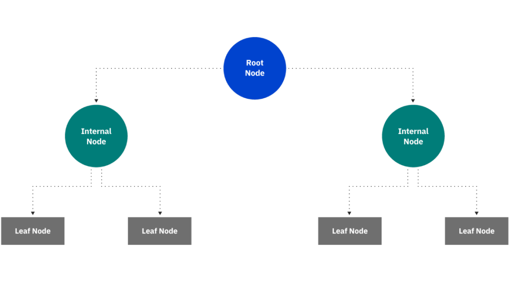
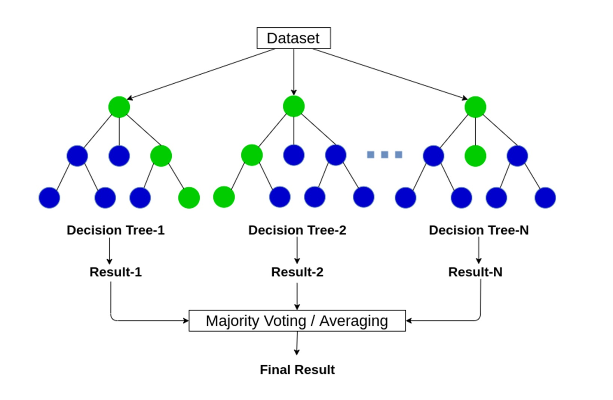

<br> 

The previous class session introduced decision trees as a fundamental algorithm used in machine learning. We also explored how spatially lagged attributes can be used as features in a predictive model as a means of accounting for or representing spillover effects or contagion processes. Recall that in a regression context, the presence of spatial autocorrelation in our data is problematic and something to be removed or at the very least, the basis for treating any inferences with caution. On the other hand `r emo::ji("backhand")` spatial autocorrelation in a machine learning context is viewed as just another source of patterns in the data that we can harness to bolster our predictive accuracy `r emo::ji("happy")`  

This Assignment continues our foray into geospatial machine learning. The assigned readings for this week are available here and may be useful as you make your way through this activity: 

 + Starmer (2018)  [Decision and Classification Trees, Clearly Explained!!!](https://www.youtube.com/watch?v=_L39rN6gz7Y&t=0s)
 + Starmer (2018)  [Regression Trees, Clearly Explained!!!](https://www.youtube.com/watch?v=g9c66TUylZ4)
 + Steif (2021) [Intro to geospatial machine learning, Part 1](https://urbanspatial.github.io/PublicPolicyAnalytics/intro-to-geospatial-machine-learning-part-1.html)
 + Steif (2021) [Intro to geospatial machine learning, Part 2](https://urbanspatial.github.io/PublicPolicyAnalytics/intro-to-geospatial-machine-learning-part-2.html)
<br>

# Setup and Data Wrangling

<br> 

```{r label="Load R Packages", include= FALSE}

library(tidyverse)
library(sf)
library(sfdep)
library(caret)
library(grid)
library(gridExtra)
library(knitr)
library(kableExtra)
library(tidycensus)
library(scales)
library(ggpubr)
library(janitor)
library(rstatix)
library(rattle)
library(tmap)

```

First we load the necessary R packages and as usual, the necessary data have been placed in the **data** folder for you `r emo::ji("cool")` As you read this week (and last week), the general aim of the two Steif chapters is to use observed home price data from Boston to train, apply, and evaluate a predictive model of home prices. However, we will pivot and follow a similar path using local Charlottesville data. We pull down the neighborhood boundaries layer from the Charlottesville open data portal, then apply a map projection to convert the data to a projected coordinate system. This Assignment also integrates data on reported crimes as a factor in predicting residential housing prices. The primary Charlottesville dataset is ready to go, but you should know that it **does not** contain all of the same variables as the Boston dataset from the readings. Instead, we have the following: 


  * PrclNmb: Parcel ID number
  * SalAmnt: Sales price
  * SqrFtFL: Total finished living area in square feet
  * Bedroms: Number of bedrooms
  * FllBthr: Total number of full baths in the structure
  * HlfBthr: Total number of half baths in the structure
  * Fireplc: Indicates if the structure has a fireplace
  * Heating: Type of heating equipment
  * BsmntTy: Type of basement (if at all)  
  * NmbrOfS: Number of levels in the structure located on the parcel
  * ExtrnlW: Primary material of external walls (e.g., brick, wood, etc.)
  * Latitud: Geographic coordinate of parcel centroid
  * Longitd: Geographic coordinate of parcel centroid
  * Age: Age of home in 2021 when these data were compiled
  * LotAcrs: Size of parcel in acres

Eventually, we will add the following features as part of the Assignment: 

  * NumAggAssaults: Number of aggravated assaults reported within one-quarter mile during the previous year (08-15-2020 to 08-15-2021)
  * NeighHood: Name of the neighborhood in which the home is located 

The reported crimes data were [taken from here](https://opendata.charlottesville.org/datasets/charlottesville::crime-data/about) and the remaining variables were pieced together by the instructor from [Real Estate (Residential Details)](https://opendata.charlottesville.org/datasets/charlottesville::real-estate-residential-details/about), [Parcel Details 2](https://opendata.charlottesville.org/datasets/charlottesville::parcel-details-2/about), and [Real Estate (Sales)](https://opendata.charlottesville.org/datasets/charlottesville::real-estate-sales/explore). Let's see what we can do with these data!

<br>

```{r label="Grab the Required Data", warning = FALSE, message = FALSE}

# Get neighborhood polygons from the open data portal in GeoJSON format, 
# then apply a map projection...
nhoods_utm_sf <- 
  st_read("https://gisweb.charlottesville.org/cvgisweb/rest/services/OpenData_1/MapServer/97/query?outFields=*&where=1%3D1&f=geojson") %>%
  st_transform("EPSG:32617")


cvilleHomes_utm <- st_read("./data/cvilleHomes_utm.geojson")


# Collapse the many categories on the number of floors attribute, as we 
# did last week so there is a more manageable number of categories...
cvilleHomes_utm_sf <- 
  cvilleHomes_utm  %>%
  mutate(NmbrOfS.collapse = case_when(
                  NmbrOfS >= 0 & NmbrOfS < 3  ~ "Up to 2 Floors",
                  NmbrOfS >= 3 & NmbrOfS < 4  ~ "3 Floors",
                  NmbrOfS > 4                    ~ "4+ Floors"),
         NmbrOfS.cat = as_factor(NmbrOfS.collapse)) %>%
  filter(SalAmnt > 0.0, 
         SqrFtFL > 0.0) %>% 
  mutate_at(c("Bedroms", "FllBthr", "HlfBthr", "Fireplc"), as.numeric) %>%
  mutate_at(c("Heating", "BsmntTy", "ExtrnlW"), as_factor)


# Read in the reported crimes information... 

cvilleCrimes <- st_read("./data/cvilleCrimes.shp")

cvilleCrimes_utm <- st_transform(cvilleCrimes,  crs = "EPSG:32617")


```

<br> 

```{r fig.height=10, fig.width=16, label = "Manipulate and Visualize Features"}

# Extract only reports of aggravated assault and get rid of observations
# with missing values, then apply consistent map projection...
cvilleAssaults_utm_sf <-
  cvilleCrimes_utm %>%
    filter(Offense == "Assault Aggravated") %>%
    drop_na() %>%
    distinct()

# Note that the LENGTHUNIT for our sf objects is meters...
st_crs(cvilleHomes_utm_sf)

# Create a quarter mile (402.336 meters) buffer around each housing unit
cvilleHomes_utm_quarter_mile_sf <- st_buffer(cvilleHomes_utm_sf, 402.336) 

# Now create a new attribute in the sf object with the number of reported
# aggravated assaults within that buffer...
cvilleHomes_utm_sf <- cvilleHomes_utm_sf %>%
  mutate(NumAggAssaults = lengths(st_intersects(cvilleHomes_utm_quarter_mile_sf, cvilleAssaults_utm_sf)))


# Visualize the location of housing units sold, reported aggravated assaults, 
# and the distance buffer we are using (i.e., in red)...
ggplot() + 
    geom_sf(data = nhoods_utm_sf, aes(fill = "white"), color = "grey25") + 
     geom_sf(data = cvilleAssaults_utm_sf, aes(col = "blue"), pch = 20, size = 2) + 
     geom_sf(data = cvilleHomes_utm_quarter_mile_sf[c(89, 302), ], color = "red", fill = NA) +
     geom_sf(data = st_centroid(cvilleHomes_utm_sf), fill = NA, aes(color = "grey75"), pch = 20, size = 1.2) + 
  scale_fill_manual(name = "Legend", values = c("white", "pink"), labels = c("Neighborhoods", "Example Buffer")) +
  scale_color_manual(name = "", values = c("blue", "grey75"), labels = c("Assaults", "Homes Sold")) +
  theme_void() +   
  theme(text = element_text(size = 20))


```
<br> 

Note that in the map above, the <span style="color:red"> **red circles** </span> are examples of the one-quarter mile buffer used to count the number of reported aggravated assaults near each home in our dataset. In some cases the count is zero and in others we can see that there are multiple blue points. 

<br> 

# Leveraging Spatial Autocorrelation for Prediction

<br> 

In the code chunk below, we use a new R package called _sfdep_ to generate a spatial weights matrix, to create a spatially lagged home price feature, and calculate spatial statistics such as the Global Moran's I. A spatially lagged variable or **feature** is simply the <span style="color:purple"> **weighted average of the sales prices of all homes that are considered "neighbors" of this particular home** </span> and this approach is used frequently in spatial econometrics. If the spatial lag of sales prices is an important feature, that would suggest lots of clustering (e.g., Euclidean zoning, segregation based on race/ethnicity/income) in the distribution of residential real estate prices in our study area. This page provides [a little more detail on spatial neighbors in R](https://personal.tcu.edu/kylewalker/spatial-neighbors-in-r.html) and even has an interactive app where you can explore how changing the way "neighboring" relationships are defined might affect the inferences we take away. If you need to use inverse distance weights, [this page demonstrates](https://spatialanalysis.github.io/lab_tutorials/Spatial_Weights_as_Distance_Functions.html#inverse-distance-weights) how to generate them.

<br>

```{r fig.height=10, fig.width=16, label = "Create Spatial Lag of Sales Price and Visualize It"}

# Create a neighbor list for homes sold based on its 5 nearest neighbors....
cvilleHomes_utm_centroids_sf <- st_centroid(cvilleHomes_utm_sf)
cvilleHomes_knn <- sfdep::st_knn(cvilleHomes_utm_centroids_sf, k = 5)

# Create lagged version of sales price for each home sold that is the 
# weighted average of the sales prices of its 5 nearest neighbors...
cvilleHomes_utm_sf <- cvilleHomes_utm_sf %>%
  mutate(lagSalAmnt = sfdep::st_lag(x = .$SalAmnt, nb = cvilleHomes_knn,
                                wt = st_weights(cvilleHomes_knn, allow_zero = TRUE), allow_zero = TRUE))


# Plot sales price against lagged sales price, like the Steif chapter...
ggplot() + 
  geom_point(data = cvilleHomes_utm_sf, mapping = aes(x = lagSalAmnt, y = SalAmnt), fill = "orange", color = "white", 
             alpha = 0.25, pch = 21, size = 3, stroke = 1.2) +
      geom_smooth(data = cvilleHomes_utm_sf, method = "lm", mapping = aes(x = lagSalAmnt, y = SalAmnt), se = FALSE, 
                  color = "green4", alpha = 0.4) +
      labs(title = "Correlation between sale price \n and the spatial lag of sale price", 
           y = "Sale Amount ($)", x = "Mean of 5 Nearest Home Sale Prices ($)") + 
      scale_y_continuous(labels=scales::dollar_format()) +
      scale_x_continuous(labels=scales::dollar_format()) +
      theme_minimal() +
      theme(plot.title = element_text(hjust = 0.5), 
             text = element_text(size = 20))

# Say it another way....
print(str_c("Lagged sales price explains ", 
            round(((summary(
                lm(SalAmnt ~ lagSalAmnt, data = cvilleHomes_utm_sf))$adj.r.squared) * 100), 2),
            " percent of the variation in observed home sales prices.")
            )


# Test for presence of spatial autocorrelation in home sales prices...
cvilleHomes_moran <- sfdep::global_moran_test(x = cvilleHomes_utm_sf$SalAmnt,  nb = cvilleHomes_knn,
                                wt = st_weights(cvilleHomes_knn, allow_zero = TRUE))

cvilleHomes_moran


```

<br>

In the above code chunk, the scatterplot shows that as sales price increases, so does the price of nearby houses&mdash;and vice versa. Creating a spatially lagged feature is one approach for leveraging spatial autocorrelation in a predictive model like this, but we could also use neighborhood boundaries as a proxy for similar spillover effects `r emo::ji("oops")`

That chunk also performs a [Global Moran's I](https://gisgeography.com/spatial-autocorrelation-moran-i-gis) test for spatial autocorrelation using the `sfdep::global_moran_test` function. The significant _p_-value indicates that the result is statistically significant, while the 0.85 value of the I statistic itself suggests the presence of strong, positive spatial autocorrelation (i.e., homes with high sales prices are likely to be located near other homes with high sales prices). 

<br>

```{r label = "More Feature Engineering"}

# Link neighborhood attributes to home sales dataset...
cvilleHomes_utm_sf <- st_join(cvilleHomes_utm_sf, nhoods_utm_sf, join = st_within, left = TRUE)
dim(cvilleHomes_utm_sf)


# Now filter out unwanted obserations and make the neighborhood
# attribute a factor rather than a character type...
cvilleHomes_utm_sf <- cvilleHomes_utm_sf %>%
  filter(SalAmnt > 0.0, 
         SqrFtFL > 0.0, 
         is.na(NeighHood) == FALSE) %>%
   mutate_at("NeighHood", as_factor)

dim(cvilleHomes_utm_sf)

```
<br> 

# Begin With A Single Decision Tree Model

<br> 

The code chunk below partitions (divides) the dataset into two pieces&mdash;a [training dataset](https://en.wikipedia.org/wiki/Training,_validation,_and_test_data_sets#Training_data_set) with approximately 75 percent of the observations and a [test dataset](https://en.wikipedia.org/wiki/Training,_validation,_and_test_data_sets#Test_data_set) with the remaining approximately 25 percent of the observations. It also stratifies on neighborhood name. We use the `caret::trainControl` function to set up the standard _k_-folds cross-validation routine with _k_ = 10, but it could just as easily be 5 folds as illustrated in the image below.

<br>

<center>  </center>

<br> 

As described in class, _k_-folds cross-validation can help us avoid [overfitting](https://www.ibm.com/topics/overfitting) and assist with tuning hyperparameters for a given machine learning algorithm. Cross-validation involves randomly dividing the data into _k_ "slices" or **folds** of roughly the same size. The first **fold** is treated as a validation set and we train the model on the remainder of the data (i.e., the other 9 slices if _k_ = 10). Next, we calculate the Mean Squared Error or another performance metric when the trained model is applied to the one **fold** that has been set aside. We repeat this process _k_ times with a different **fold** or "slice" acting as the validation set. This technique provides us with _k_ estimates of the test error rate as opposed to the single test error rate that we would otherwise have from the training set. 

<br>

As mentioned in class, the _caret_ package currently supports over 230 algorithms and by setting the **method** argument of the `caret::train` function  to "rpart", we are fitting a simple decision tree model. Because the outcome we are predicting is continuous rather than categorical, it is a regression tree rather than a classification tree. 

<br> 


```{r label="Split the Dataset and Fit Initial Tree Model", warning = FALSE, message = FALSE}

# This allows us to reproduce the results in the future...
set.seed(42)  

#################################################################################
# This function is part of the caret package and the y argument outlines
# how to stratify the data. From the documentation "the sample is split 
# into groups sections based on percentiles and sampling is done within 
# these subgroups" and the paste function simply concatenates several features. 
#
# This allows us to stratify on multiple features rather than just the outcome
# we are trying to predict (i.e., the training and test sets are more comparable)
#################################################################################
inTrain <- createDataPartition(
              y = cvilleHomes_utm_sf$NeighHood, 
              p = 0.75, list = FALSE)

cville_training <- cvilleHomes_utm_sf[inTrain, ] 
cville_testing <- cvilleHomes_utm_sf[-inTrain, ]  

cville_training %>%
  st_drop_geometry() %>%
  rstatix::get_summary_stats()

cville_testing %>%
  st_drop_geometry() %>%
  rstatix::get_summary_stats()


# Set up for standard, 10 fold cross-validation...
tree_ctrl <- trainControl(method = "cv", number = 10)

tree_model <- train(SalAmnt ~ SqrFtFL + Bedroms + FllBthr + Age + LotAcrs + Fireplc + NmbrOfS.cat + NumAggAssaults, 
                                  data = cville_training %>% 
                                  st_drop_geometry() %>%
                                  drop_na() %>%
                                  dplyr::select(SalAmnt, SqrFtFL, Bedroms, FllBthr, Age, LotAcrs, Fireplc, 
                                                NmbrOfS.cat, NumAggAssaults, PrclNmb),
                    method = "rpart",
                    trControl = tree_ctrl,
                    tuneLength = 10)

print(tree_model)


```
<br> 

### A Tool For Assessing Feature Importance

<br>

```{r label="Show Important Features from Initial Tree Model"}

# Note the scale argument defaults to TRUE and the importance values are 
# normalized to range between 0 and 100...
caret::varImp(tree_model)

# We can avoid this normalization by setting the scale argument to FALSE
tree_model_importance <- caret::varImp(tree_model, scale = FALSE) 

# We can also visualize the most important features in our model this way...
plot(tree_model_importance, top = 5)

```

<br>

In the above chunk, we introduce the `caret::varImp` function which [provides insight into which features](https://topepo.github.io/caret/variable-importance.html) we have included in the model are most important for making th resulting predictions. Without getting too much into the weeds, `r emo::ji("tree")` this function involves permuting the values of a given feature, re-estimating the model, and noting how much the prediction error changes on average^[Friedman, J. H. (2001). Greedy function approximation: A gradient boosting machine. Annals of Statistics, 29(5), 1189-1232.].


We fit the model on the training dataset in the above code chunk, then we applied it to the test dataset in the code chunk above using the `predict` function in the code chunk below. The MAE and the Absolute Percent Error are also calculated based on the known sales price **AND** the predicted sale prices from the model.

<br>

```{r fig.height=10, fig.width=16, label = "Visualize Sale Prices and Prediction Errors"}

cville_testing_no_geometry <-
  cville_testing %>%
  st_drop_geometry() %>%
  drop_na() %>%
  dplyr::select(SalAmnt, SqrFtFL, Bedroms, FllBthr, Age, LotAcrs, Fireplc, 
                                                NmbrOfS.cat, NumAggAssaults, PrclNmb)

tree_model_testing <- predict(tree_model, cville_testing_no_geometry)

outputPredictions <- cville_testing_no_geometry %>%
  mutate(                          
         SalePrice_AbsError = abs(tree_model_testing - cville_testing_no_geometry$SalAmnt),
         SalePrice_APE = ((abs(tree_model_testing - cville_testing_no_geometry$SalAmnt)) / tree_model_testing) * 100) %>%
  filter(SalAmnt < 5000000)


# Assess accuracy...
mean(outputPredictions$SalePrice_AbsError, na.rm = T)

mean(outputPredictions$SalePrice_APE, na.rm = T)

# Map model performance...

cville_testing_to_plot <- left_join(cville_testing, outputPredictions %>%
                                      select(PrclNmb, SalePrice_AbsError, SalePrice_APE), 
                                    by = "PrclNmb")

tmap_mode("view") 

cville_testing_to_plot <- st_make_valid(cville_testing_to_plot) %>%
  drop_na(SalePrice_AbsError)

tm_shape(nhoods_utm_sf, name = "Neighborhoods") + 
  tm_borders(col = "dodgerblue") + 
  tm_shape(cville_testing_to_plot, "Prediction Error of Simple Regression Tree Model") + 
  tm_dots(shape = 21, col = "SalePrice_AbsError", palette = "viridis", 
          style = "quantile", colorNA = "orange", textNA = "Unknown", title = "Absolute Error ($)",
          popup.vars = c("Sale Amount: " = "SalAmnt", "Square Footage: " = "SqrFtFL", 
                         "Lot (Acres): " = "LotAcrs", "% Prediction Error: " = "SalePrice_APE"),
          legend.format = list(fun = function(x) paste0("$", formatC(x, digits = 0, big.mark=',', format = "f"))),
          id = "PrclNmb") +
  tmap_options(check.and.fix = TRUE) + 
  tm_view(set.view = c(-78.4837122981158, 38.03437353596851, 13)) + 
  tm_basemap(c("Esri.WorldGrayCanvas", "CartoDB.Positron", "Esri.WorldTopoMap", "CartoDB.DarkMatter"))


```
<br>

These metrics and the interactive map give us a sense of how well the model performs when applied to **new** data. Celebrate! `r emo::ji("party")` 

<br>

```{r fig.height=10, fig.width=16, label = "Visually Represent the Tree Model"}

fancyRpartPlot(tree_model$finalModel, main = "Simple Decision Tree Model", sub = "Charlottesville Housing Sales", digits = -3)

```

<br> 

The code chunk above uses a new R package called _rattle_ to visually display the decision tree created when we trained our model. Recall that decision trees are "grown" and read from the top to the bottom. Although the **cville_training** set contains 1546 observations, the model is fit using 1233 of these due to filtering of missing data values in a prior chunk. We can see in the figure that the first split is based on the **SqrFtFL** (i.e., the square footage of the home) feature and branches to the left if an observation is less 2,816 square feet and to the right otherwise. From there, other important features like , **FllBthr** (i.e., number of full bathrooms), **LotAcrs** (i.e., size of the lot), and **Age** (i.e., how old is the home?). 

<br> 

<center>  </center>


At each internal node (i.e., between the root node and the leaves or terminal nodes), the plot displays the number and percentage of observations that "flow" through that node of the decision tree, as well as what the model would predict as the sales price. 

<br>

# From A Single Decision Tree To A Random Forest

<br> 

In this section of the Assignment, we train a model using the random forest algorithm from the _randomForest_ package by setting the **method** argument of the `caret::train` function to _"rf"_ rather than _"rpart"_ which trains a simple regression tree model. So what distinguishes the random forest algorithm from a simple decision tree algorithm? Before we can answer that question, we have to introduce the concept of bagging (more information in the next class session): 

> Bootstrap aggregating of bagging "creates _b_ new bootstrap samples by drawing samples with replacement of the original training data. Bagging, is one of the first ensemble algorithms machine learning practitioners learn and is designed to improve the stability and accuracy of regression and classification algorithms. By model averaging, bagging helps to reduce variance and minimize overfitting. Although it is usually applied to decision tree methods, it can be used with any type of method.
>
> [Boehmke & Greenwell (2020)](https://bradleyboehmke.github.io/HOML/bagging.html)

A random forest is a special type of bagged ensemble model where a large number of individual decision trees (e.g., hundreds or thousands) are generated, but these individual trees are de-correlated. This means that each time a split is to be performed, the search for the split variable is limited to a random subset of **mtry** (i.e., one of the algorithm's hyperparamters) of the total number of features available.  


<center>  </center> 


So why is the random forest algorithm popular? 

  + A simple decision tree is **unlikely** to deliver high predictive accuracy because deep trees tend to have high variance (and low bias) and shallow trees tend to be overly biased (but exhibit low variance)
  + A random forest is a type of [ensemble model](https://machinelearningmastery.com/tour-of-ensemble-learning-algorithms) where we create many different individual trees each time and all of them contribute to the final prediction (average across all trees)
  + At each **split** only a subset of the features in the model are tested, which de-correlates the trees and avoids a situation where the strongest predictors always appear near the top
  + Random forest algorithms perform well with little tuning and are less susceptible to overfitting, but they are less interpretable and more of a "black box" than simple decision trees
  
```{r label = "Train Random Forest Model"}

# Set up for standard, 10 fold cross-validation...
tree_ctrl <- trainControl(method = "cv", number = 10)

rf_model <- train(SalAmnt ~ SqrFtFL + Bedroms + FllBthr + Age + LotAcrs + Fireplc + NmbrOfS.cat + NumAggAssaults, 
                                  data = cville_training %>% 
                                  st_drop_geometry() %>%
                                  drop_na() %>%
                                  dplyr::select(SalAmnt, SqrFtFL, Bedroms, FllBthr, Age, LotAcrs, Fireplc, 
                                                NmbrOfS.cat, NumAggAssaults, PrclNmb, NeighHood, lagSalAmnt),
                    method = "rf",
                    trControl = tree_ctrl,
                    tuneLength = 10)

print(rf_model)
varImp(rf_model, scale = FALSE)

rf_model_importance <- varImp(rf_model, scale = TRUE)
plot(rf_model_importance, top = 5)


```

<br> 

You should also recall that _caret_ supports over 230 machine learning algorithms and there are multiple variations on the random forest algorithm. As [shown in the documentation](https://topepo.github.io/caret/train-models-by-tag.html#Random_Forest) there are multiple options for the **method** argument of the `caret::train` function that train a random forest, but the one we have selected here has a single hyperparameter&mdash;it is called **mtry** and represents the number of features to consider at each split point. This means that values of **mtry** may range between 1 and the total number of features in your model. Another approach would be to use `method = 'ranger'` to train a random forest algorithm using the _ranger_ package, which allows us to tune two additional hyperparameters&mdash;**splitrule** and **min.node.size**. You could find more information on these two hyperparamters by [referring to the documentation](https://www.rdocumentation.org/packages/rpart/versions/4.1.16/topics/rpart.control) of the R package that _caret_ is calling in the background, which is [_ranger_](https://search.r-project.org/CRAN/refmans/ranger/html/ranger.html) in that alternate case but is [_randomForest_](https://cran.r-project.org/web/packages/randomForest/index.html) in our present example. 

<br> 

```{r fig.height=10, fig.width=16, label = "Visualize Sale Prices and Prediction Errors from RF Model"}

cville_testing_no_geometry <-
  cville_testing %>%
  st_drop_geometry() %>%
  drop_na() %>%
  dplyr::select(SalAmnt, SqrFtFL, Bedroms, FllBthr, Age, LotAcrs, Fireplc, 
                                                NmbrOfS.cat, NumAggAssaults, PrclNmb, NeighHood, lagSalAmnt)

rf_model_testing <- predict(rf_model, cville_testing_no_geometry)

outputPredictions_rf <- cville_testing_no_geometry %>%
  mutate(                          
         SalePrice_AbsError = abs(rf_model_testing - cville_testing_no_geometry$SalAmnt),
         SalePrice_APE = ((abs(rf_model_testing - cville_testing_no_geometry$SalAmnt)) / rf_model_testing) * 100) %>%
  filter(SalAmnt < 5000000)


# Assess accuracy...
mean(outputPredictions_rf$SalePrice_AbsError, na.rm = T)

mean(outputPredictions_rf$SalePrice_APE, na.rm = T)


# Create interactive map of RF model errors...

cville_testing_rf_to_plot <- left_join(cville_testing, outputPredictions_rf %>%
                                      select(PrclNmb, SalePrice_AbsError, SalePrice_APE), 
                                    by = "PrclNmb")
tmap_mode("plot")

tmap_mode("view") 

cville_testing_rf_to_plot <- st_make_valid(cville_testing_rf_to_plot) %>%
  drop_na(SalePrice_AbsError)

tm_shape(nhoods_utm_sf, name = "Neighborhoods") + 
  tm_borders(col = "dodgerblue") + 
  tm_shape(cville_testing_rf_to_plot, "Prediction Error of Random Forest Model") + 
  tm_dots(shape = 21, col = "SalePrice_AbsError", palette = "inferno", 
          style = "quantile", colorNA = "orange", textNA = "Unknown", title = "Absolute Error ($)",
          popup.vars = c("Sale Amount: " = "SalAmnt", "Square Footage: " = "SqrFtFL", 
                         "Lot (Acres): " = "LotAcrs", "% Prediction Error: " = "SalePrice_APE"),
          legend.format = list(fun = function(x) paste0("$", formatC(x, digits = 0, big.mark=',', format = "f"))),
          id = "PrclNmb") +
  tmap_options(check.and.fix = TRUE) + 
  tm_view(set.view = c(-78.4837122981158, 38.03437353596851, 13)) + 
  tm_basemap(c("Esri.WorldGrayCanvas", "CartoDB.Positron", "Esri.WorldTopoMap", "CartoDB.DarkMatter"))


```


# Accounting for Neighborhood

Sometimes real estate characteristics are constant across properties in the same neighborhood (e.g., access to a common swimming pool or walking trails) and the code chunk below uses the name of the neighborhood as a proxy for <span style="color:purple">**all those unobserved characteristics that vary across neighborhoods** </span> in Charlottesville, but that <span style="color:purple"> **are the same for homes located within a given neighborhood** </span>. Let's use the _rstatix_ package to quickly get a sense of how well the random forest model performed **across** neighborhoods in Charlottesville.  `r emo::ji("flex")`  

<br>

```{r label="Inspect Sale Price Prediction Error By Neighborhood", message = FALSE, warning=FALSE}


kbl(
cville_testing_rf_to_plot %>%
  st_drop_geometry() %>%
  group_by(NeighHood) %>%
  rstatix::get_summary_stats(SalePrice_AbsError),
  digits = 3, align = "lccrr", caption = "Observed Versus Predicted Sales Price by Neighborhood") %>%
  kable_paper("hover", full_width = TRUE)


```

<br> 

The above code chunk enlists the `kableExtra::kbl` function to gently format a table for us. You can learn more about [this function here](https://cran.r-project.org/web/packages/kableExtra/vignettes/awesome_table_in_html.html), but I have not found table formatting to be a particularly useful place to channel effort. Packages like *formattable* and *pixiedust* are reviewed at the links below if you want to take a deeper dive into table formatting: 

   + [Little Miss Data blog](https://www.littlemissdata.com/blog/prettytables)
   + [R for the Rest of Us blog](https://rfortherestofus.com/2019/11/how-to-make-beautiful-tables-in-r)
<br> 

As outlined in [greater detail here](https://urbanspatial.github.io/PublicPolicyAnalytics/intro-to-geospatial-machine-learning-part-2.html#generalizability-of-the-neighborhood-model), the neighborhood effects model not only fits our data better, it is also likely to perform better when it "sees new data" its accuracy is more consistent across neighborhoods. This speaks directly to Steif's definition of **generalizability** which consists of: 

> "... the ability to predict accurately on new data - which was the focus of cross-validation in Chapter 3" and "...the ability to predict with comparable accuracy across different group contexts, like neighborhoods" otherwise, "...the algorithm may not be fair" and frankly not very useful...

Recall the plot of RMSE and R-Squared across the _k_-Folds validation from Lab Exercise #6 that we can access like this `rf_model$resample`. Those plots speak to the first aspect of **generalizability** as articulated here&mdash;whether the model performs at a comparable level when it "sees new data" that have not been used to train and test it. The table displayed here instead addresses the second aspect of **generalizability** and provides insight into whether the model's accuracy is consistent across neighborhoods.   

When you have read and understand what the preceding code chunks are doing, please proceed... `r emo::ji("queen")`  

---

### Exercise  

<br>
This exercise asks you to experiment with two features that we created, but that we have not yet included in our models&mdash;**NeighHood** and **lagSalAmnt**.  By drawing on code in the three preceding code chunks, write your own code that trains and tests a random forest model that includes **NeighHood** and an alternate that includes **lagSalAmnt** then respond to the questions posed below:      

1. For your random forest model that includes **NeighHood** as a feature:    
   + Which Charlottesville neighborhoods are most influential in predicting sales price? 
   + Does adding this feature improve model performance relative to the results from the two preceding code chunks? 
2. For your random forest model that includes **lagSalAmnt** as a feature:    
   + Does adding this feature improve model performance relative to the results from the two preceding code chunks? 
   + How might you explain what this feature is capturing? 
3. Choose one of the two random forest models you have trained and tested. 
   + How well did your model perform across neighborhoods? Are there specific neighborhoods where your selected model performs best? Are there specific neighborhoods where your selected model performs best? **Hint:** take another look at the "Inspect Sale Price Prediction Error By Neighborhood" chunk above.  
   + Can you think of some additional features that might help improve the performance of your model?
   + Briefly describe the steps that would need to be taken in order to apply your selected model to Staunton, Fredericksburg, Roanoke, etc. 
4. If the random forest algorithm has an [Achilles' heel](https://en.wikipedia.org/wiki/Achilles%27_heel), it is the presence of correlated features. If we run a line of code like `DataExplorer::plot_correlation(cville_training %>% drop_na() %>% select(SalAmnt, SqrFtFL, Bedroms, FllBthr, Age, Fireplc, LotAcrs, NumAggAssaults))` we see that the presence of a fireplace is highly correlated with sales price **AND** with square footage of the home. Sometimes we can achieve addition through subtraction `r emo::ji("lol")` so let's see if this is one of those times!
   + Does removing **Fireplc** as a feature  improve the performance of your model?
   
<br>

---

### Work Products

Please submit an R Notebook and knitted HTML file that shows your work and responses for each of the **Exercise** included in this Assignment. Also, briefly comment on your experience with R this week (i.e., provide the requested _Reflective Content_ described in the rubric below). Please **upload your report to Collab** by **5:00 pm on Friday April 21st**.  

<br>

### Assessment Rubric  

This Lab Exercise will be graded on a 100-point scale according to the rubric below:  

**Length and formatting (10 pts)**  

* Are the Lab Exercise responses provided in an acceptable format (e.g., R Notebook, rendered HTML file, etc.)?
* Is there enough explanatory text to evaluate the work? 

**Clarity of writing and attention to detail (20 pts)**  

* Is the text component clearly written? Please do not rely too heavily on bulleted lists. 
* Are there more than one or two grammatical or typographical errors? Please perform a spelling/grammar check prior to submission.  

**Technical Content  (45 pts)** 

* Are the requested graphics, tables, etc. included and intelligible?
* Does the submission explicitly and thoroughly respond to any questions posed?   
* Please explain why you reached the conclusions you did when responding to the questions posed.

**Reflective Content  (25 pts)** 

* Does the response reflect on the procedures used (i.e., what am I clicking and why?)?
* Is there evidence that the student understands how the substance of the Lab Exercise relates to concepts from the lectures/readings and/or how the substance of the Lab Exercise might be applied in the work planners (or you personally) do? 

<br>
<center> <font size="2"> © Bev Wilson 2023 | Department of Urban + Environmental Planning | University of Virginia </font> </center>
<br>


