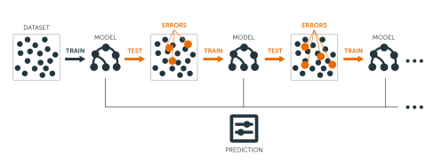

<br>

This week's Lab Assignment takes a closer look at gradient boosting as a strategy for improving predictive capacity. The defining characteristic of boosting is that we sequentially add trained models to an ensemble with each subsequent model explicitly focused on correcting for the errors of its predecessor. In addition to exploring the **gbm** algorithm, we will also consider the practical questions that arise when applying these tools to real-world datasets (e.g., what to do if I suspect my model is overfitted?) `r emo::ji("scream")` We will use two datasets this week&mdash;the first seeks to understand the drivers of [observed demolitions](http://www.portlandchronicle.com) of single-family (detached) residential housing units in Portland, Oregon over several years. Portland has grappled with [gentrification and displacement for many years](https://www.theatlantic.com/national/archive/2016/08/albina/623360) and there are studies that link the [demolition of housing units to gentrification](https://www.tandfonline.com/doi/pdf/10.1111/j.0735-2166.2006.00257.x). However, before we dive into the modeling component of the Lab Assignment, let's explore the data a little. 

### Data Wrangling and EDA 

```{r setup, message=FALSE, label = "Load Packages and Data", include = FALSE}

library(caret)
library(FNN)
library(ggmap)
library(ggpubr)
library(magick)
library(gifski)
library(gganimate)
library(ISLR)
library(psych)
library(rpart)
library(rpart.plot)
library(rsample)
library(sf)
library(tidyverse)
library(RColorBrewer)
library(sfdep)
library(Metrics)
library(gbm)
# install.packages("remotes")
library(remotes)
# remotes::install_github("ModelOriented/treeshap")
library(treeshap)
library(shapviz)
library(tmap)
# remotes::install_github("hadley/emo")
library(emo)
library(janitor)


# Turns off scientific notation in output
options(scipen = 999)

portland_demolitions <- st_read("./data/residential_demolitions_2014_2019.shp")

portland_2014_2018 <- read_csv("./data/portland_2014_2018.csv") 
portland_2019 <- read_csv("./data/portland_2019.csv") 

```

<br> 
The **sf** object called `portland_demolitions` is based on an older version of [this dataset](https://gis-pdx.opendata.arcgis.com/datasets/3c28e4e1acb44b04a43253b887852c44_126) available on the Portland open data portal. If you are curious about its attributes, take a look at the metadata there, but we mainly want to plot the points to get a feel for the pattern of residential demolitions over time in the city. 

We also now have a dataset with observations from 2014 to 2018 and a second dataset with observations from 2019 in memory. In both cases, the set of demolished properties was combined with a random sample of single-family (detached) residential properties that existed in 2014 but **were not demolished** as a control. A description of what the columns (variables) each of these datasets contains is given in the image below: 

<br>
<center> {width=750px}</center>  
<br>

The **BLDGTOTVAL** feature is of particular interest due to its connection to the [rent-gap theory](https://en.wikipedia.org/wiki/Rent-gap_theory) of gentrification posited by Neil Smith in the late 1970s. The idea is that gentrification is more likely to occur in neighborhoods with a high proportion of real estate where **the land is valued much more highly** than the **structure itself** and so demolishing housing units like those and replacing them with the "highest and best use" is a strategy for extracting profits from the city. 

Let's do some quick exploratory data analysis before proceeding. 

```{r fig.height=10, fig.width=16, label = "Quick EDA"}

# Read the Portland basemap so we do not have to retrieve it from the web

load(file = "./data/pdx_basemap.RData")

portland_demolitions_wgs84 <- st_transform(portland_demolitions, 4326)
                                           
demos_map <- ggmap(pdx_basemap) +
  geom_point(data = portland_demolitions_wgs84, aes(color = as_factor(DEMOYEAR), 
    x = st_coordinates(portland_demolitions_wgs84)[,1], 
    y = st_coordinates(portland_demolitions_wgs84)[,2])) +
    scale_color_brewer(palette = "Spectral") +
    theme_classic() +
    theme(axis.line = element_blank(), axis.text = element_blank(),
        axis.ticks = element_blank(), axis.title = element_blank(), 
        legend.title = element_blank())


demos_hist <- ggplot(portland_demolitions_wgs84, aes(x = DEMOYEAR)) +
  geom_histogram(bins = 6, fill = brewer.pal(n = 6, name = "Spectral"), color="#e9ecef", alpha=0.9) + 
  theme(plot.title = element_text(hjust = 0.5), 
        axis.text.x = element_text(face="bold", size=10)) + 
  scale_x_continuous(breaks = seq(2014, 2020, by = 1)) +
  labs(x = "Year", y = "", caption = "Source: City of Portland Open Data Portal") + 
  theme_minimal() + 
  theme(panel.border = element_blank(), panel.grid.major = element_blank(), panel.grid.minor = element_blank())


ggpubr::ggarrange(demos_map, demos_hist)

ggplot2::ggsave("./plots/demolitions_map_and_hist.png", width = 18, height = 8, bg = "white")

table(portland_demolitions$DEMOYEAR)


# Create annual animation...

ggmap::ggmap(pdx_basemap) +
  geom_sf(data = portland_demolitions_wgs84, mapping = aes(color = as_factor(DEMOYEAR)), size = 3, alpha = 0.8, pch = 20, inherit.aes = FALSE) + 
    labs(title = 'Demolitions in: {frame + 2013}', subtitle = "Single-Family (Detached) Residential Properties") +
    scale_color_brewer(palette = "Set1") +
    theme_classic() +
    theme(plot.title = element_text(hjust = 0.5, size = 20), 
          plot.subtitle = element_text(hjust = 0.5, size = 14), 
          axis.line = element_blank(), axis.text = element_blank(),
          axis.ticks = element_blank(), axis.title = element_blank(), 
          legend.title = element_blank()) +
gganimate::transition_manual(as.integer(DEMOYEAR))


# Save the last animation for sharing via email...
gganimate::anim_save(filename = "./plots/locations_of_demolished_structures_by_year.gif")


```

Now that we have a feel for where demolitions occurred in Portland and the volume by year, we can turn our attention to fitting models. 

### Fit Initial Classification Model 

In the code chunk below, we use the `set.seed` function to assign a starting value to the random number generator built into R so that we can replicate the analysis later. This part of the Assignment uses the **method = gbm** algorithm to predict which housing units will be torn down. Like [random forests](https://youtu.be/v6VJ2RO66Ag), GBMs are an ensemble model based on decision trees in that they leverage the strength of many less robust models to improve predictive accuracy, but what distinguishes a GBM is that the algorithm builds trees one at a time and [each new tree actively seeks to correct errors made by the previously trained tree](https://en.wikipedia.org/wiki/Gradient_boosting). Targeting observations in the training data where the previously fit model performed poorly and attempting to improve prediction for those cases is called **boosting**, but this also means that GBMs are prone to overfitting (i.e., predicts the training data very well, but is not generalizable to new data).   

<br> 

```{r label = "Split the Dataset and Assess Balance"}

# For the sake of reproducibility...
set.seed(1984)

# First, we partition the 2014-2018 data into training and test sets....
inTrain <- createDataPartition(
              y = portland_2014_2018$DEMOLISHED, 
              p = 0.80, list = FALSE)

portland_2014_2018_train <- portland_2014_2018[inTrain, ] 
portland_2014_2018_test <- portland_2014_2018[-inTrain, ]  

##################################################################
# Check the distribution in original data and partitioned data
# and note that the proportion of demolished and non-demolished
# housing units is comparable in both.
##################################################################
portland_2014_2018_train %>%
  st_drop_geometry() %>%
  rstatix::get_summary_stats()

portland_2014_2018_test %>%
  st_drop_geometry() %>%
  rstatix::get_summary_stats()


tabyl(portland_2014_2018_test$DEMOLISHED)
tabyl(portland_2014_2018_train$DEMOLISHED)

```

<br> 

For classification (i.e., categorical dependent variables), the decision tree-based algorithms predict the probability that a given observation belongs to a particular class or category (e.g., it was torn down). In the code chunk below, we use the _caret_ package to fit a gradient boosted classification tree model where the outcome is demolition (i.e., was the dwelling unit demolished or not?), but this is just one of many algorithm options for fitting decision tree models in R with the _caret_ package. 

<br> 

There are several resources available that go into greater detail with bootstrap aggregation including [this post from R Bloggers](https://www.r-bloggers.com/2017/06/machine-learning-explained-bagging) and [this tutorial](https://datasciencelessons.wordpress.com/2019/08/05/learn-bagged-trees-for-classification-in-r). As mentioned in class, **bagging** is a technique that combines the predictions of many, many high variance models (i.e., decision trees) in order to enhance predictive capacity. If you were doing this kind of work professionally or for a thesis, you might combine **bagging** with **boosting** which iteratively attempts to correct the errors of the previous model by weighting incorrect predictions more heavily as the overall model is refined. The chapter in the Boehmke and Greenwell (2020) [text](https://bradleyboehmke.github.io/HOML/gbm.html) that you read this week covers this in detail. 

<br>

<center> {width=650px} <br> Source: Boehmke & Greenwell (2020) </center>

<br> 

The short video from the syllabus for this week does a fantastic job of walking through the custom grid search as applied to hyperparameters and [can be accessed here](https://www.youtube.com/watch?v=xGZVxxvgzI4) if you have four minutes to spare `r emo::ji("tired")` Take a few moments to refresh your memory of the help documentation for the `train` and the `trainControl` functions, then proceed with the code chunk below. 

<br>

```{r fig.height=10, fig.width=16, label = "Fit Initial GBM Model and Assess Performance"}

# Set up for standard, 10 fold cross-validation...
gbm_ctrl <- trainControl(method = "cv", number = 10)

# Because our dependent variable is categorical, we set 
# the methods argument to "class" for classification...
gbm_model <- caret::train(as_factor(DEMOLISHED) ~ BLDGTOTVAL + PARCELSIZE + AGE_2014 + 
                    WScore + TScore + Pop.Density,
  data    = portland_2014_2018_train,
  method  = "gbm", 
  trControl = gbm_ctrl,
  tuneLength = 3, verbose = FALSE
)

# Examine the output in both text and visual format...
gbm_model

# Using accuracy...
ggplot(gbm_model) + 
  labs(title = "How Does Accuracy Vary Across Our Two Primary Hyperparameters?",
     subtitle = "Initial gbm Model", x = "Number of Trees") +
  theme_minimal() + 
  theme(plot.title = element_text(hjust = 0.5, size = 18), 
          plot.subtitle = element_text(hjust = 0.5, size = 14))

# Using kappa...
ggplot(gbm_model, metric = "Kappa") + 
  labs(title = "How Does Accuracy Vary Across Our Two Primary Hyperparameters?",
     subtitle = "Initial gbm Model", x = "Number of Trees") +
  theme_minimal() + 
  theme(plot.title = element_text(hjust = 0.5, size = 18), 
          plot.subtitle = element_text(hjust = 0.5, size = 14))


# Retrieve more detailed info and display it graphically...
summary(gbm_model)

plot(x = varImp(gbm_model, scale = TRUE), nVar = 5, main = "Five Most Influential Predictors of Demolition",
     sub = "Initial gbm Model")


```


<br>

<center> {width=500px} </center>  

<br>

As noted in [the reading for this week](https://bradleyboehmke.github.io/HOML/gbm.html), the recommended approach for applying a **gbm** algorithm (i.e., general tuning strategy) is to: 

1. Choose a relatively high learning rate. Generally the default value of 0.1 works but somewhere between 0.05–0.2 should work across a wide range of problems.
2. Determine the optimum number of trees for this learning rate.
3. Fix number of trees hyperparameter and tune learning rate and assess speed vs. performance.
4. Tune tree-specific parameters for decided learning rate.
5. Once tree-specific parameters have been found, lower the learning rate to assess for any improvements in accuracy.
6. Use final hyperparameter settings and increase CV procedures to get more robust estimates. Often, the above steps are performed with a simple validation procedure or 5-fold CV due to computational constraints. If you used k-fold CV throughout steps 1–5 then this step is not necessary.

Let's implement this approach `r emo::ji("smile")`

<br>

```{r label = "Consider Other Values for n.trees Hyperparameter"}

gbm_Grid <-  expand.grid(interaction.depth = 3, 
                        n.trees = c(100, 150, 200, 500), 
                        shrinkage = 0.1,
                        n.minobsinnode = 10)

gbm_model_revised <- caret::train(as_factor(DEMOLISHED) ~ BLDGTOTVAL + PARCELSIZE + AGE_2014 + 
                    WScore + TScore + Pop.Density,
            data    = portland_2014_2018_train,
            method  = "gbm", 
            trControl = trainControl(method = "cv", number = 50),
#            tuneLength = 3)
            tuneGrid = gbm_Grid, verbose = FALSE)


# Examine the output in both text and visual format...
gbm_model_revised


# Using accuracy...
ggplot() + 
  geom_line(gbm_model_revised$results, mapping = aes(y = Accuracy, x = n.trees), color = "dodgerblue", linewidth = 1.25) + 
  geom_point(gbm_model_revised$results, mapping = aes(y = Accuracy, x = n.trees), color = "blue", shape = 21, size = 4) + 
  labs(title = "How Does Accuracy Vary With Number of Trees?",
     subtitle = "Revised gbm Model", x = "Number of Trees") +
  theme_minimal() + 
  theme(plot.title = element_text(hjust = 0.5, size = 18), 
          plot.subtitle = element_text(hjust = 0.5, size = 14))

# Using kappa...
ggplot() + 
  geom_line(gbm_model_revised$results, mapping = aes(y = Kappa, x = n.trees), color = "pink", linewidth = 1.25) + 
  geom_point(gbm_model_revised$results, mapping = aes(y = Kappa, x = n.trees), color = "firebrick", shape = 0, size = 4) + 
  labs(title = "How Does Kappa Vary With Number of Trees?",
     subtitle = "Revised gbm Model", x = "Number of Trees") +
  theme_minimal() + 
  theme(plot.title = element_text(hjust = 0.5, size = 18), 
          plot.subtitle = element_text(hjust = 0.5, size = 14))


```


As we can see, increasing the **n.trees** hyperparameter did not yield improvement in the model's performance. Let's assume that 100 is the optimal value. The next step in the general tuning strategy is to revisit the learning rate for **our chosen value** for the **n.trees** hyperparameter. 

<br> 


```{r fig.height=10, fig.width=16, label = "Custom Grid Search of Learning Rate Hyperparameter"}

gbm_Grid_shrinkage <-  expand.grid(interaction.depth = 3, 
                        n.trees = 100, 
                        shrinkage = c(0.001, 0.01, 0.1, 0.2),
                        n.minobsinnode = 10)

gbm_model_shrinkage <- caret::train(as_factor(DEMOLISHED) ~ BLDGTOTVAL + PARCELSIZE + AGE_2014 + 
                    WScore + TScore + Pop.Density,
            data    = portland_2014_2018_train,
            method  = "gbm", 
            trControl = trainControl(method = "cv", number = 50),
            tuneGrid = gbm_Grid_shrinkage, 
            verbose = FALSE)


# Examine the output in both text and visual format...
gbm_model_shrinkage


# How stable is the model performance over the 50 cross-validation folds 
# we have requested here (i.e., range, standard deviation, etc.)?
gbm_model_shrinkage$resample %>% 
  as_tibble() %>%
  rstatix::get_summary_stats()


# Does the confidence envelope (in grey) generated by geom_smooth help us to 
# gauge how stable the training error is? 

ggplot() + 
  geom_line(gbm_model_shrinkage$resample, mapping = aes(y = Accuracy, x = seq(1, 50, 1)), color = "dodgerblue", linewidth = 1.25) + 
  geom_point(gbm_model_shrinkage$resample, mapping = aes(y = Accuracy, x = seq(1, 50, 1)), color = "blue", shape = 0, size = 4) + 
  geom_smooth(gbm_model_shrinkage$resample, mapping = aes(y = Accuracy, x = seq(1, 50, 1)), method = "lm", inherit.aes = FALSE) +
  labs(title = "How Does Accuracy Vary Across CV Folds?",
     subtitle = "Revised gbm Model Varying Shrinkage", x = "cv Fold") +
  theme_minimal() + 
  theme(plot.title = element_text(hjust = 0.5, size = 18), 
          plot.subtitle = element_text(hjust = 0.5, size = 14))


ggplot() + 
  geom_line(gbm_model_shrinkage$resample, mapping = aes(y = Kappa, x = seq(1, 50, 1)), color = "pink", linewidth = 1.25) + 
  geom_point(gbm_model_shrinkage$resample, mapping = aes(y = Kappa, x = seq(1, 50, 1)), color = "firebrick", shape = 0, size = 4) + 
  geom_smooth(gbm_model_shrinkage$resample, mapping = aes(y = Kappa, x = seq(1, 50, 1)), method = "lm", inherit.aes = FALSE) +
  labs(title = "How Does Kappa Vary Across CV Folds?",
     subtitle = "Revised gbm Model Varying Shrinkage", x = "cv Fold") +
  theme_minimal() + 
  theme(plot.title = element_text(hjust = 0.5, size = 18), 
          plot.subtitle = element_text(hjust = 0.5, size = 14))


```

<br> 


```{r fig.height=10, fig.width=16, label = "Tune Tree-Specific Parameters for Chosen Learning Rate"}

gbm_Grid_final <-  expand.grid(interaction.depth = c(3, 5, 8), 
                        n.trees = 100, 
                        shrinkage = 0.1,
                        n.minobsinnode = c(5, 10, 15))

gbm_model_final <- caret::train(as_factor(DEMOLISHED) ~ BLDGTOTVAL + PARCELSIZE + AGE_2014 + 
                    WScore + TScore + Pop.Density,
            data    = portland_2014_2018_train,
            method  = "gbm", 
            trControl = trainControl(method = "cv", number = 50),
            tuneGrid = gbm_Grid_final, verbose = FALSE)


# Examine the output in both text and visual format...
gbm_model_final


# How stable is the model performance over the 50 cross-validation folds 
# we have requested here (i.e., range, standard deviation, etc.)?
gbm_model_final$resample %>% 
  as_tibble() %>%
  rstatix::get_summary_stats()


# Does the confidence envelope (in grey) generated by geom_smooth help us to 
# gauge how stable the training error is? 

ggplot() + 
  geom_line(gbm_model_final$resample, mapping = aes(y = Accuracy, x = seq(1, 50, 1)), color = "dodgerblue", linewidth = 1.25) + 
  geom_point(gbm_model_final$resample, mapping = aes(y = Accuracy, x = seq(1, 50, 1)), color = "blue", shape = 0, size = 4) + 
  geom_smooth(gbm_model_final$resample, mapping = aes(y = Accuracy, x = seq(1, 50, 1)), method = "lm", inherit.aes = FALSE) +
  labs(title = "How Does Accuracy Vary Across CV Folds?",
     subtitle = "Revised gbm Model Varying Tree-Specifics", x = "cv Fold") +
  theme_minimal() + 
  theme(plot.title = element_text(hjust = 0.5, size = 18), 
          plot.subtitle = element_text(hjust = 0.5, size = 14))


ggplot() + 
  geom_line(gbm_model_final$resample, mapping = aes(y = Kappa, x = seq(1, 50, 1)), color = "pink", linewidth = 1.25) + 
  geom_point(gbm_model_final$resample, mapping = aes(y = Kappa, x = seq(1, 50, 1)), color = "firebrick", shape = 0, size = 4) + 
  geom_smooth(gbm_model_final$resample, mapping = aes(y = Kappa, x = seq(1, 50, 1)), method = "lm", inherit.aes = FALSE) +
  labs(title = "How Does Kappa Vary Across CV Folds?",
     subtitle = "Revised gbm Model Varying Tree-Specifics", x = "cv Fold") +
  theme_minimal() + 
  theme(plot.title = element_text(hjust = 0.5, size = 18), 
          plot.subtitle = element_text(hjust = 0.5, size = 14))


```
<br> 

As we have seen, the `caret::confusionMatrix` function produces a variety of metrics that help us to assess performance of the classification model. In the actual [confusion matrix](https://en.wikipedia.org/wiki/Confusion_matrix) at the top of the output, the numbers on the diagonal represent correctly classified observations, while the numbers off the diagonal represent misclassified observations. The **accuracy rate** is given along with a confidence interval and p-value. The [**kappa statistic**](https://thedatascientist.com/performance-measures-cohens-kappa-statistic/) is also included. Note that for kappa, 1 means perfect agreement and 0 is chance agreement. One rule-of-thumb suggests that kappa values of 0.21-0.40 is fair, 0.41- 0.60 is moderate, 0.61-0.80 is substantial, and 0.81-1.00 is almost perfect agreement. 

<br> 

Note that the tree-specific hyperparameters are related to the complexity of the model and as a result, are one of the levers we have if we feel that we may be overfitting the training data. However, the only real way to know if there is evidence of overfitting is to apply the trained model to the test set and ask whether the predictive performance declines considerably (i.e., evidence of overfitting). For tree-based algorithms, we can reduce the maximum depth of the tree (i.e., lower the **interaction.depth**), increase the size of the training set, reduce the number of features included to those that are the most important, and early stopping techniques (more on that in just a few `r emo::ji("thirty")`)  These are often the opposite of strategies we employ to address underfitting (i.e., to improve predictive performance on the training set) like adding more features and increasing the complexity of the model itself. 

<br>

```{r label = "Apply Fitted Model to Test Set and Visualize Results"}

# Apply model with best hyperparameters to the test set...

predict_gbm_model <- predict(gbm_model_final, portland_2014_2018_test, 
                                  n.trees = gbm_model_final$bestTune$n.trees,
                                  n.minobsinnode = gbm_model_final$bestTune$n.minobsinnode,
                                  interaction.depth = gbm_model_final$bestTune$interaction.depth,
                                  shrinkage = gbm_model_final$bestTune$shrinkage) 

caret::confusionMatrix(as_factor(predict_gbm_model), as_factor(portland_2014_2018_test$DEMOLISHED), positive = "1")
predict_gbm_model_cmatrix <- caret::confusionMatrix(as_factor(predict_gbm_model), as_factor(portland_2014_2018_test$DEMOLISHED), positive = "1")


print(str_c("The final trained model had a best Accuracy of ", 
            round(min(gbm_model_final$results$Accuracy), 3), 
            " which is not terrible, but yielded an Accuracy of ", 
            round(predict_gbm_model_cmatrix$overall[1], 3), 
            " when applied to the test set."
            )
    )

print(str_c("The final trained model had a best Kappa of ", 
            round(min(gbm_model_final$results$Kappa), 3), 
            " which is not terrible, but yielded a Kappa of ", 
            round(predict_gbm_model_cmatrix$overall[2], 3), 
            " when applied to the test set."
            )
    )


# Make point sf object from coordinates for mapping...
portland_2014_2018_test_sf <- st_as_sf(portland_2014_2018_test, coords = c("X_COORD", "Y_COORD"), crs = st_crs(portland_demolitions))

# Map the model performance without overwriting the geometry column...
plot_2014_2018_test_set <- bind_cols(portland_2014_2018_test_sf, predict_gbm_model) %>%
  rename("PREDICTED" = (dim(portland_2014_2018_test_sf)[2] + 1))


plot_2014_2018_test_set <- plot_2014_2018_test_set %>%
  mutate(PERFORM = case_when(
    ((as.character(DEMOLISHED) == as.character(PREDICTED)) ~ "Correct"), 
    ((as.character(DEMOLISHED) == 1 & as.character(PREDICTED) == 0) ~ "False Negative"), 
    ((as.character(DEMOLISHED) == 0 & as.character(PREDICTED) == 1) ~ "False Positive")))


# Plot model predictions with neighborhood boundaries...
neighborhoods_0 <- st_read("https://www.portlandmaps.com/arcgis/rest/services/Public/COP_OpenData_Boundary/MapServer/125/query?outFields=*&where=1%3D1&f=geojson")

neighborhoods <- st_transform(neighborhoods_0, crs = st_crs(portland_demolitions))

ggplot() + 
  geom_sf(data = plot_2014_2018_test_set, aes(fill = PERFORM), shape = 21, size = 3) +
  scale_fill_manual(name = "Performance", breaks = c("Correct", "False Positive", "False Negative"), values = c("green4", "red", "dodgerblue")) +
  geom_sf(data = neighborhoods, color = "grey70", fill = NA) +
  theme_void()


fp <- plot_2014_2018_test_set %>%
  filter(PERFORM == "False Positive") %>% 
ggplot() + 
  geom_sf(aes(fill = PERFORM), shape = 21, size = 3) +
  scale_fill_manual(name = "Performance", breaks = c("Correct", "False Positive", "False Negative"), values = c("green4", "red", "dodgerblue")) +
  geom_sf(data = neighborhoods, color = "grey70", fill = NA) +
  theme_void()

fn <- plot_2014_2018_test_set %>%
  filter(PERFORM == "False Negative") %>% 
ggplot() + 
  geom_sf(aes(fill = PERFORM), shape = 21, size = 3) +
  scale_fill_manual(name = "Performance", breaks = c("Correct", "False Positive", "False Negative"), values = c("green4", "red", "dodgerblue")) +
  geom_sf(data = neighborhoods, color = "grey70", fill = NA) +
  theme_void()

ggarrange(fp, fn)
ggplot2::ggsave("./plots/model_predictions_with_nhood_boundaries.png", width = 18, height = 8, bg = "white")


# Plot model predictions with Google basemap...
plot_2014_2018_test_set_wgs84 <- st_transform(plot_2014_2018_test_set, 4326)

ggmap(pdx_basemap) +
  geom_point(data = plot_2014_2018_test_set_wgs84, aes(color = PERFORM), 
    x = st_coordinates(plot_2014_2018_test_set_wgs84)[,1], 
    y = st_coordinates(plot_2014_2018_test_set_wgs84)[,2], size = 2) +
  scale_color_manual(name = "Performance", breaks = c("Correct", "False Positive", "False Negative"), values = c("green4", "red", "dodgerblue")) +
  theme_void()
ggplot2::ggsave("./plots/model_predictions_with_google_basemap.png", width = 18, height = 8, bg = "white")


```
<br> 

In this example, the accuracy and kappa metrics appear to be fairly stable over the 50 cross-validation folds **AND** when we compared the best-fitting model from the training phase to the metrics when we applied it to the test set&mdash;however, the kappa is actually lower for the test set, which suggests we might not want to push the envelope even further in terms of improving model performance even if we had the time and interest.

The code chunk below generates a correlation matrix for the numeric features as a way to identify features that might be dropped if we think the model might be overfit to the training set. Based on the correlations, parcel size and building size are strongly related and we might consider dropping one of those if we think we have an overfitting situation here. Another strategy that we can always implement is to avoid going with the absolute best-fitting model in favor of one that is close to the best-fitting in terms of performance but that is likely not quite as locked into the idiosyncrasies of this particular training set as that best-fitting model. 
<br>

<center> {width=500px} </center>  


The second part of the chunk below follows the example from [Boehmke and Greenwell text](https://topepo.github.io/caret/model-training-and-tuning.html#final) to demonstrate who we might make our model "less good" in a way that Mediocrates could appreciate `r emo::ji("lol")` 

<br>

```{r fig.height=10, fig.width=16, label = "Demonstrate Techniques to Address Overfitting"}

# Generate correlation matrix...
portland_2014_2018_train %>% 
  dplyr::select(PARCELSIZE, BLDGSIZE, BLDGTOTVAL, AGE_2014, DEMOLISHED, WScore, TScore, Total.Pop, Pop.Density, Median.Hhld.Income, Pct.White.Alone, 
  Pct.Black.Alone, Pct.Asian.Alone, Pct.Renter.Occ, Median.Year.Built, Median.Gross.Rent.Pct.Inc, BLDGSIZE.thous, PARCELSIZE.sqft) %>%
  drop_na() %>%
  DataExplorer::plot_correlation()


# Identify a model that is "good enough" but not the best-fitting for these
# training data defined as within two percent of the absolute best fitting model...
whichTwoPctAccu <- tolerance(gbm_model_final$results, metric = "Accuracy", tol = 2, maximize = FALSE)  
gbm_model_final$results[whichTwoPctAccu, ]

# Compare that with the best-fitting version...
gbm_model_final$bestTune


# But what if we base this on kappa rather than the simple accuracy?
# Choose best fitting model based on kappa that is within two percent 
# of the absolute best fitting model... sometimes these will be the 
# same and sometimes one metric will contradict the other...
whichTwoPctKappa <- tolerance(gbm_model_final$results, metric = "Kappa", tol = 2, maximize = FALSE)  
gbm_model_final$results[whichTwoPctKappa, ]

# Compare that with the best-fitting version...
gbm_model_final$bestTune


```
<br> 

The code chunk below generates SHAP values for the Portland test set. **Note:** that the _treeshap_ package does not support factors, which is why **DEMOLISHED** is not inserted into the `as_factor` function as it was before. Otherwise, RStudio will crash. Frankly, there is not a ton of documentation on [SHapley Additive exPlanations](https://en.wikipedia.org/wiki/Shapley_value) but in general, we are calculating a value that reflects the contribution of a given feature to the model prediction for each individual observation (in this case, housing units in our dataset). In the code chunk below, we have to run the using the native `gbm::gbm` function because _treeshap_ expects the input object to be of a particular class. After the SHAP values have been generated, we use the _shapviz_ package to visualize them. This package is helpful, but again does not provide a wealth of context as evidenced by [this official vignette](https://cran.r-project.org/web/packages/shapviz/vignettes/basic_use.html) available on CRAN. 

<br> 

```{r label = "Generate and Viz SHAP Values", message=FALSE, warning=TRUE}

# The treeshap package requires that our model be created with the gbm package that caret "calls" in the background...

gbm_model_for_shap <- gbm::gbm(DEMOLISHED ~ BLDGTOTVAL + PARCELSIZE + AGE_2014 + 
                    WScore + TScore + Pop.Density,
            data    = portland_2014_2018_train,
            n.trees = gbm_model_final$bestTune$n.trees,
            interaction.depth = gbm_model_final$bestTune$interaction.depth,
            shrinkage = gbm_model_final$bestTune$shrinkage,
            n.minobsinnode = gbm_model_final$bestTune$n.minobsinnode,
            cv.folds = 3,
            distribution = "bernoulli", verbose = FALSE)

# Extract only the features we need...

pdx_training_for_shap <- portland_2014_2018_train %>% 
  dplyr::select(DEMOLISHED, BLDGTOTVAL, PARCELSIZE, AGE_2014, WScore, TScore, Pop.Density) %>%
  drop_na()


pdx_testing_for_shap <- portland_2014_2018_test %>% 
  dplyr::select(DEMOLISHED, BLDGTOTVAL, PARCELSIZE, AGE_2014, WScore, TScore, Pop.Density) %>%
  drop_na()


# The treeshap package requires that our model be converted to a data.frame format...

unified_gbm_model <- gbm.unify(gbm_model_for_shap, pdx_training_for_shap)


# Now calculate SHAP values...
treeshap_res <- treeshap(unified_gbm_model, pdx_testing_for_shap)

treeshap_res$shaps


# Plot the importance of features based on mean SHAP values...
shp = shapviz::shapviz(treeshap_res, X_pred = data.matrix(pdx_testing_for_shap[, -1]), X = pdx_testing_for_shap)
sv_importance(shp, kind = 'bar', show_numbers = TRUE, max_display = 8)

# Visualize the SHAP values for a single observation... the fourth one is shown below...
sv_waterfall(shp, row_id = 4)

# Plot individual SHAP values...
sv_importance(shp, kind = 'beeswarm', show_numbers = TRUE)

# Change the color palette from the default (i.e., viridis inferno) and use 
# ?ggplot2::scale_color_viridis_c() to explore these options in more detail...
sv_importance(shp, kind = 'beeswarm', show_numbers = TRUE, viridis_args = list(option = "viridis", alpha = 0.9, begin = 0.25, end = 0.9))

```

<br> 

The bar chart is self-explanatory and communicates which features are most influential on average&mdash;mean of all SHAP values across columns gives us feature importance. The waterfall plot shows how this plays out for a single observation (i.e., housing unit) and is read from the bottom to the top&mdash;population density exerts a small positive influence followed by transit access score. The parcel size and total assessed value of the structure add larger, positive effects while the age of the structure and its walking access score exert large negative influences on the estimated probability of demolition. Finally, the beeswarm plot shows the distribution of SHAP values in a very granular way. Here, each point on the chart is one SHAP value for an individual observation for the corresponding feature and the **contribution on average** to the prediction is indicated by the numbers shown on the left. If a majority of the points are clustered around zero, this would suggest a lower level of importance for a given feature. The color of the points give us an idea of what the original value of each observation was for each of the features in the model.    

<br> 

You now have the foundational concepts and skills needed to take a deeper dive here, if you like. Perhaps over the summer you may decide to complete the [Machine Learning Crash Course from Google](https://developers.google.com/machine-learning/crash-course) that has become something of a standard. The assumption is that you are on **team Python** but all of these techniques are available in R as well. 

### Exercise  

For this portion of the Lab Assignment, you are asked to experiment with the classification model presented here. 

1. Adapt the "Apply Fitted Model to Test Set and Visualize Results" code chunk above to the **portland_2019** dataset.  
    + Does the model perform as well "in the wild" with these 2019 data as it did on the test set? 
    + Are there any obvious patterns in the location of correctly labeled observations, false positives, and false negatives, relative to the maps from the "Apply Fitted Model to Test Set and Visualize Results" code chunk based on the test set? 
    + As part of your submission, include screen captures, code, etc. that shows OR recreates the information you used to answer the preceding questions. 
2. Revisit the "Fit Initial GBM Model and Assess Performance" code chunk and include more **features** than were considered in the example provided.
    + Were you able to improve the performance of the model? 
3. Please do not forget the **Reflective Content** portion of the Lab Assignment. 

<br>


This is the end of the final graded Lab Assignment. Congratulations and thank you for sticking with it this semester! `r emo::ji("party")`

---

### Work Products

Please submit an R Notebook and knitted HTML file that shows your work and responses for the **Exercise** included in this lab exercise. Also, briefly comment on your experience with R during this lab exercise. Please **upload your report to Collab** by **5:00 pm on Friday May 5th**.  

<br>

### Assessment Rubric  

This Lab Exercise will be graded on a 100-point scale according to the rubric below:  

**Length and formatting (10 pts)**  

* Are the Lab Exercise responses provided in an acceptable format (e.g., R Notebook, rendered HTML file, etc.)?
* Is there enough explanatory text to evaluate the work? 

**Clarity of writing and attention to detail (20 pts)**  

* Is the text component clearly written? Please do not rely too heavily on bulleted lists. 
* Are there more than one or two grammatical or typographical errors? Please perform a spelling/grammar check prior to submission.  

**Technical Content  (45 pts)** 

* Are the requested graphics, tables, etc. included and intelligible?
* Does the submission explicitly and thoroughly respond to any questions posed?   
* Please explain why you reached the conclusions you did when responding to the questions posed.

**Reflective Content  (25 pts)** 

* Does the response reflect on the procedures used (i.e., what am I clicking and why?)?
* Is there evidence that the student understands how the substance of the Lab Exercise relates to concepts from the lectures/readings and/or how the substance of the Lab Exercise might be applied in the work planners (or you personally) do? 

<br>
<center> <font size="2"> © Bev Wilson 2023 | Department of Urban + Environmental Planning | University of Virginia </font> </center>
<br>


