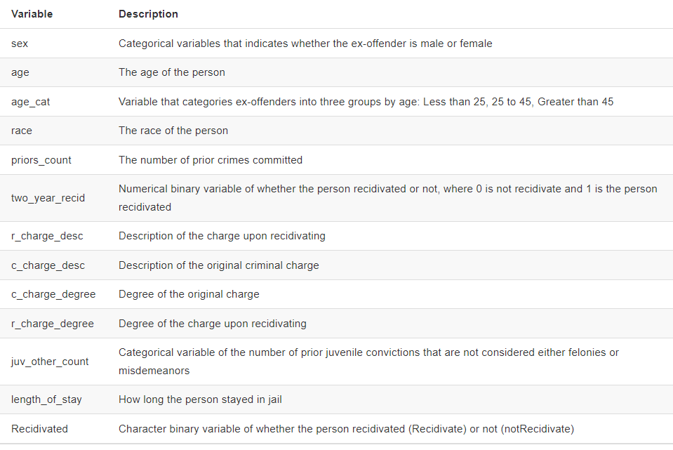

<br> 

This week begins our foray into machine learning`r emo::ji("sweet")` We will read and walk through exercises from Ken Steif's book outlined in the syllabus. The remaining graded Lab Exercises will be largely drawn from the assignments presented in the Steif text, but augmented to highlight techniques covered in class. The assigned readings for this week are available here and may be useful as you make your way through this activity: 

 + Starmer (2018) [Machine Learning Fundamentals: Bias and Variance](https://www.youtube.com/watch?v=EuBBz3bI-aA)
 + Starmer (2018) [Machine Learning Fundamentals: Cross Validation](https://www.youtube.com/watch?v=fSytzGwwBVw)
 + Starmer (2018) [Support Vector Machines Part 1 (of 3): Main Ideas](https://www.youtube.com/watch?v=efR1C6CvhmE)
 + Steif (2021) [People-Based ML Models: Algorithmic Fairness](https://urbanspatial.github.io/PublicPolicyAnalytics/people-based-ml-models-algorithmic-fairness.html)

The first portion of the Steif chapter introduces the machine learning workflow and defines some important terms (e.g., feature engineering, training set, accuracy, etc.). We will skip down to section 7.2 where the data analysis begins in earnest.  

# 7.2 Data and exploratory analysis

```{r label = "Load R Packages", include= FALSE}

library(lubridate)
library(tidyverse)
library(caret)
library(kableExtra)
library(ModelMetrics)
library(plotROC)
library(knitr)
library(grid)
library(gridExtra)
library(QuantPsyc)
library(emo)
library(rsample)
library(rstatix)

source("./data/functions.r")

palette_9_colors <- c("#FF2AD4","#E53AD8","#CC4ADC","#996AE5","#7F7BE9",
                      "#668BED","#33ABF6","#19BBFA","#00CCFF")
palette_3_colors <- c("#FF2AD4","#7F7BE9","#00CCFF")
palette_2_colors <- c("#FF2AD4", "#00CCFF")
palette_1_colors <- c("#00CCFF")


```

After loading the necessary R packages, we specify a list of colors that will be used to generate graphics and execute the **functions.R** script, which loads several custom functions from the text into memory for us. The companion data have been placed in the **data** folder. 

<br> 

As you read, the general aim is to assess the potential for machine learning algorithms to produced biased and racially disparate outcomes when used to predict recidivism rates. The underlying data were collected by ProPublica and [featured in a story](https://www.propublica.org/article/how-we-analyzed-the-compas-recidivism-algorithm) back in 2016. The attributes of this dataset are listed below: 

<br>

<center>  </center>

<br>

The code chunk below reads in the data, then processes it to remove some missing, erroneous, etc. observations. 
<br> 

```{r label = "Grab the Required Data", include = FALSE}

raw_data <- read_csv("./data/compas-scores-two-years.csv")

df <- 
  raw_data %>%
  filter(days_b_screening_arrest <= 30) %>%
  filter(days_b_screening_arrest >= -30) %>%
  filter(is_recid != -1) %>%
  filter(c_charge_degree != "O") %>%
  filter(priors_count != "36") %>%
  filter(priors_count != "25") %>%
  mutate(length_of_stay = as.numeric(as.Date(c_jail_out) - as.Date(c_jail_in)),
         priors_count = priors_count,
         Recidivated = as_factor(ifelse(two_year_recid == 1,"Recidivate","notRecidivate")),
         recidivatedNumeric = ifelse(Recidivated == "Recidivate", 1, 0),
         race2 = case_when(race == "Caucasian"        ~ "Caucasian",
                           race == "African-American" ~ "African-American", 
                           TRUE                       ~ "Other")) %>%
  dplyr::select(sex, age, age_cat, race, race2, priors_count, two_year_recid, r_charge_desc,
         c_charge_desc, c_charge_degree, r_charge_degree, juv_other_count,
         length_of_stay, priors_count, Recidivated, recidivatedNumeric) %>%
  filter(priors_count != 38)


```

<br> 

The chunk below displays descriptive statistics and reproduces the initial charts from the chapter using *tidyverse* functions wherever possible, for the sake of consistency with what we have been learning.  

<br>

```{r label = "Make Initial EDA Plots"}

rstatix::get_summary_stats(df)

# Barchart of most frequently levied criminal charges...

df %>% 
  group_by(c_charge_desc) %>%
  summarize(count = n()) %>%
  mutate(rate = count / sum(count), 
         charge_capitalized = str_to_title(c_charge_desc)) %>%
  arrange(-rate) %>% 
  head(9) %>%
  ggplot(aes(reorder(charge_capitalized, rate, FUN = max), 
             rate, fill = charge_capitalized)) +
    geom_col() + 
    coord_flip() +
    scale_fill_manual(values = palette_9_colors, name = "") +
    labs(x = "Charge", y = "Rate", title = "Most Frequent Initial Charges") +
    theme(legend.position = "none", plot.title = element_text(hjust = 0.5)) + theme_minimal()


# Barchart of recidivism rates by race and ethnicity...

df %>%
    group_by(Recidivated, race) %>%
    summarize(n = n()) %>%
    mutate(freq = n / sum(n)) %>% 
    filter(Recidivated == "Recidivate") %>%
    ggplot(aes(reorder(race, -freq), freq)) +
        geom_bar(stat = "identity", position = "dodge", fill = palette_2_colors[2]) +
        labs(title = "Recidivism Rate by Race and Ethnicity", y = "Rate", x = "Race") +
        theme_minimal() +
        theme(axis.text.x = element_text(angle = 45, hjust = 1), plot.title = element_text(hjust = 0.5), 
              text = element_text(size = 14)) 


```

<br> 

You can see that in the chart above, the recidivism rate for African-Americans is much higher (as noted in the chapter). However, we will now fit models to explore the utility of race as [a feature](https://en.wikipedia.org/wiki/Feature_(machine_learning)) in a predictive model. 

<br>

# 7.3 Estimate two recidivism models

The Steif chapter uses logistic regression because the outcomes (did the person commit another crime or not) is binary. However, rather than delving into the specifics of logistic regression, odds ratios, etc. we will fit support vector machines (SVM) models instead `r emo::ji("flex")` The code chunk below splits the dataset into a training set and a test set, as described in the materials you reviewed for today's class.

<br>

```{r label = "Data Split", message=FALSE, warning=FALSE}

# This allows us to reproduce the results in the future...
set.seed(223)  


# Use caret::createDataPartition to split the data.... then assess comparability

trainIndex <- createDataPartition(df$Recidivated, p = 0.75, list = FALSE, times = 1)
head(trainIndex)

train <- df[ trainIndex, ]
test <- df[ -trainIndex, ]

rstatix::get_summary_stats(train)
rstatix::get_summary_stats(test)


# Use rsample::initial_split to split the data... then assess comparability

df_split_index <- initial_split(df, prop = 0.75, strata = Recidivated)
df_train <- training(df_split_index)
df_test  <- testing(df_split_index)

rstatix::get_summary_stats(df_train)
rstatix::get_summary_stats(df_test)


```
<br> 

Ideally, we want the training and test sets to be comparable and typically we stratify on the outcomes being predicted and/or key features used in the model to predict that outcome. The `get_summary_stats` function in the above chunk is designed to help us assess how comparable the training and test sets are `r emo::ji("magnifying")`

The chunk below shows how the standard machine learning workflow is implemented using the *caret* package. The `trainControl` function outlines [what type of cross-validation](https://topepo.github.io/caret/model-training-and-tuning.html#the-traincontrol-function) we want to perform. 

<br>

```{r label = "Train SVM Models", message=FALSE, warning=FALSE}

# Set up for standard, 10 fold cross-validation...
trctrl <- trainControl(method = "cv", number = 10)

train_subset <- train %>% dplyr::select(sex, age, age_cat, 
                                juv_other_count, length_of_stay, 
                                priors_count, Recidivated, race)

train_svm_results <- train(Recidivated ~., data = train_subset,
                  method = "svmLinear",
                  trControl = trctrl,
                  preProcess = c("center", "scale"),
                  tuneLength = 10)

print(train_svm_results)


# Now exclude race from the model....

train_subset_no_race <- train_subset %>% select(-race)

train_svm_no_race_results <- train(Recidivated ~., data = train_subset_no_race,
                  method = "svmLinear",
                  trControl = trctrl,
                  preProcess = c("center", "scale"),
                  tuneLength = 10)

print(train_svm_no_race_results)


# So what does this mean?
print(
  str_c("The SVM model that includes race had an Accuracy of: ", round(train_svm_results$results$Accuracy, 6), " while the model that excluded race had an Accuracy of: ", round(train_svm_no_race_results$results$Accuracy, 6))
  )


# Visualize mean prior arrests by race...

df %>%
group_by(race2) %>%
  summarise(averagePriors = mean(as.numeric(priors_count))) %>%
  ggplot(aes(x = race2, y = averagePriors, fill = race2)) +
    geom_bar(stat = "identity", position = "dodge") +
    labs(title = "Mean Priors by Race", y = "Mean Priors", x = "Race") +
    scale_fill_manual(values = palette_3_colors, name = "Recidivism") +
  theme_minimal() +
    theme(legend.position = "none", plot.title = element_text(hjust = 0.5), 
              text = element_text(size = 14)) 


```

<br> 

The Steif chapter shows that the number of prior crimes is associated with race by removing **priors_count** from the model, then the **race** emerges as a statistically significant predictor. We can do the same with our SVM model by comparing fit metrics without the **priors_count** feature. 


### **Your Turn** 

<br>

Insert a completely new code chunk and write some code that fits a similar SVM model as the above code chunk, but that **does not include** the number of prior crimes. Is the accuracy level higher or lower? `r emo::ji("chart")` 

<br>


### 7.3.1 Accuracy & Generalizability

Now let's use this SVM model to predict recidivism outcomes for our test data `r emo::ji("smile")`

<br> 


```{r label = "Make Predictions" }

# Best fitting SVM model that excludes race...

test_subset_no_race <- test %>% dplyr::select(sex, age, age_cat, 
                                juv_other_count, length_of_stay, 
                                priors_count, Recidivated, race)


test_svm_no_race_results <- predict(train_svm_no_race_results, test_subset_no_race) 

# test_svm_no_race_results_alt <- kernlab::ksvm(Recidivated ~., data = test_subset_no_race) 

caret::confusionMatrix(as_factor(test_svm_no_race_results), test_subset_no_race$Recidivated, positive = "Recidivate")


# This chunk recreates the prediction above, but that is okay
# because above we wanted the confusion matrix...

testProbs <- 
  data.frame(Observed = test$Recidivated,
             Predicted = predict(train_svm_no_race_results, test_subset_no_race, type = "raw"),
             Race = test$race2)


```


### **Another Opportunity To Shine ** 


<br>

Insert a completely new code chunk and write some code that summarizes the following by race using the **testProbs** object created in the preceding chunk: 

 + True Positive (“Sensitivity”) - “The person was predicted to recidivate and actually recidivated.”
 + True Negative (“Specificity”) - “The person was predicted not to recidivate and actually did not recidivate.”
 + False Positive - “The person was predicted to recidivate and actually did not recidivate.”
 + False Negative - “The person was predicted not to recidivate and actually did recidivate.”

<br>

What (if anything) does your table or chart tell us about algorithmic bias in this context? 

----

<br>

<center> You have reached the end! </center>
<center> Celebrate! `r emo::ji("party")` </center>


<br> 

