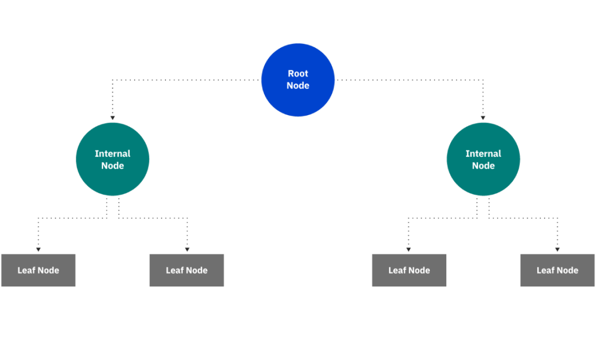

<br> 

This week begins our foray into geospatial machine learning. We will read and walk through exercises from Ken Steif's book outlined in the syllabus. The remaining graded Lab Exercises will be largely drawn from the assignments presented in the Steif text. The assigned readings for this week are available here and may be useful as you make your way through this activity: 

 + Starmer (2018)  [Decision and Classification Trees, Clearly Explained!!!](https://www.youtube.com/watch?v=_L39rN6gz7Y&t=0s)
 + Starmer (2018)  [Regression Trees, Clearly Explained!!!](https://www.youtube.com/watch?v=g9c66TUylZ4)
 + Steif (2021) [Intro to geospatial machine learning, Part 1](https://urbanspatial.github.io/PublicPolicyAnalytics/intro-to-geospatial-machine-learning-part-1.html)
 + Steif (2021) [Intro to geospatial machine learning, Part 2](https://urbanspatial.github.io/PublicPolicyAnalytics/intro-to-geospatial-machine-learning-part-2.html)

The first portion of the Steif chapter introduces the machine learning workflow and defines some important terms (e.g., feature engineering, training set, accuracy, etc.). We will skip down to section 3.2 where the data analysis begins in earnest.  

# 3.2 Data wrangling - Home price & crime data

```{r label="Load R Packages", include= FALSE}

library(tidyverse)
library(sf)
library(spdep)
library(caret)
library(ckanr)
library(FNN)
library(grid)
library(gridExtra)
library(ggcorrplot)
library(ggpubr)

source("./data/functions.r")

palette5 <- c("#25CB10", "#5AB60C", "#8FA108",   "#C48C04", "#FA7800")


```

After loading the necessary R packages, we specify a list of colors that will be used to generate graphics and execute the **functions.R** script, which loads several custom functions from the text into memory for us. The companion data have been placed in the **data** folder. 

<br> 

As you read, the general aim is to use observed home price data from Boston to train, apply, and evaluate a predictive model of home prices> We pull down the neighborhood boundaries layer from the Boston open data portal, then apply a map projection to convert the data to a projected coordinate system. We also read in tabular data on home sales (i.e., transaction data) and convert it to a points *sf* object. 


```{r label="Import Required Data"}

nhoods <- 
  st_read("http://bostonopendata-boston.opendata.arcgis.com/datasets/3525b0ee6e6b427f9aab5d0a1d0a1a28_0.geojson") %>%
  st_transform('ESRI:102286')

boston <- read_csv("./data/bostonHousePriceData_clean.csv", locale = locale(encoding = "latin1"))

boston.sf <- 
  boston %>% 
  st_as_sf(coords = c("Longitude", "Latitude"), crs = 4326, agr = "constant") %>%
  st_transform('ESRI:102286')

```

<br> 

The chunk below maps the price per square foot attribute of homes that were sold using a quintiles (i.e., five bins) scheme.

<br>

```{r label="Make Initial Plot"}

ggplot() +
  geom_sf(data = nhoods, fill = "grey40") +
  geom_sf(data = boston.sf, aes(colour = q5(PricePerSq)), 
          show.legend = "point", size = .75) +
  scale_colour_manual(values = palette5,
                   labels=qBr(boston,"PricePerSq"),
                   name="Quintile\nBreaks") +
  labs(title="Price Per Square Foot, Boston") +
  mapTheme()

```

<br> 

The text asks us to consider these questions after generating the map from the above code chunk: 

   * What do you notice about the spatial process of home prices? Are they randomly distributed throughout the city or do they seem clustered? 
   * Why do you think prices are spatially distributed the way they are?


<br> 

> <span style="color:dodgerblue"> Why did the chicken go to the gym? </span>
> 
> <span style="color:forestgreen"> To work on his pecks. </span>
`r emo::ji("laughing")`

The next step is to bring in crime data as a means of expanding the kinds of characteristics that we can loop into the model **beyond the structural characteristics** of the home. Actual and perceived crime rates can influence property values, and the chunk below gives a sense of what the most commonly reported offenses were at the time. 


```{r label="Bring in Crime Data"}

bostonCrimes <- read_csv("./data/bostonCrimes.csv", locale = locale(encoding = "latin1"))

length(unique(bostonCrimes$OFFENSE_CODE_GROUP))

group_by(bostonCrimes, OFFENSE_CODE_GROUP) %>%
  summarize(count = n()) %>%
  arrange(-count) %>% top_n(5)


```
<br>

The code below restricts the data to only reports of **Aggravated Assault** then uses *ggplot2::stat_density_2d* to derive a kernel density estimate (expected number of aggravated assaults per unit area) from the point locations themselves. Take a moment to inspect arguments that you do not recognize (e.g., the attribute-geometry-relationship argument in `st_as_sf`). Also, the dot-dot syntax **..level..** indicates a computed variable called **level** that is being created when the code runs. 


```{r label="Generate Kernel Density of Aggraveted Assault Reports"}

bostonCrimes.sf <-
  bostonCrimes %>%
    filter(OFFENSE_CODE_GROUP == "Aggravated Assault",
           Lat > -1) %>%
    dplyr::select(Lat, Long) %>%
    na.omit() %>%
    st_as_sf(coords = c("Long", "Lat"), crs = 4326, agr = "constant") %>%
    st_transform('ESRI:102286') %>%
    distinct()

ggplot() + geom_sf(data = nhoods, fill = "grey40") +
  stat_density2d(data = data.frame(st_coordinates(bostonCrimes.sf)), 
                 aes(X, Y, fill = ..level.., alpha = ..level..),
                 linewidth = 0.01, bins = 40, geom = 'polygon') +
  scale_fill_gradient(low = "#25CB10", high = "#FA7800", 
                      breaks=c(0.000000003,0.00000003),
                      labels=c("Minimum","Maximum"), name = "Density") +
  scale_alpha(range = c(0.00, 0.35), guide = "none") +
  labs(title = "Density of Aggravated Assaults, Boston") +
  mapTheme()

```


## 3.2.1 Feature Engineering - Measuring exposure to crime

The code chunk below calculates the number of reported aggravated assault incidents within 1/8 of a mile or 660 feet. However, the coordinate system used here appears to be meters, which would make the buffer roughly 0.41 miles rather than 0.125 miles. Let's just roll with it as written.

<br> 

```{r label="Count Nearby Reports of Aggravated Assault"}

boston.sf$crimes.Buffer =
    st_buffer(boston.sf, 660) %>%
    aggregate(mutate(bostonCrimes.sf, counter = 1), ., sum) %>%
    pull(counter)

```

<br> 

The code chunk below uses some of the custom functions contained in the  **functions.R** script to generate the average nearest neighbor statistic for a variety of numbers of neighbors&mdash;this is an [established way](https://pro.arcgis.com/en/pro-app/latest/tool-reference/spatial-statistics/average-nearest-neighbor.htm) to quantify clustering in space. The code below creates a series of new columns in the **boston.sf** object that contain the average distance in meters from each neighborhood (i.e., the centroid of each polygon is used) to the specified number of nearest points in the **bostonCrimes.sf** object (i.e., 1, 2, 3, ..., 5 closest reported crimes).    

```{r  label="Calculate Average Nearest Neighbor Statistic"}

st_c <- st_coordinates

boston.sf <-
  boston.sf %>% 
    mutate(
      crime_nn1 = nn_function(st_c(boston.sf), st_c(bostonCrimes.sf), 1),
      crime_nn2 = nn_function(st_c(boston.sf), st_c(bostonCrimes.sf), 2), 
      crime_nn3 = nn_function(st_c(boston.sf), st_c(bostonCrimes.sf), 3), 
      crime_nn4 = nn_function(st_c(boston.sf), st_c(bostonCrimes.sf), 4), 
      crime_nn5 = nn_function(st_c(boston.sf), st_c(bostonCrimes.sf), 5)) 


```


## 3.2.2 Exploratory analysis: Correlation

<br> 

This portion of the workflow is what might be termed **feature engineering** in data science speak or what we learned a few weeks ago as exploratory data analysis. Pearson correlations can be calculated between pairs of continuous variables, with a higher correlation coefficient suggesting that two variables are closely related. In general, we want to avoid duplication among the **features** included in a predictive model (i.e., collinearity).

   * Do you think these **features** are a reasonable place to begin building a predictive model? Which one seems to have the strongest relationship with sales price? 
   * What other factors would you expect to be most important for predicting home prices? 


```{r fig.height=10, fig.width=16, label="Scatterplots with Sales Price and Key Features"}

st_drop_geometry(boston.sf) %>% 
  mutate(Age = 2015 - YR_BUILT) %>%
  dplyr::select(SalePrice, LivingArea, Age, GROSS_AREA) %>%
  filter(SalePrice <= 1000000, Age < 500) %>%
  gather(Variable, Value, -SalePrice) %>% 
   ggplot(aes(Value, SalePrice)) +
     geom_point(size = .5) + geom_smooth(method = "lm", se=F, colour = "#FA7800") +
     facet_wrap(~Variable, ncol = 3, scales = "free") +
     labs(title = "Price as a function of continuous variables") +
     plotTheme()

```

<br> 

Scatterplots and Pearson correlations ar not appropriate for categorical variables. Instead, the code chunk below uses our old friend the barchart to visualize these relationships `r emo::ji("wink")` Note the use of the `stat = "summary"` argument (see the [documentation here](https://ggplot2.tidyverse.org/reference/stat_summary.html)). 

```{r fig.height=10, fig.width=16, label="Barcharts with Sales Price and Key Features"}

boston %>% 
  dplyr::select(SalePrice, Style, OWN_OCC, NUM_FLOORS) %>%
  mutate(NUM_FLOORS = as.factor(NUM_FLOORS)) %>%
  filter(SalePrice <= 1000000) %>%
  gather(Variable, Value, -SalePrice) %>% 
   ggplot(aes(Value, SalePrice)) +
     geom_bar(position = "dodge", stat = "summary", fun.y = "mean") +
     facet_wrap(~Variable, ncol = 1, scales = "free") +
     labs(title = "Price as a function of\ncategorical variables", y = "Mean_Price") +
     plotTheme() + theme(axis.text.x = element_text(angle = 45, hjust = 1))

```

<br> 

```{r fig.height=10, fig.width=16, label="Generate Scatterplot with Crime Features"}

options(scipen = 999)

plot.1 <- boston.sf %>%
   filter(SalePrice <= 1000000) %>%
  ggplot(mapping = aes(x = crime_nn1, y = SalePrice)) +
     geom_point(size = .5) + geom_smooth(method = "lm", se=F, colour = "green4") +
     labs(title = "Correlation between Sale Price \n and mean distance to the nearest crime") +
     plotTheme()

plot.2 <-  boston.sf %>%
   filter(SalePrice <= 1000000) %>%
  ggplot(mapping = aes(x = crime_nn2, y = SalePrice)) +
     geom_point(size = .5) + geom_smooth(method = "lm", se=F, colour = "green4") +
     labs(title = "Correlation between Sale Price \n and mean distance to the 2 nearest crimes") +
     plotTheme()

plot.3 <-  boston.sf %>%
   filter(SalePrice <= 1000000) %>%
  ggplot(mapping = aes(x = crime_nn3, y = SalePrice)) +
     geom_point(size = .5) + geom_smooth(method = "lm", se=F, colour = "green4") +
     labs(title = "Correlation between Sale Price \n and mean distance to the 3 nearest crimes") +
     plotTheme()

plot.4 <-  boston.sf %>%
   filter(SalePrice <= 1000000) %>%
  ggplot(mapping = aes(x = crime_nn4, y = SalePrice)) +
     geom_point(size = .5) + geom_smooth(method = "lm", se=F, colour = "green4") +
     labs(title = "Correlation between Sale Price \n and mean distance to the 4 nearest crimes") +
     plotTheme()

plot.5 <-  boston.sf %>%
   filter(SalePrice <= 1000000) %>%
  ggplot(mapping = aes(x = crime_nn5, y = SalePrice)) +
     geom_point(size = .5) + geom_smooth(method = "lm", se=F, colour = "green4") +
     labs(title = "Correlation between Sale Price \n and mean distance to the 5 nearest crimes") +
     plotTheme()

plot.6 <-  boston.sf %>%
   filter(SalePrice <= 1000000) %>%
  ggplot(mapping = aes(x = crimes.Buffer, y = SalePrice)) +
     geom_point(size = .5) + geom_smooth(method = "lm", se=F, colour = "green4") +
     labs(title = "Correlation between Sale Price \n and the crimes within 0.4 miles") +
     plotTheme()

library(ggpubr)

ggarrange(plot.1, plot.2, plot.3, plot.4, plot.5, plot.6)  

```

<br> 

The scatterplots above show a negative relationship between sales price and proximity to reported crimes regardless of whether we consider the average distance to neighboring reported crimes (e.g., **crime_nn2**, **crime_nn5**) or the total number of reported crimes within a specified distance radius (i.e., **crimes.Buffer**).

<br>

We have already seen how a correlation matrix represented graphically can be a useful thing. The code chunk below accomplishes this with the present data. 

<br> 

```{r fig.height=10, fig.width=16, label="Generate Correlation Matrix"}

numericVars <- 
  select_if(st_drop_geometry(boston.sf), is.numeric) %>% na.omit()

ggcorrplot(
  round(cor(numericVars), 1), 
  p.mat = cor_pmat(numericVars),
  colors = c("#25CB10", "white", "#FA7800"),
  type="lower",
  insig = "blank") +  
    labs(title = "Correlation across numeric variables") 

cor.test(boston$LivingArea, boston$SalePrice, method = "pearson")


```

<br> 

# 3.3 Introduction to Regression Trees

This portion of the practice exercise diverges from the Steif text and rather than fitting a linear regressions model, it demonstrates how [decision trees](https://towardsdatascience.com/decision-trees-in-machine-learning-641b9c4e8052) can be used to better understand patterns in a dataset, as well as how these tools can be used for prediction purposes in the R environment.


## 3.3.1 Our regression tree model


```{r "Grab the Required Data", warning = FALSE, message = FALSE}

# Get neighborhood polygons from the open data portal in GeoJSON format, 
# then apply a map projection...
nhoods <- 
  st_read("http://bostonopendata-boston.opendata.arcgis.com/datasets/3525b0ee6e6b427f9aab5d0a1d0a1a28_0.geojson") %>%
  st_transform('ESRI:102286')


# Read in the homes data in tabular format with the encoding argument for 
# folks using MacOS...
boston <- read_csv("./data/bostonHousePriceData_clean.csv", locale = locale(encoding = "latin1"))


# Convert the homes data to a point sf object with actual geometry...
boston.sf <- 
  boston %>% 
  st_as_sf(coords = c("Longitude", "Latitude"), crs = 4326, agr = "constant") %>%
  st_transform('ESRI:102286')


# Collapse the many categories on the number of floors attribute,so there is a more manageable number of categories...
boston.sf <- 
  boston.sf %>%
  mutate(NUM_FLOORS.cat = case_when(
                  NUM_FLOORS >= 0 & NUM_FLOORS < 3  ~ "Up to 2 Floors",
                  NUM_FLOORS >= 3 & NUM_FLOORS < 4  ~ "3 Floors",
                  NUM_FLOORS > 4                    ~ "4+ Floors"))


# Read in the tabular reported crimes information... 
bostonCrimes <- read_csv("./data/bostonCrimes.csv", locale = locale(encoding = "latin1"))


# Extract only reports of aggravated assault and get rid of observations
# with missing values, then generate a point sf object...
bostonCrimes.sf <-
  bostonCrimes %>%
    filter(OFFENSE_CODE_GROUP == "Aggravated Assault",
           Lat > -1) %>%
    dplyr::select(Lat, Long) %>%
    na.omit() %>%
    st_as_sf(coords = c("Long", "Lat"), crs = 4326, agr = "constant") %>%
    st_transform('ESRI:102286') %>%
    distinct()


# This is not how I would have written it, but create a new attribute called
# crimes.Buffer with the number of reported aggravated assaults within the 
# specified distance...
boston.sf$crimes.Buffer <- st_buffer(boston.sf, 660) %>%
    aggregate(mutate(bostonCrimes.sf, counter = 1), ., sum) %>%
    pull(counter)


```

<br> 

The code chunk below partitions (divides) the dataset into two pieces&mdash;a [training dataset](https://en.wikipedia.org/wiki/Training,_validation,_and_test_data_sets#Training_data_set) with approximately 60 percent of the observations and a [test dataset](https://en.wikipedia.org/wiki/Training,_validation,_and_test_data_sets#Test_data_set) with the remaining approximately 40 percent of the observations. It also stratifies on neighborhood name, number of floors, structure style, and air conditioning.    

<br>

```{r label = "Data Split"}


# This allows us to reproduce the results in the future...
set.seed(223)  

#################################################################################
# This function is part of the caret package and the y argument outlines
# how to stratify the data. From the documentation "the sample is split 
# into groups sections based on percentiles and sampling is done within 
# these subgroups" and the paste function simply concatenates several features. 
#
# This allows us to stratify on multiple features rather than just the outcome
# we are trying to predict (i.e., the training and test sets are more comparable)
#################################################################################
inTrain <- createDataPartition(
              y = paste(boston.sf$Name, boston.sf$NUM_FLOORS.cat, 
                        boston.sf$Style, boston.sf$R_AC), 
              p = .60, list = FALSE)

boston.training <- boston.sf[inTrain, ] 
boston.test <- boston.sf[-inTrain, ]  

boston.training %>%
  st_drop_geometry() %>%
  rstatix::get_summary_stats()

boston.test %>%
  st_drop_geometry() %>%
  rstatix::get_summary_stats()


```

<br> 

The code chunk below uses the `caret::trainControl` function to set up the standard _k_-folds cross-validation routine with _k_ = 10, but it could just as easily be 5 folds as illustrated in the image below.

<br>

<center>  </center>

<br> 

As described in class, _k_-folds cross-validation can help us avoid [overfitting](https://www.ibm.com/topics/overfitting) and assist with tuning hyperparameters for a given machine learning algorithm. Cross-validation involves randomly dividing the data into _k_ "slices" or **folds** of roughly the same size. The first **fold** is treated as a validation set and we train the model on the remainder of the data (i.e., the other 9 slices if _k_ = 10). Next, we calculate the Mean Squared Error or another performance metric when the trained model is applied to the one **fold** that has been set aside. We repeat this process _k_ times with a different **fold** or "slice" acting as the validation set. This technique provides us with _k_ estimates of the test error rate as opposed to the single test error rate that we would otherwise have from the training set. 

<br>

As mentioned in class, the _caret_ package currently supports over 230 algorithms and by setting the **method** argument of the `caret::train` function  to "rpart", we are fitting a simple decision tree model. Because the outcome we are predicting is continuous rather than categorical, it is a regression tree rather than a classification tree. 

<br> 

```{r label = "Initial Regression Tree Model"}

# Set up for standard, 10 fold cross-validation...
tree.ctrl <- trainControl(method = "cv", number = 10)

tree.model <- train(SalePrice ~ ., data = boston.training %>% 
                                  st_drop_geometry() %>%
                                  dplyr::select(SalePrice, LivingArea, Style, 
                                               GROSS_AREA, R_TOTAL_RM, NUM_FLOORS,
                                               R_BDRMS, R_FULL_BTH, R_HALF_BTH, 
                                               R_KITCH, R_AC, R_FPLACE),
                    method = "rpart",
                    trControl = tree.ctrl,
                    tuneLength = 10)
print(tree.model)

# Do we want more folds? How stable is the model performance based on 
# this information? 
ggplot(mapping = aes(y = tree.model$resample$RMSE, x = seq(1, 10, 1))) + 
  geom_line(color = "red") + 
  xlab("Fold Number") + ylab("RMSE")

ggplot(mapping = aes(y = tree.model$resample$MAE, x = seq(1, 10, 1))) + 
  geom_line(color = "dodgerblue") + 
  xlab("Fold Number") + ylab("Mean Absolute Error")


```

## 3.3.2 More feature engineering

<br> 

The chunk below introduces some mild **feature engineering** in an attempt to boost model fit and predictive capability. 

```{r label="Feature Engineering"}

boston.training <- 
  boston.training %>%
  mutate(NUM_FLOORS.cat = case_when(
                  NUM_FLOORS >= 0 & NUM_FLOORS < 3  ~ "Up to 2 Floors",
                  NUM_FLOORS >= 3 & NUM_FLOORS < 4  ~ "3 Floors",
                  NUM_FLOORS > 4                    ~ "4+ Floors"))


boston.test <- 
  boston.test %>%
  mutate(NUM_FLOORS.cat = case_when(
                  NUM_FLOORS >= 0 & NUM_FLOORS < 3  ~ "Up to 2 Floors",
                  NUM_FLOORS >= 3 & NUM_FLOORS < 4  ~ "3 Floors",
                  NUM_FLOORS > 4                    ~ "4+ Floors"))


```

<br> 

We then re-run the model with the newly created categorical variable that reflects the number of floors in a home. **Note:** Below we are including **Parcel_No** in the `select` component so that we can link the predicted sales price back to the geometry for mapping purposes, but it is not used as a feature in the model itself.

<br>

```{r label="Revisit the Regression Tree Model"}

# Set up for standard, 10 fold cross-validation...
tree.ctrl <- trainControl(method = "cv", number = 10)

tree.model.revised <- train(SalePrice ~ LivingArea + Style + GROSS_AREA + R_TOTAL_RM + NUM_FLOORS.cat + 
                                        R_BDRMS + R_FULL_BTH + R_HALF_BTH + R_KITCH + R_AC + R_FPLACE,
                                  data = boston.training %>% 
                                  st_drop_geometry() %>%
                                  drop_na() %>%
                                  dplyr::select(SalePrice, LivingArea, Style, 
                                               GROSS_AREA, R_TOTAL_RM, NUM_FLOORS.cat,
                                               R_BDRMS, R_FULL_BTH, R_HALF_BTH, 
                                               R_KITCH, R_AC, R_FPLACE, Parcel_No),
                    method = "rpart",
                    trControl = tree.ctrl,
                    tuneLength = 10)

print(tree.model.revised)


```

# 3.4 Cross-validation & return to goodness of fit

According to Steif, "...*a generalizable model is one that accurately predicts on new data*..." and "...*a generalizable model is also one that predicts with comparable accuracy across different groups*...". Mean Absolute Error [(MAE)](https://en.wikipedia.org/wiki/Mean_absolute_error) is a fundamental measure of accuracy and is one of the metrics generated by most [machine learning packages](https://cran.r-project.org/web/views/MachineLearning.html) by default. MAE measures the average magnitude of the errors in a set of predictions, without considering their direction. It is the average over the test sample of the absolute differences between prediction and actual observation where all individual differences have equal weight. By contrast, since the errors are squared before they are averaged, the RMSE gives a relatively high weight to large errors.
<br> 

## 3.4.1 Accuracy - Mean Absolute Error

<br> 
We fit the model on the training dataset in the above code chunk, then apply it to the test dataset in the code chunk below using the `predict` function. The MAE and the Absolute Percent Error are also calculated based on the known sales price **AND** the predicted sale prices from the model. These metrics give us a sense of how well the model performs when applied to **new** data. 


```{r label="Apply Fitted Model to Test Dataset"}

boston.test.no.geometry <-
  boston.test %>%
  st_drop_geometry() %>%
  drop_na() %>%
  dplyr::select(SalePrice, LivingArea, Style, GROSS_AREA, R_TOTAL_RM, NUM_FLOORS.cat,
                                               R_BDRMS, R_FULL_BTH, R_HALF_BTH, 
                                               R_KITCH, R_AC, R_FPLACE, Parcel_No)

tree.model.test <- predict(tree.model.revised, boston.test.no.geometry)

outputPredictions <- boston.test.no.geometry %>%
  mutate(                          
         SalePrice.AbsError = abs(tree.model.test - boston.test.no.geometry$SalePrice),
         SalePrice.APE = (abs(tree.model.test - boston.test.no.geometry$SalePrice)) / tree.model.test) %>%
  filter(SalePrice < 5000000)


# Assess accuracy...
mean(outputPredictions$SalePrice.AbsError, na.rm = T)

mean(outputPredictions$SalePrice.APE, na.rm = T)

```
<br> 

In the above code chunk we see that on average, the model predictions are off by over $190,000 which translates to about 27.5 percent `r emo::ji("sad")` This is not super surprising because single decision tree models are typically not among those with the greatest predictive capacity. During the next session, we will introduce the [random forest algorithm](https://www.ibm.com/topics/random-forest#:~:text=Random%20forest%20is%20a%20commonly,both%20classification%20and%20regression%20problems.) which uses decisions trees as a building block to boost predictive capacity. 

<br> 

```{r fig.height=10, fig.width=16, label = "Visually Represent the Tree Model"}

# install.packages("rattle")

library(rattle)

fancyRpartPlot(tree.model.revised$finalModel, main = "My Awesome Decision Tree Model", sub = "Boston Housing Sales with Collapsed Number of Floors Feature", digits = -3)

```

<br> 

The code chunk above uses a new R package called _rattle_ to visually display the decision tree created when we trained our model. Recall that decision trees are "grown" and read from the top to the bottom. Although the **boston.training** set contains 915 observations, the model is fit using 870 of these due to filtering of missing data values in the "Revisit the Regression Tree Model" chunk. We can see in the figure that the first split is based on the **Style** feature and branches to the left if an observation if a row house located in the middle of the row and branches to the right in all other cases. From there, other important features like **LivingArea** (i.e., the square footage of the home), **R_FULL_BTH** (i.e., number of full bathrooms), **R_AC** (i.e., has air conditioning), and **R_FPLACE** (i.e., has a fireplace). 

<br> 

<center>  </center>


At each internal node (i.e., between the root node and the leaves or terminal nodes), the plot displays the number and percentage of observations that "flow" through that node of the decision tree, as well as what the model would predict as the sales price. 

<br>

### **Your Turn** 

<br>

Insert a new code chunk that generates a map similar to that created in the "Make Initial Plot" chunk. However, instead of price per square foot, your map should: 

   + Use a `left_join` to link the **boston.test** object and the **outputPredictions** object so that we can plot absolute error for each observation in the test set
   + Use `filter(is.na(SalePrice.AbsError) == FALSE)` to ensure that the number of observations in the two objects is the same
   + Modify the `ggplot` code from the "Make Initial Plot" chunk to produce a map similar to the one shown below
   + Does your model perform consistently better/worse in particular areas of Boston than others? 


<br>
   

----

<br>

<center> You have reached the end! `r emo::ji("flex")`  </center>

<br> 

