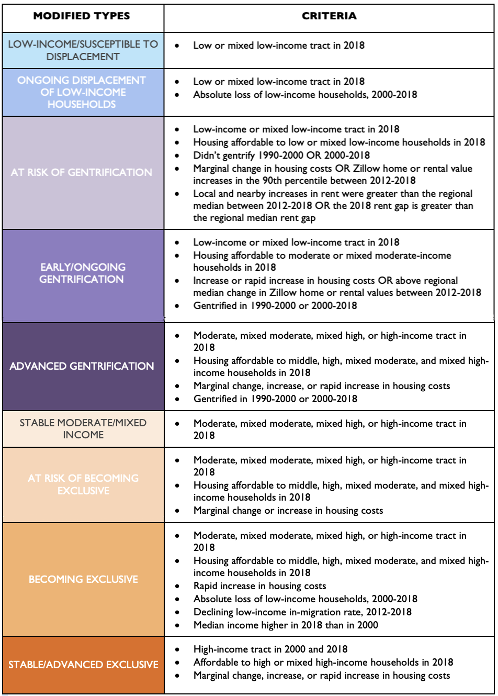

<br> 

This week we continue exploring the fundamentals of machine learning with R and move geography from Boston to Chicago. Both cities have been leaders in investing in data infrastructures and in providing open data. This chapter of the Steif text considers the use of these techniques in policing and criminal justice more broadly. The assigned reading for this week is available below and may be useful as you make your way through this activity: 

 + Glander (2020) [Hyperparameter Tuning With _caret_.](https://www.youtube.com/watch?v=xGZVxxvgzI4)
 + Boehmke & Greenwell (2020) [Gradient Boosting](https://bradleyboehmke.github.io/HOML/gbm.html)
 + Boehmke & Greenwell (2020) [Bagging](https://bradleyboehmke.github.io/HOML/bagging.html)
 + Boehmke & Greenwell (2020) [Random Forests](https://bradleyboehmke.github.io/HOML/random-forest.html)
 + Steif (2021) [Chapter 5 Geospatial risk modeling - Predictive Policing](https://urbanspatial.github.io/PublicPolicyAnalytics/geospatial-risk-modeling-predictive-policing.html)

The first portion of the Steif chapter for this week provides some context and a longer view on the [use of predictive analytics in policing](https://www.brennancenter.org/our-work/research-reports/predictive-policing-explained) including the [role Chicago has played](https://www.theverge.com/c/22444020/chicago-pd-predictive-policing-heat-list) in pioneering the use of these tools in the United States. It also considers the practical challenges of allocating scarce personnel and resources across a very large and dense urban area in order to maintain public safety. 

<br> 

The key distinction between a **geospatial risk model** and the examples we have seen so far is that: 

> "...[t]he dependent variable is the occurrence of discrete events like crime, fires, successful sales calls, locations of donut shops, etc." and "[p]redictions from these models are interpreted as ‘the forecasted risk/opportunity of that event occurring here'."

The question of what contributes to the risk of a crime happening at a particularly location is complex, in part because we know that reported crimes do not provide a comprehensive accounting of illegal activity that occurs in a given location. Most crimes are also relatively rare occurrences, which makes modeling the likelihood or a car theft or aggravated assault more challenging (i.e., pushes the limits of what OLS regression is designed to do). Because reported crimes are likely not a representative sample, this can skew the way that policing is done. For example: 

> [f]or a drug offense event to appear in the data, it must be observed by law enforcement. Many drug offenses go unobserved, and worse, officers may selectively choose to enforce drug crime more fervently in some communities than others. If selective enforcement is the result of an officer’s preconceived or biased beliefs, then this ‘selection bias’ will be baked into the crime outcome. If a model fails to account for this bias, it will fall into the error term of the regression and lead to predictions that do not generalize across space.

For our purposes, you can think about **selection bias** as relating to how arrests or citations are non-randomly distributed across demographic groups, neighborhoods, etc. while **exposure bias** refers to erroneous or incomplete beliefs about how contributing factors affect the likely of criminal activity at a specific location (e.g., the [Broken Windows Theory](https://en.wikipedia.org/wiki/Broken_windows_theory) of crime). 


```{r label="Load R Packages", include= FALSE}

library(tidyverse)
library(sf)
library(RSocrata)
library(viridis)
library(raster)
library(spdep)
library(FNN)
library(grid)
library(gridExtra)
library(knitr)
library(kableExtra)
library(tidycensus)
library(jsonlite)
library(ggpubr)
library(sfdep)
library(caret)
library(Metrics)
library(gbm)
# install.packages("remotes")
library(remotes)
# remotes::install_github("ModelOriented/treeshap")
library(treeshap)
library(shapviz)
library(tmap)
# remotes::install_github("hadley/emo")
library(emo)


```

<br> 

# Data Wrangling - Creating the Fishnet

After loading the necessary R packages, we consider the appropriate unit of analysis, keeping in mind our discussion of the [Modifiable Areal Unit Problem](https://en.wikipedia.org/wiki/Modifiable_areal_unit_problem) from last week. The code chunk below reads in police district and police beats boundaries from the Chicago open data portal. The remainder of the companion data for this chapter have been **painstakingly** wrangled, curated, and placed in the **data** folder for you `r emo::ji("police")`  

```{r label="Grab the Required Data", warning = FALSE, message = FALSE}

policeDistricts <- 
  st_read("https://data.cityofchicago.org/api/geospatial/fthy-xz3r?method=export&format=GeoJSON") %>%
  st_transform('ESRI:102271') %>%
  dplyr::select(District = dist_num)


policeBeats <- 
  st_read("https://data.cityofchicago.org/api/geospatial/aerh-rz74?method=export&format=GeoJSON") %>%
  st_transform('ESRI:102271') %>%
  dplyr::select(District = beat_num)


bothPoliceUnits <- rbind(mutate(policeDistricts, Legend = "Police Districts"), 
                         mutate(policeBeats, Legend = "Police Beats"))

ggplot(bothPoliceUnits, color = "grey30", fill = "white") +
  geom_sf() + 
  facet_wrap(~Legend) + 
  theme_void() 

```

<br> 

The code chunk below creates a **fishnet** raster with 500ft by 500ft grid cells (roughly 1/10 mile by 1/10 mile) as a way of avoiding the pitfalls of arbitrarily chosen units of analysis. We also use `st_join` to constrain the fishnet layer to only those grid cells that intersect the city boundary.


```{r label="Generate Fishnet Covering Entire City", warning = FALSE, message = FALSE}

# Read in the city boundary...
chicagoBoundary <- 
  st_read(file.path("./data/chicagoBoundary.geojson")) %>%
  st_transform('ESRI:102271') 


# Create the fishnet layer...
fishnet_0 <- 
  st_make_grid(chicagoBoundary, cellsize = 500, what = "polygons", square = TRUE) %>%
  st_sf() %>%
  mutate(uniqueID = rownames(.))

# Make sure it has valid geometry...
fishnet_1 <- fishnet_0 %>%  
  st_make_valid() %>% 
  st_cast("MULTIPOLYGON" ) %>% 
  st_cast("POLYGON")


# Limit the fishnet ONLY to areas within the city...
fishnet <- st_join(fishnet_1, chicagoBoundary, join = st_intersects, left = FALSE)


# Admire your handiwork....
ggplot(data = fishnet) + 
  geom_sf(fill = "white", color = "dodgerblue") + 
  ggtitle("Fishnet in Chicago") +
  theme_void() + 
  theme(plot.title = element_text(size=14, face="bold.italic"))

```

<br> 

Next, we download data on burglaries and use the `stat_density2d` function that we first saw with the Boston example in the Steif text to visualize areas of the city that experienced more reported burglaries in 2017. 

<br> 

> <span style="color:dodgerblue"> What do you call a computer that can sing? </span>
> 
> <span style="color:forestgreen"> A Dell. </span>
`r emo::ji("laughing")`

<br> 

```{r fig.height=10, fig.width=16, label = "Get and Visualize  Burglaries Data"}

burglaries <- fromJSON("https://data.cityofchicago.org/resource/ijzp-q8t2.json?year=2017&primary_type=BURGLARY&$limit=25000") %>%
  filter(description == "FORCIBLE ENTRY") %>%
    na.omit() %>%
    st_as_sf(coords = c("longitude", "latitude"), crs = 4326, agr = "constant")%>%
    st_transform('ESRI:102271') %>% 
    distinct()


burgs<- ggplot() +
  geom_sf(data = chicagoBoundary, fill = NA, color = "black") + 
  geom_sf(data = burglaries, color = "red", shape = 19, size = 0.3) +
  ggtitle("Burglaries, Chicago - 2017") +
  theme_void() +
  theme(plot.title = element_text(hjust = 0.5, size=18))
  

kdens_burgs <- ggplot() + 
  geom_sf(data = chicagoBoundary, fill = "grey40") +
  stat_density2d(data = data.frame(st_coordinates(burglaries)), 
                 aes(X, Y, fill = after_stat(level), alpha = after_stat(level)),
                 size = 0.01, bins = 40, geom = 'polygon') +
  scale_fill_viridis(guide = "none") +
  scale_alpha(range = c(0.00, 0.35), guide = "none") +
  labs(title = "Density of Burglaries") +
  theme_void() +
  theme(plot.title = element_text(hjust = 0.5, size=18))


ggarrange(burgs, kdens_burgs, nrow = 1, ncol = 2)


```
<br>

## Data Wrangling - Joining Burglaries to the Fishnet

Next, we perform some [data wrangling described in the text](https://urbanspatial.github.io/PublicPolicyAnalytics/geospatial-risk-modeling-predictive-policing.html#data-wrangling-joining-burglaries-to-the-fishnet) and link the count of reported burglaries to the fishnet grid cells.  

```{r fig.height=10, fig.width=16, label = "Count and Visualize Burglaries By Grid Cell"}

# Count 'em...
crime_net <- 
  fishnet %>% 
  mutate(countBurglaries = lengths(st_intersects(fishnet, burglaries)),
         cvID = sample(round(nrow(fishnet) / 24), size = nrow(fishnet), replace = TRUE)) %>%
  dplyr::select(-Id)


# Plot 'em...
ggplot() +
  geom_sf(data = crime_net, aes(fill = countBurglaries)) +
  scale_fill_viridis() +
  labs(title = "Count of Burglaries for the fishnet", fill = "Burglaries") +
  theme_void() + 
  theme(plot.title = element_text(hjust = 0.5, size=20))


```
<br>

## Wrangling the Risk Factors

The **crime_net** object has counts of reported burglaries, but we also need **features** in order to model the risk of a burglary occurring in the city of Chicago. Let's attend to that now...


```{r fig.height=10, fig.width=16, label = "Bring In Relevant Predictors and Plot Them", message=FALSE, warning=FALSE}

abandonCars <- st_read("./data/abandonCars.geojson") 
st_crs(abandonCars) <- st_crs(fishnet)

 
abandonBuildings <- st_read("./data/abandonBuildings.geojson")
st_crs(abandonBuildings) <- st_crs(fishnet)


graffiti <-  st_read("./data/graffiti.geojson") 
st_crs(graffiti) <- st_crs(fishnet)


streetLightsOut <- st_read("./data/streetLightsOut.geojson")
st_crs(streetLightsOut) <- st_crs(fishnet)


sanitation <- st_read("./data/sanitation.geojson")
st_crs(sanitation) <- st_crs(fishnet)


liquorRetail <- st_read("./data/liquorRetail.geojson")
st_crs(liquorRetail) <- st_crs(fishnet) 


neighborhoods <- st_read("./data/chicago.geojson") %>%
  st_transform(st_crs(fishnet)) 


bldgs <- ggplot() +
  geom_sf(data = chicagoBoundary, fill = NA, color = "black") + 
  geom_sf(data = abandonBuildings, color = "dodgerblue", shape = 19, size = 0.3) +
  ggtitle("Abandoned Buildings") +
  theme_void() + 
  theme(plot.title = element_text(size=14, hjust = 0.5, face="bold.italic"))

cars <- ggplot() +
  geom_sf(data = chicagoBoundary, fill = NA, color = "black") + 
  geom_sf(data = abandonCars, color = "red", shape = 19, size = 0.3) +
  ggtitle("Abandoned Cars") +
  theme_void() + 
  theme(plot.title = element_text(size=14, hjust = 0.5, face="bold.italic"))

graffiti_plot <- ggplot() +
  geom_sf(data = chicagoBoundary, fill = NA, color = "black") + 
  geom_sf(data = graffiti, color = "green4", shape = 19, size = 0.3) +
  ggtitle("Graffiti") +
  theme_void() + 
  theme(plot.title = element_text(size=14, hjust = 0.5, face="bold.italic"))


liquor <- ggplot() +
  geom_sf(data = chicagoBoundary, fill = NA, color = "black") + 
  geom_sf(data = liquorRetail, color = "chartreuse1", shape = 19, size = 0.3) +
  ggtitle("Liquor Retail") +
  theme_void() + 
  theme(plot.title = element_text(size=14, hjust = 0.5, face="bold.italic"))

sanitation_plot <- ggplot() +
  geom_sf(data = chicagoBoundary, fill = NA, color = "black") + 
  geom_sf(data = sanitation, color = "blue3", shape = 19, size = 0.3) +
  ggtitle("Sanitation") +
  theme_void() + 
  theme(plot.title = element_text(size=14, hjust = 0.5, face="bold.italic"))

streetlights <- ggplot() +
  geom_sf(data = chicagoBoundary, fill = NA, color = "black") + 
  geom_sf(data = streetLightsOut, color = "tomato3", shape = 19, size = 0.3) +
  ggtitle("Street Lights") +
  theme_void() + 
  theme(plot.title = element_text(size = 14, face="bold.italic", hjust = 0.5))

ggarrange(bldgs, cars, graffiti_plot, liquor, sanitation_plot, streetlights, nrow = 2, ncol = 3)

```

<br>

Great, we have our basic dataset in place. Celebrate! `r emo::ji("party")`  

When you are done celebrating, we can turn our attention to **feature engineering** or what social scientists often call exploratory data analysis (EDA). 

# Feature Engineering - Count of Risk Factors by Fishnet Cell

The code chunk below manipulates the data so that we can use it for modeling purposes. The details are [outlined here](https://urbanspatial.github.io/PublicPolicyAnalytics/geospatial-risk-modeling-predictive-policing.html#feature-engineering---count-of-risk-factors-by-grid-cell) if you want to take a deeper dive  `r emo::ji("fish")`  

```{r fig.height=10, fig.width=16, label = "More Data Wrangling and Visualize Risk Factors for Burglary"}

vars_net <- 
  fishnet %>% 
  mutate(abandonCarsCount = lengths(st_intersects(fishnet, abandonCars)),
         streetLightsOutCount = lengths(st_intersects(fishnet, streetLightsOut)),
         abandonBuildingsCount = lengths(st_intersects(fishnet, abandonBuildings)),
         liquorRetailCount = lengths(st_intersects(fishnet, liquorRetail)),
         graffitiCount = lengths(st_intersects(fishnet, graffiti)),
         sanitationCount = lengths(st_intersects(fishnet, sanitation))) %>%
  st_drop_geometry(.) %>%
  pivot_longer(cols = c(3:8)) %>%
  dplyr::mutate(Legend = case_when(name == 'abandonCarsCount' ~ "Abandoned_Cars", 
                            name == 'abandonBuildingsCount' ~ "Abandoned_Buildings", 
                            name == 'graffitiCount' ~ "Graffiti", 
                            name == 'streetLightsOutCount' ~ "Street_Lights_Out", 
                            name == 'sanitationCount' ~ "Sanitation", 
                            name == 'liquorRetailCount' ~ "Liquor_Retail")) %>%
  group_by(uniqueID, Legend) %>%
  summarize(value = sum(value)) %>%
    full_join(fishnet) %>%
    pivot_wider(names_from = Legend, values_from = value) %>%
    st_sf() %>%
    ungroup() 


# Now plot risk factors...

a <- ggplot() +
      geom_sf(data = vars_net, aes(fill = Abandoned_Buildings), color = NA) +
      scale_fill_viridis(name = "Number of \n Abandoned \n Buildings") +
      labs(title = "Abandoned Buildings") +
      theme_void() + 
      theme(plot.title = element_text(hjust = 0.5, size=20))

b <- ggplot() +
      geom_sf(data = vars_net, aes(fill = Abandoned_Cars), color = NA) +
      scale_fill_viridis(name = "Number of \n Abandoned \n Cars") +
      labs(title = "Abandoned Cars") +
      theme_void() + 
      theme(plot.title = element_text(hjust = 0.5, size=20))

c <- ggplot() +
      geom_sf(data = vars_net, aes(fill = Graffiti), color = NA) +
      scale_fill_viridis(name = "Number of \n Graffiti \n Reports") +
      labs(title = "Graffiti Reports") +
      theme_void() + 
      theme(plot.title = element_text(hjust = 0.5, size=20))

d <- ggplot() +
      geom_sf(data = vars_net, aes(fill = Liquor_Retail), color = NA) +
      scale_fill_viridis(name = "Number of \n Liquor \n Stores") +
      labs(title = "Liquor Stores") +
      theme_void() + 
      theme(plot.title = element_text(hjust = 0.5, size=20))

e <- ggplot() +
      geom_sf(data = vars_net, aes(fill = Sanitation), color = NA) +
      scale_fill_viridis(name = "Number of \n Sanitation \n Issues") +
      labs(title = "Sanitation Issues") +
      theme_void() + 
      theme(plot.title = element_text(hjust = 0.5, size=20))

f <- ggplot() +
      geom_sf(data = vars_net, aes(fill = Street_Lights_Out), color = NA) +
      scale_fill_viridis(name = "Number of \n Street \n Lights Out") +
      labs(title = "Street Lights Out") +
      theme_void() + 
      theme(plot.title = element_text(hjust = 0.5, size=20))


ggarrange(a, b, c, d, e, f, ncol = 3, nrow = 2)


```

<br>

## Feature Engineering - Spatially Lagged Features to Capture Spillover Effects

We spent quite a bit of time last week on **spatial autocorrelation** and strategies for representing it in our models. The code below builds on that foundation. 


```{r fig.height=10, fig.width=16, label = "Generate Spatial Lag of Risk Factors for Modeling and Plot Them", message = FALSE, warning = FALSE}


# Create a neighbor list for fishnet cells based on a rook contiguity definition....
vars_net_rook_nb <- sfdep::st_contiguity(vars_net, queen = FALSE)

# Create lagged version of each of the risk factors that is the 
# weighted average of the neighboring (adjacent) fishnet cells...
vars_net_rook_sf <- vars_net %>%
  mutate(Abandoned_Buildings_lag = sfdep::st_lag(x = .$Abandoned_Buildings, nb = vars_net_rook_nb,
                                wt = st_weights(vars_net_rook_nb, allow_zero = TRUE), allow_zero = TRUE), 
         Abandoned_Cars_lag = sfdep::st_lag(x = .$Abandoned_Cars, nb = vars_net_rook_nb,
                                wt = st_weights(vars_net_rook_nb, allow_zero = TRUE), allow_zero = TRUE), 
         Graffiti_lag = sfdep::st_lag(x = .$Graffiti, nb = vars_net_rook_nb,
                                wt = st_weights(vars_net_rook_nb, allow_zero = TRUE), allow_zero = TRUE), 
         Liquor_Retail_lag = sfdep::st_lag(x = .$Liquor_Retail, nb = vars_net_rook_nb,
                                wt = st_weights(vars_net_rook_nb, allow_zero = TRUE), allow_zero = TRUE), 
         Sanitation_lag = sfdep::st_lag(x = .$Sanitation, nb = vars_net_rook_nb,
                                wt = st_weights(vars_net_rook_nb, allow_zero = TRUE), allow_zero = TRUE), 
         Street_Lights_Out_lag = sfdep::st_lag(x = .$Street_Lights_Out, nb = vars_net_rook_nb,
                                wt = st_weights(vars_net_rook_nb, allow_zero = TRUE), allow_zero = TRUE))


# Now plot spatially lagged risk factors...

a <- ggplot() +
      geom_sf(data = vars_net_rook_sf, aes(fill = Abandoned_Buildings_lag), color = NA) +
      scale_fill_viridis(name = "Number of \n Abandoned \n Buildings", option = "inferno") +
      labs(title = "Spatial Lag of Abandoned Buildings") +
      theme_void() + 
      theme(plot.title = element_text(hjust = 0.5, size=20))

b <- ggplot() +
      geom_sf(data = vars_net_rook_sf, aes(fill = Abandoned_Cars_lag), color = NA) +
      scale_fill_viridis(name = "Number of \n Abandoned \n Cars", option = "inferno") +
      labs(title = "Spatial Lag of Abandoned Cars") +
      theme_void() + 
      theme(plot.title = element_text(hjust = 0.5, size=20))

c <- ggplot() +
      geom_sf(data = vars_net_rook_sf, aes(fill = Graffiti_lag), color = NA) +
      scale_fill_viridis(name = "Number of \n Graffiti \n Reports", option = "inferno") +
      labs(title = "Spatial Lag of Graffiti Reports") +
      theme_void() + 
      theme(plot.title = element_text(hjust = 0.5, size=20))

d <- ggplot() +
      geom_sf(data = vars_net_rook_sf, aes(fill = Liquor_Retail_lag), color = NA) +
      scale_fill_viridis(name = "Number of \n Liquor \n Stores", option = "inferno") +
      labs(title = "Spatial Lag of Liquor Stores") +
      theme_void() + 
      theme(plot.title = element_text(hjust = 0.5, size=20))

e <- ggplot() +
      geom_sf(data = vars_net_rook_sf, aes(fill = Sanitation_lag), color = NA) +
      scale_fill_viridis(name = "Number of \n Sanitation \n Issues", option = "inferno") +
      labs(title = "Spatial Lag of Sanitation Issues") +
      theme_void() + 
      theme(plot.title = element_text(hjust = 0.5, size=20))

f <- ggplot() +
      geom_sf(data = vars_net_rook_sf, aes(fill = Street_Lights_Out_lag), color = NA) +
      scale_fill_viridis(name = "Number of \n Street \n Lights Out", option = "inferno") +
      labs(title = "Spatial Lag of Street Lights Out") +
      theme_void() + 
      theme(plot.title = element_text(hjust = 0.5, size=20))


ggarrange(a, b, c, d, e, f, ncol = 3, nrow = 2)

```

<br> 

## Feature Engineering - Measure Distance to One Destination

The code chunk below creates an additional **feature** that reflects that importance of proximity to downtown areas, like The Loop in Chicago. We use the `sf::st_distance` function to calculate the straight-line distance from each fishnet cell to downtown in meters. 


```{r label="Calculate Euclidean Distance to The Loop"}

loopPoint <-
  filter(neighborhoods, name == "Loop") %>%
  st_centroid()

vars_net_rook_sf$loopDistance =
  st_distance(st_centroid(vars_net_rook_sf), loopPoint) %>%
  as.numeric() 

# Now plot it....
ggplot() +
  geom_sf(data = vars_net_rook_sf, aes(fill = loopDistance)) +
  scale_fill_viridis(option = "cividis") +
  labs(title = "Euclidean Distance to The Loop") +
  theme_void() + 
  theme(plot.title = element_text(hjust = 0.5, size=20))


```

<br> 

# Exploring the Spatial Process of Burglary

Last week the **Local Moran's I** statistic was introduced in class as a complement to the [Global Moran's I](https://en.wikipedia.org/wiki/Indicators_of_spatial_association). The latter asks if there is evidence of clustering, considering the dataset as a whole and given the way that we have defined "neighbor" relationships among the observations (i.e., the spatial weights matrix). The former identifies **precisely where** clusters or high and/or low values are located within the study area. The code below applies it to the data we have wrangled. 

No, really... the code chunk below compiles all of the data we have wrangled so that we can do some modeling work... Celebrate! `r emo::ji("smug")` 


```{r label="Calculate and Visualize Local Moran's I for Burglaries", message=FALSE, warning=FALSE}

final_net <-
  left_join(vars_net_rook_sf, st_drop_geometry(crime_net), by = "uniqueID") %>%
  mutate(burglary.isSig = if_else(
                                local_moran(.$countBurglaries, nb = vars_net_rook_nb,
                                wt = st_weights(vars_net_rook_nb, allow_zero = TRUE), nsim = 199)[, 5] <= 0.05, 1, 0))


ggplot() +
  geom_sf(data = final_net, aes(fill = as_factor(burglary.isSig))) +
  scale_fill_viridis(option = "cividis", discrete = TRUE, name = "Hotspot", labels = c("No", "Yes")) +
  labs(title = "Burglary Hostpots", subtitle = "Local Moran's I statistic <= 0.05") +
  theme_void() + 
  theme(plot.title = element_text(hjust = 0.5, size = 20))


final_net <-
  st_centroid(final_net) %>%
    st_join(dplyr::select(neighborhoods, name)) %>%
    st_join(dplyr::select(policeDistricts, District)) %>%
      st_drop_geometry() %>%
      left_join(dplyr::select(final_net, geometry, uniqueID)) %>%
      st_sf() %>%
  na.omit()

```

<br> 

## Descriptive Statistics and Correlations

The chunk below digs into the long-awaited **feature selection** phase of the workflow. These graphics should be familiar by now and simply give us a sense of how the risk factors vary (are associated) with the number of reported burglaries. 


```{r fig.height=10, fig.width=16, label= "Correlation of Features and Burglaries"}

# Display decsriptive statitistics...
final_net %>%
  st_drop_geometry() %>%
  dplyr::select(countBurglaries, 
                        Abandoned_Buildings, Abandoned_Cars, Graffiti, Liquor_Retail, 
                        Sanitation, Street_Lights_Out, loopDistance, Abandoned_Buildings_lag, 
                        Abandoned_Cars_lag, Graffiti_lag, Liquor_Retail_lag, 
                        Sanitation_lag, Street_Lights_Out_lag) %>%
  drop_na() %>%
  rstatix::get_summary_stats()


# Generate correlation matrix...
final_net %>% 
  st_drop_geometry() %>%
  dplyr::select(countBurglaries, 
                        Abandoned_Buildings, Abandoned_Cars, Graffiti, Liquor_Retail, 
                        Sanitation, Street_Lights_Out, loopDistance, Abandoned_Buildings_lag, 
                        Abandoned_Cars_lag, Graffiti_lag, Liquor_Retail_lag, 
                        Sanitation_lag, Street_Lights_Out_lag) %>%
  drop_na() %>%
  DataExplorer::plot_correlation()


```

<br> 


# Gradient Boosting Machines (GBM) Regression

The next portion of the chapter introduces [GBM regression](https://bradleyboehmke.github.io/HOML/gbm.html) which is the final machine learning algorithm that we will explore in this class. Like [random forests](https://youtu.be/v6VJ2RO66Ag), GBMs are an ensemble model based on decision trees in that they leverage the strength of many less robust models to improve predictive accuracy, but what distinguishes a GBM is that the algorithm builds trees one at a time and [each new tree actively seeks to correct errors made by the previously trained tree](https://en.wikipedia.org/wiki/Gradient_boosting). Targeting observations in the training data where the previously fit model performed poorly and attempting to improve prediction for those cases is called **boosting**, but this also means that GBMs are prone to overfitting (i.e., predicts the training data very well, but is not generalizable to new data).   

<br> 

```{r label = "Split the Dataset and Fit Initial GBM Regression", message = FALSE, warning = TRUE}

# This allows us to reproduce the results in the future...
set.seed(8675309) 


inTrain <- createDataPartition(
              y = final_net$countBurglaries, 
              p = 0.75, list = FALSE)

chicago_training <- final_net[inTrain, ] 
chicago_testing <- final_net[-inTrain, ]  

chicago_training %>%
  st_drop_geometry() %>%
  rstatix::get_summary_stats()

chicago_testing %>%
  st_drop_geometry() %>%
  rstatix::get_summary_stats()


# Set up for standard, 10 fold cross-validation...
gbm_ctrl <- trainControl(method = "cv", number = 10)

gbm_model <- train(countBurglaries ~ Abandoned_Buildings + Abandoned_Cars + Graffiti + Liquor_Retail + Sanitation + Street_Lights_Out + 
                   Abandoned_Buildings_lag + Abandoned_Cars_lag + Graffiti_lag + Liquor_Retail_lag + Sanitation_lag + Street_Lights_Out_lag + 
                   loopDistance + burglary.isSig,  
                   data = chicago_training %>% st_drop_geometry() %>% drop_na(),
                   method = "gbm",
                   trControl = gbm_ctrl,
                   tuneLength = 3, verbose = FALSE)

print(gbm_model)


# Note the scale argument defaults to TRUE and the importance values are 
# normalized to range between 0 and 100...
caret::varImp(gbm_model)

# We can avoid this normalization by setting the scale argument to FALSE
gbm_model_importance <- caret::varImp(gbm_model, scale = FALSE) 

# We can also visualize the most important features in our model this way...
plot(gbm_model_importance, top = 5, main = "Five Most Influential Burglary Predictors",
     sub = "Initial gbm Model")


```

<br> 

In the preceding code chunk, we set the **tuneLength** argument to 3 and the `caret::train` function automatically tested three values of the following hyperparameters associated with the [gbm algorithm](https://topepo.github.io/caret/train-models-by-tag.html#boosting): 

   + **interaction.depth**: maximum depth of each tree( i.e., highest level of variable interactions allowed while training the model)&mdash;default value of 1 implies an additive model, a value of 2 implies a model with up to 2-way interactions
   + **n.trees**: the number of single decision tree models "grown" keeping in mind that this happens sequentially&mdash;defaults to 100 trees
   
We also see how the RMSE, R^2, and MAE metrics vary across the different combinations of hyperparameters considered. In general, the RMSE is more conservative than the MAE in that larger errors (i.e., those that are farther from the mean of all prediction errors from the model) are given more weight (i.e., carry a higher penalty) with RMSE than with MAE. Just something to keep in mind `r emo::ji("smile")` There are also two other tunable hyperparameters with this particular algorithm (i.e., method = 'gbm'): 
   + **shrinkage**: a smaller learning rate typically requires more trees&mdash;defaults to 0.1
   + **n.minobsinnode**: minimum number of observations required in the terminal nodes of the trees


### What Do You Think? 

   * Do you think these **features** are a reasonable place to begin building a predictive model? Which one seems to have the strongest relationship with reported burglaries? 
   * What other factors would you expect to be most important for predicting reported burglaries?
   
   
----


# Manual Hyperparameter Tuning

Let's assume that we accept the **n.trees** = 50 and **interaction.depth** = 3 hyperparameter values that emerged from the initial model, but that we want to use a [grid search](https://topepo.github.io/caret/model-training-and-tuning.html#grids) to see if we can improve the model's performance by varying the **shrinkage** or learning rate hyperparameter. 

In the chunk below, we restrict the **n.trees** and **interaction.depth** hyperparameters by hard-coding them in the `caret::train` function and test different values for the learning rate between  0.001 and 0.2. 

```{r label = "Revise GBM Regression Model and Demo Grid Search" }

gbm_Grid <-  expand.grid(interaction.depth = 3, 
                        n.trees = 50, 
                        shrinkage = c(0.001, 0.01, 0.1, 0.2),
                        n.minobsinnode = 10)


set.seed(8675309) 

gbm_model_revised <- train(countBurglaries ~ Abandoned_Buildings + Abandoned_Cars + Graffiti + Liquor_Retail + Sanitation + Street_Lights_Out + 
                   Abandoned_Buildings_lag + Abandoned_Cars_lag + Graffiti_lag + Liquor_Retail_lag + Sanitation_lag + Street_Lights_Out_lag + 
                   loopDistance + burglary.isSig,  
                   data = chicago_training %>% st_drop_geometry() %>% drop_na(),
                   method = "gbm",
                   trControl = gbm_ctrl,
#                   tuneLength = 3)
                   tuneGrid = gbm_Grid, verbose = FALSE)

print(gbm_model_revised)


# Note the scale argument defaults to TRUE and the importance values are 
# normalized to range between 0 and 100...
caret::varImp(gbm_model_revised)

# We can avoid this normalization by setting the scale argument to FALSE
gbm_model_revised_importance <- caret::varImp(gbm_model_revised, scale = FALSE) 

# We can also visualize the most important features in our model this way...
plot(gbm_model_revised_importance, top = 5, main = "Five Most Influential Burglary Predictors", 
     sub = "Revised gbm Model")


print(str_c("The initial model had an RMSE of ", 
            round(min(gbm_model$results$RMSE), 2), 
            " which is not terrible, but the revised model had an RMSE of ", 
            round(min(gbm_model_revised$results$RMSE), 2), 
            " and that is clearly much better, right?"
            )
    )


print(str_c("The initial model had an MAE of ", 
            round(min(gbm_model$results$MAE), 2), 
            " which is not terrible, but the revised model had an MAE of ", 
            round(min(gbm_model_revised$results$MAE), 2), 
            " and that is clearly much better, right?"
            )
    )


```
<br> 

### **Your Turn** 

<br>

Insert a completely new code chunk and write some code that explores a range of values between 5 and 15 for the **n.minobsinnode** hyperparameter. Decide whether you want to modify the **shrinkage** as well or not. Is the accuracy level higher or lower for your newly trained model? `r emo::ji("chart")` 

<br> 

> <span style="color:dodgerblue"> After my failed attempt at growing vegetables this year, I've decided to become a music producer. </span>
> 
> <span style="color:forestgreen"> I've got a _**ton**_ of sick beets. </span>
`r emo::ji("laughing")`

<br> 

```{r label = "Apply Your Best GBM to the Test Set"}

# This example just goes with the initial model, but you may have a better one...

predict_gbm_model <- predict(gbm_model, chicago_testing %>% st_drop_geometry(), 
                                  n.trees = gbm_model$bestTune$n.trees,
                                  n.minobsinnode = gbm_model$bestTune$n.minobsinnode,
                                  interaction.depth = gbm_model$bestTune$interaction.depth,
                                  shrinkage = gbm_model$bestTune$shrinkage) 


final_model_rmse <- rmse(predict_gbm_model, chicago_testing$countBurglaries) 

print(str_c("The initial model had an RMSE of ", 
            round(min(gbm_model$results$RMSE), 2), 
            " which is not terrible, but the final model had an RMSE of ", 
            round(final_model_rmse, 2), 
            " when applied to the test set."
            )
    )


final_model_mae <- mae(predict_gbm_model, chicago_testing$countBurglaries) 


print(str_c("The initial model had an MAE of ", 
            round(min(gbm_model$results$MAE), 2), 
            " which is not terrible, but the final model had an MAE of ", 
            round(final_model_mae, 2), 
            " when applied to the test set."
            )
    )


```
<br> 

So how might we improve the performance of a trained model once it is applied to the test set or when it is deployed in the real world? Basically the same strategies that are used to combat overfitting. In the case of tree-based models, depth (i.e, deeper trees) adds complexity faster than increasing the number of trees. Both the **interaction.depth** and the **n.minobsinnode** values can affect how deep/complex the trees become. 

<br> 

```{r fig.height=10, fig.width=10, label = "Visualize Reported Burglaries and Prediction Errors from GBM Model"}

# Calculate absolute and percent error for the observed and predicted number of burglaries by fishnet cell...

to_join_gbm_model_predictions <- chicago_testing %>% st_drop_geometry() %>%
  mutate(
         predictedBurglaries = predict_gbm_model, 
         countBurglaries_AbsError = abs(.$countBurglaries - predict_gbm_model),
         countBurglaries_APE = (((abs(.$countBurglaries - predict_gbm_model)) / .$countBurglaries) * 100))


# Create interactive map of gbm model errors...

gbm_model_predictions_to_plot <- left_join(chicago_testing, to_join_gbm_model_predictions %>%
                                      dplyr::select(uniqueID, predictedBurglaries, countBurglaries_AbsError, countBurglaries_APE), 
                                      by = "uniqueID")

tmap_mode("view") 

gbm_model_predictions_to_plot <- st_make_valid(gbm_model_predictions_to_plot) %>%
  filter(is.na(countBurglaries_AbsError) == FALSE)

tm_shape(fishnet, name = "Grid Cells") + 
  tm_borders(col = "dodgerblue") + 
tm_shape(gbm_model_predictions_to_plot, "Prediction Error of GBM Model") + 
  tm_dots(shape = 21, col = "countBurglaries_AbsError", palette = "inferno", 
                    style = "equal", colorNA = "orange", textNA = "Unknown", title = "Absolute Error",
          popup.vars = c("Reported \n Burglaries: " = "countBurglaries", "Distance to \n Downtown (m): " = "loopDistance", 
                         "Abandoned Buildings: " = "Abandoned_Buildings", "Predicted \n Burglaries: " = "predictedBurglaries", 
                         "% Prediction Error: " = "countBurglaries_APE"),
          legend.format = list(fun = function(x) paste0(formatC(x, digits = 0, big.mark=',', format = "d"), " Burglaries")),
          id = "uniqueID") +
  tmap_options(check.and.fix = TRUE) + 
  tm_view(set.view = c(-87.633000, 41.881279, 11)) + 
  tm_basemap(c("Esri.WorldGrayCanvas", "CartoDB.Positron", "Esri.WorldTopoMap", "CartoDB.DarkMatter"))

```

<br> 


### What Do You Think? 

In the interactive map, the yellow points are grid cells in our fishnet overlay where the model performs most poorly when applied to the test set. 

   * Are there any obvious spatial patterns in the distribution of these points? 
   * Does this map help to clarify what types of additional information should be included as features in a revised model?   

Keep in mind that the empty grid cells shown were either used to train the model or were removed due to missing data. 

---- 


# Introducing SHAP Values

The last thing we want to introduce today are the [SHapley Additive exPlanations](https://en.wikipedia.org/wiki/Shapley_value) (SHAP) values that were described during the lecture. 

<br> 

```{r label = "SHAP Values", message=FALSE, warning=TRUE}

# The treeshap package requires that our model be created with the gbm package that caret "calls" in the background...

gbm_model_for_shap <- gbm::gbm(countBurglaries ~ Abandoned_Buildings + Abandoned_Cars + Graffiti + Liquor_Retail + Sanitation + Street_Lights_Out + 
                   Abandoned_Buildings_lag + Abandoned_Cars_lag + Graffiti_lag + Liquor_Retail_lag + Sanitation_lag + Street_Lights_Out_lag + 
                   loopDistance + burglary.isSig,  
                   data = chicago_training %>% st_drop_geometry() %>% drop_na(),
                   n.trees = gbm_model$bestTune$n.trees,
                   interaction.depth = gbm_model$bestTune$interaction.depth,
                   shrinkage = gbm_model$bestTune$shrinkage,
                   n.minobsinnode = gbm_model$bestTune$n.minobsinnode,
                   cv.folds = 10,
                   distribution = "gaussian")


# Extract only the features we need...

chicago_training_for_shap <- chicago_training %>% 
  st_drop_geometry() %>% 
  dplyr::select(countBurglaries, Abandoned_Buildings, Abandoned_Cars, Graffiti, Liquor_Retail, Sanitation, Street_Lights_Out,  
                   Abandoned_Buildings_lag, Abandoned_Cars_lag, Graffiti_lag, Liquor_Retail_lag, Sanitation_lag, Street_Lights_Out_lag,  
                   loopDistance, burglary.isSig) %>%
  drop_na()


chicago_testing_for_shap <- chicago_testing %>% 
  st_drop_geometry() %>% 
  dplyr::select(countBurglaries, Abandoned_Buildings, Abandoned_Cars, Graffiti, Liquor_Retail, Sanitation, Street_Lights_Out,  
                   Abandoned_Buildings_lag, Abandoned_Cars_lag, Graffiti_lag, Liquor_Retail_lag, Sanitation_lag, Street_Lights_Out_lag,  
                   loopDistance, burglary.isSig) %>%
  drop_na()


# The treeshap package requires that our model be converted to a data.frame format...

unified_gbm_model <- gbm.unify(gbm_model_for_shap, chicago_testing_for_shap)

# Use the training set as thr reference for calculating SHAP values...
unified2 <- set_reference_dataset(unified_gbm_model, chicago_training_for_shap)

treeshap_res <- treeshap(unified_gbm_model, chicago_testing_for_shap)

treeshap_res$shaps


# Plot the importance of features based on mean SHAP values...
shp = shapviz::shapviz(treeshap_res, X_pred = data.matrix(chicago_testing_for_shap[, -1]), X = chicago_testing_for_shap)
sv_importance(shp, kind = 'bar', show_numbers = TRUE, max_display = 8)

# Visualize the SHAP values for a single observation... the fourth one is shown below...
sv_waterfall(shp, row_id = 4)

# Plot individual SHAP values...
sv_importance(shp, kind = 'beeswarm', show_numbers = TRUE)
 

```

<br> 

In the second chart above, the x-axis represents the SHAP value and each point corresponds to an individual cell in the fishnet. The colors and density of the points give us another way to "open the black box" of predictive models like this... `r emo::ji("tired")` more on Thursday!


----

If you find yourself hankering `r emo::ji("sweet")` for more, consider pulling in the GeoJSON file called **chicagoGentRisk.geojson** stored in the **data** folder. It was created by the [Urban Displacement Project](https://www.urbandisplacement.org) based at UC-Berkeley and is the [layer seen here](https://www.urbandisplacement.org/maps/chicago-gentrification-and-displacement) labelled **Displacement Typology**. Based on Census tract information as well as Zillow data, "*Each category represents a stage of neighborhood change, although should not be taken to represent a linear trajectory or to predetermine neighborhood outcomes*". 

<br> 

<center> {width=650px} </center>

<br> 

If you have the time and interest you might: 

   * Overlay this polygon layer with the 2017 and/or 2018 point locations of reported burglaries 
   * Extract one or more categories from the typology and use it as a categorical **feature** in the predictive model 

There is some evidence that [police presence and arrests are likely to increase](https://www.theatlantic.com/politics/archive/2017/12/the-criminalization-of-gentrifying-neighborhoods/548837) while [actual crime is likely to decrease](https://mitsloan.mit.edu/ideas-made-to-matter/new-study-gentrification-triggered-16-percent-drop-city-crime) in gentrifying neighborhoods. Integrating this dataset might allow us to say something further about crime in Chicago. 


----

<br>

<center> You have reached the end! </center>
<center> Celebrate! `r emo::ji("party")` </center>


<br> 

