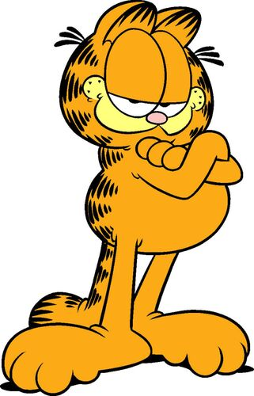
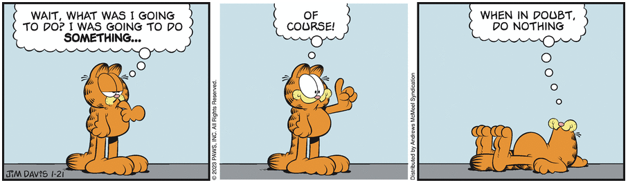
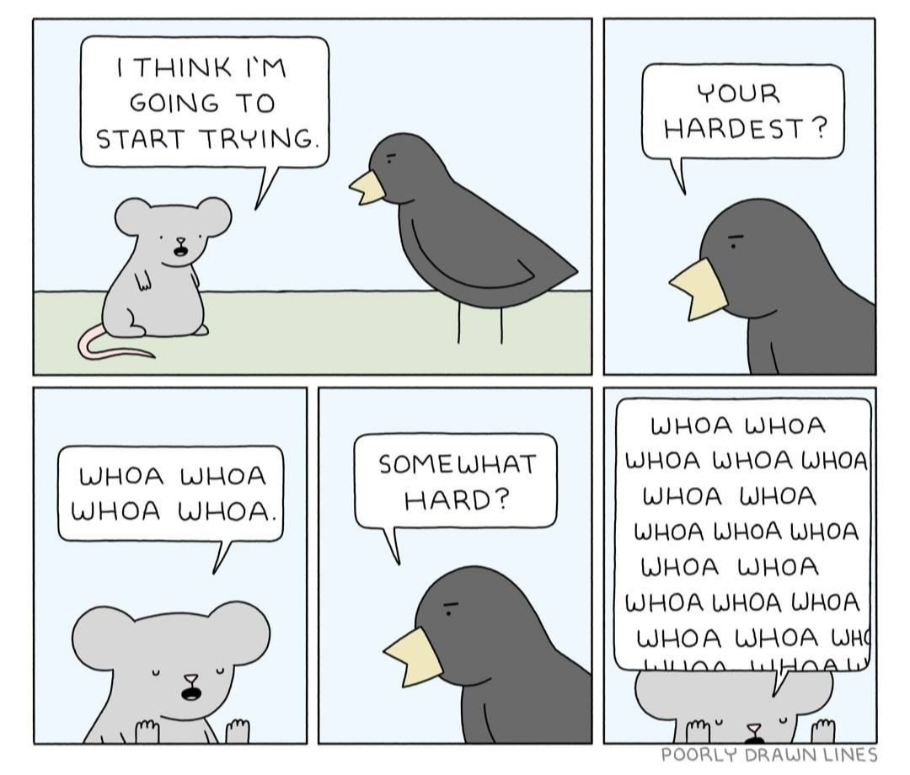
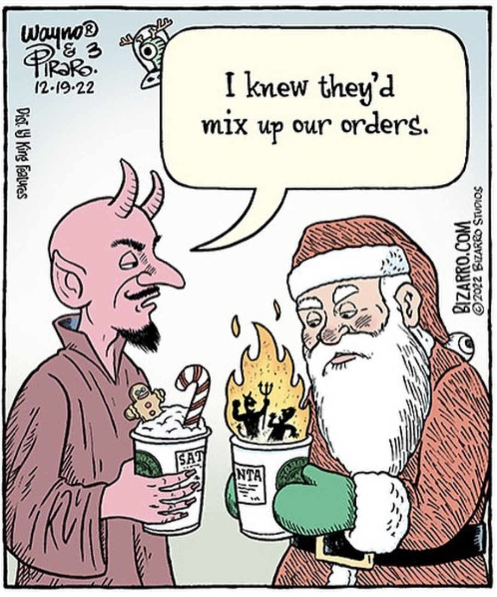

This week we are launching into RStudio and R Markdown. You should have R, RStudio, and RTools (Windows OS) installed on your machine by now. Because [R Notebooks](https://argoshare.is.ed.ac.uk/healthyr_book/what-is-the-difference-between-a-notebook-and-an-r-markdown-file.html) and [R Markdown](https://player.vimeo.com/video/178485416) will be the primary platform for writing and sharing code in this class, it is a good idea for us to build familiarity with it ASAP. This exercise is whimsical but also introduces several of the R Markdown formatting conventions that we will come to rely on and gives you a reason to practice what you read for today's class. **To wit** this HTML file was produced by knitting the .Rmd file into the format specified in the YAML header&mdash;this will typically be an HTML file for us. 

<br> 

Some people think that I only like nerdy comics like [xkcd](https://xkcd.com), but they are mistaken. I also have a deep appreciation for what has come before. Take, for instance, *Garfield* by **Jim Davis**. 

<center> {height=350px}</center> 

<br> 

The table below lists the main characters, for those who may be Garfield noobs!

|Name|Description|
|:-|:---:|
Garfield | Cat
Odie     | Dog
Jon      | Human
Nermal   | Cat?


There are several R packages designed to help you create better looking tables in R Markdown and we will introduce a couple of those over the coming weeks (e.g., **kable**). 


# Reasons Garfield Is Awesome

There many reasons that Garfield is a great character. Allow me to explain in bulleted list form...

* Garfield never gets rattled
* Garfield understands the important things in life
  * Eating as much lasagne as possible
  * Manipulating Odie and Jon
  
<center> {width="20%"}</center> 

<br> 


***

## Fun Facts About Garfield

There are lots of interesting things that you may not know about **Garfield** that you probably *should* know about **Garfield**. Here's one... Did you know that Muncie, Indiana is the setting for the comic strip? Muncie also happens to be the home of Ball State University. 

<center> {width=850px}</center> 

<br> 

The image above is from last week, so this strip is still going strong!

<br> 

## Other Recommended Distractions

I have already mentioned xkcd and Garfield, but there are sooooo many other strips and web comics out there these days! Here are a few other faves:

{width=450px}[Poorly Drawn Lines](https://poorlydrawnlines.com) by Reza Farazmand

<br> 

{width="40%"}[ Bizarro](https://www.bizarro.com) by Wayne Piraro

<br> 

{width=400px}[ Deliberately Buried](https://twitter.com/delibburiedcmx) by Sean ???

<br>


## From Comic Strips to Comic Books

Some of you may also be fans of comic books and the Marvel Cinematic Universe has really become embedded in American popular culture. The data included in the file *marvel-wikia-data.csv* was scraped in 2014 and was used in a [FiveThirtyEight story](https://fivethirtyeight.com/features/women-in-comic-books) about gender bias in the comic book industry. I realize that we have not yet introduced the **dplyr** package, but you did look at the piece on the **readr** package today. Let's import this comic book characters dataset and poke around a little...


```{r label="Import MCU Data and Explore It"}

# install.packages("tidyverse")
library(tidyverse)

data_0 <- read_csv("marvel-wikia-data.csv")

str(data_0)

View(data_0)

```

The `read_csv` function is part of the **readr** package and we use it to import&mdash;you guessed it&mdash;.csv files. Note that the `str` function displays the structure of an object while the `View` function  allows us to interact with the data in a separate window. 

<br> 

The reading for next time goes into further detail regarding the **dplyr** package which is the workhorse for data wrangling. It is fundamental to the work we will do this semester, and so we may as well start familiarizing ourselves with it. 


```{r label="Filter Data and Summarize Characters By Sex"}

data <- data_0 %>%
  drop_na(SEX)

dim(data_0)
dim(data)

data %>% 
  group_by(SEX) %>%
  count()

data %>% 
  count(SEX) %>%
  mutate(percent = (n / sum(n)) * 100)


```

In the above code chunk, we use the `tidyr::drop_na` function to remove observations (i.e., rows) in the dataset that do not have a value for the **SEX** attribute. We then use the base R function `dim` which is short for dimensions, to compare the number of rows and columns before and after we perform that operation. 


Next, we use the pipe operator `%>%` to link multiple functions together&mdash;this allows us to write fewer lines of code and (arguably) makes it easier to understand what is happening! You read the code from top to bottom. The **data** object above has the `dplyr::group_by` function  applied to it such that observations (i.e., rows) are grouped according to the value of this attribute, then the result is passed to the `dplyr::count` function. Because there is no `<-` operator, the resulting table is displayed but **it is not stored** in an object that we can go back to later. By default, the `count` function generates a new attribute (i.e., column) called **n** which can be referenced in subsequent functions that are part of the sequence and linked though the `%>%` operator. 


The final bit of the above code chunk eliminates the `group_by` component and instead applies the `count` function directly to the **SEX** attribute. Then, the `dplyr::mutate` function is used **to create a new attribute (i.e., column)** alongside the **n** attribute that contains the percentage value. Again, because there is no `<-` operator, the resulting table is displayed but **it is not stored** in an object that we can go back to later.


This quick analysis shows that there are far fewer male characters, but we could also ask if the number of appearances is more or less skewed. 

### **Your Turn** 
<br>

Insert a new code chunk then try to modify the preceding code to determine: 

  + How the percentage of appearances varies across gender designations
  + If there is more balance in the percentage of appearances if we limit the analysis to characters originating **since 2010** 
  
Keeping in mind that these data are circa 2014, you can limit the dataset to characters introduced in 2010 or later like this `data_2010_2014 <- data %>% filter(Year >= 2010)` **Hint:** you will probably want to create a standalone object that contains the total number of appearances for use as the denominator in your calculations. You can access the function reference for the **dplyr** package [here](https://dplyr.tidyverse.org/reference/count.html). 

<br> 

If you are hungry for more **dplyr** try rerunning the same code for the DC Comics dataset included with this assignment (i.e., *dc-wikia-data.csv*).


## Why Do I Need RTools? 

The last thing I want to introduce here is the rationale for installing RTools (or Xcode Command Line Tools if you have a Mac). Sometimes we want to access R packages that are not available on the official CRAN mirror sites and usually that means downloading and compiling from a platform like GitHub. In the chunk below, we set out preferred CRAN mirror in the code, then install the **devtools** package, which allows us to pull packages like **emo** from GitHub. The **emo** package allows us to insert emoji into our R Notebooks, which will really increase your enjoyment and quality of life. 


```{r label="Load R Packages", message = FALSE, warning=FALSE}

options(repos=c(CRAN="https://mirrors.nics.utk.edu/cran/")) 
install.packages("devtools")

devtools::install_github("hadley/emo")
library(emo)

```

If we **did not** have RTools (or Xcode Command Line Tools if you have a Mac) installed, this part wouldn't work and the mood would be decidedly `r emo::ji("sad")` 

Take a look at this page to get a sense of which keywords are associated with your fave emoji `r emo::ji("wow")` but you should know that if there are multiple emoji associated with a given keyword, RStudio randomly grabs one each time.


----


<br> 

<center> You have reached the end! </center>

<br> 

