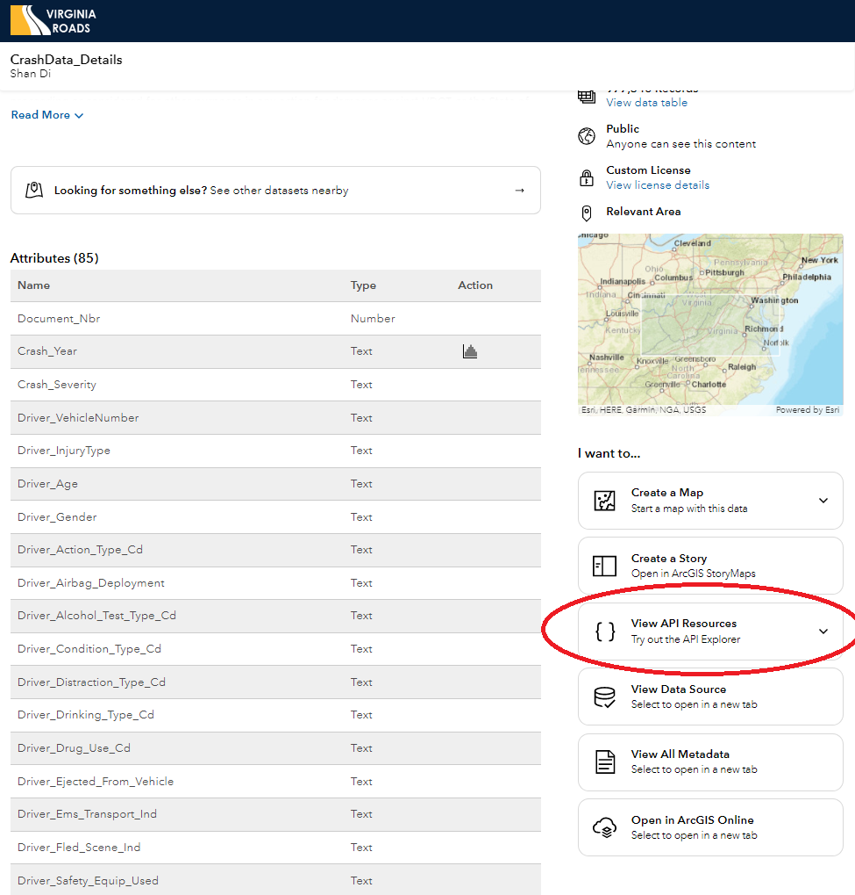

<br>
The Virginia Department of Transportation maintains a geospatial dataset of [reported traffic accidents](https://www.virginiaroads.org/datasets/VDOT::crash-data-1/about?layer=1). As shown in the screen capture below, this is a very large dataset with **85 attributes** or columns and over **977,000 records** or rows: 
<br> 

<center> {width=800px} </center>

<br>
<br>

Next, scroll down the page and take a quick look at the many attributes. When you are done perusing, click the **View API Resources** link shown below: 

<br>

<center>  </center>

<br>

Finally, click the **Open in API Explorer** link. This particular dataset is hosted using ESRI's ArcGIS Hub, which not important in-and-of itself&mdash;this just means that the idiosyncrasies of how we interact with these datasets through an application programming interface or **API** is a little more predictable. I like to think about APIs as setting the **rules of engagement** for how we interact with (or are *allowed* to interact with) data programmaticaly (i.e., from R scripts or code chunks). 

<br>

<center> {width=800px} </center>

<br>

<br>

The default query string is shown in the upper right corner. Let's break it down: 

  * The protocol or scheme: `https://`
  * The host or base URL: `services.arcgis.com`
  * The path parameters to the [endpoint](https://blog.hubspot.com/website/api-endpoint): `p5v98VHDX9Atv3l7/arcgis/rest/services/CrashData_test/FeatureServer/1`
  * The beginning of the query string, which is comprised of query parameters chained together with am `&`: `query?`

Take a moment to scroll **all the way down** the documentation page for the [Query (Feature Service/Layer)](https://developers.arcgis.com/rest/services-reference/enterprise/query-feature-service-layer-.htm) operation for this API and make sure you understand what the additional query string parameters shown below mean: 

  * where=1%3D1
  * &outFields=*
  * &outSR=4326
  * &f=json

Note that some values, like spaces, are not permitted in URLs and must be encoded. That is what is happening with `1%3D1` above. There are lots of decoder/encoder sites out there and [here is a no-frills](https://meyerweb.com/eric/tools/dencoder) option. Visit that site and paste `1%3D1` into it to see how the remote server would "translate" it when we send the request over. 

The image below shows how the query builder can be used to create a properly formatted API call to retrieve records where the `DRIVER_DISTRACTION_TYPE_CD` is `6. CELL PHONE`. 

<br> 

<br>

<center>  </center>

<br>

This string can be opened in a new browser tab or cut-and-paste into a new browser tab to execute the query and retrieve the records from the remote server in the default [JSON format](https://en.wikipedia.org/wiki/JSON). 

### **Your Turn** 
<br>
Experiment with the **Open in API Explorer** tool and see if you can write a query that keeps the current `DRIVER_DISTRACTION_TYPE_CD` parameter, but that **also limits** the retrieved data to the year 2021. Recall that query string parameters are chained together using the `&` operator. 


---


```{r label="Load Packages and Get Data", message=FALSE, cache=TRUE}

install.packages("jsonlite", repos = "http://R-Forge.R-project.org", dependencies = TRUE)
library(jsonlite)
library(tidyverse)
library(emo)

crash_data <- fromJSON("https://services.arcgis.com/p5v98VHDX9Atv3l7/arcgis/rest/services/CrashData_test/FeatureServer/1/query?where=DRIVER_DISTRACTION_TYPE_CD%20%3D%20%276.%20CELL%20PHONE%27&outFields=*&outSR=4326&maxRecordCount=90000&f=json")

dim(crash_data$features$attributes)
str(crash_data)  

crash_data_tb <- as_tibble(crash_data$features$attributes)

```

<br> 

As you can see, the response from the server is pretty complex `r emo::ji("confused")`  There are nested lists, data frame objects, etc. Typically, we are interested in the data itself, so we are extracting that and storing it in a tibble in the code chunk above. The reason we only have 2000 records is because that is the maximum the API allows `r emo::ji("fear")` per call: 

<br>

<center>  </center>

<br>

<br>

<center>  </center>

<br>

However, we can sometimes _side step_ this constraint by adding the `$limit=` component shown below `r emo::ji("wink")` : 

```{r label="Get MORE Data", message=FALSE, cache=TRUE}

more_crash_data <- fromJSON("https://services.arcgis.com/p5v98VHDX9Atv3l7/arcgis/rest/services/CrashData_test/FeatureServer/1/query?where=DRIVER_DISTRACTION_TYPE_CD%20%3D%20%276.%20CELL%20PHONE%27&outFields=*&outSR=4326&maxRecordCount=90000&f=json&$limit=5000")

dim(more_crash_data$features$attributes)

more_crash_data_tb <- as_tibble(more_crash_data$features$attributes)
str(more_crash_data_tb)  

```
<br> 

...and sometimes the API says "no, I **really did mean** that you can only have 2,000 records at a time" `r emo::ji("angry")`in which case, we can write more narrowly focused queries, or send multiple queries to retrieve sets of 2,000 records or less. **More to come on Thursday!**

----


<br> 

<center> You have reached the end! </center>

<br> 


