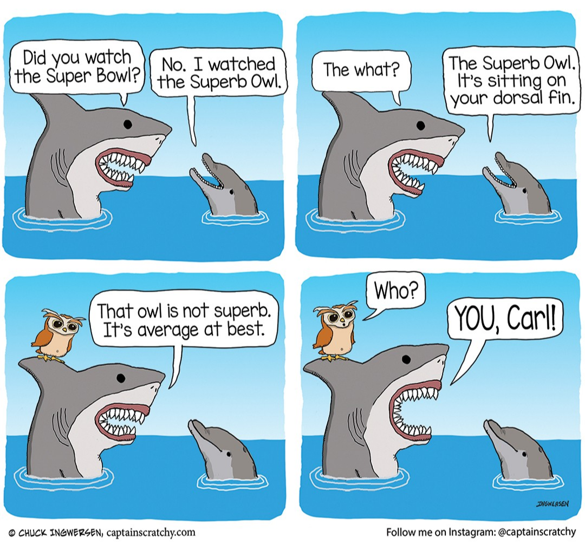

<br> 

```{r label="Load R Packages", include= FALSE}

options(repos = "http://cran.wustl.edu")
install.packages("ggimage")

library(tidyverse)
library(jsonlite)
library(lubridate)
library(tufte)
library(ggpubr)
library(viridis)
library(emo)
library(ggimage)
library(scales)
library(janitor)


```


This week we are formally introducing the **ggplot2** package, which is essentially the graphics creation workhorse of the **tidyverse**. The lecture portion of the session steps through the logic of **ggplot2** and explains that it is designed to standardize and streamline data visualization. 

<br> 

<center> {width="50%"} </center>

<br> 

Let's practice a bit using a rather timely dataset showing selected information related to the Super Bowl `r emo::ji("football")` Take a moment to import the file called _superbowl_dataset.csv_ and familiarize yourself with its contents. **Hint:** You will need to use the `read_csv` function to import _superbowl_dataset.csv_ from the _data_ folder (i.e., "./data/superbowl_dataset.csv"). 

<br> 

The foundation for data visualization in R is the **ggplot2** package that you read about today. 

 * [The `ggplot2` Library](https://info201.github.io/ggplot2.html)
 * [Exploratory Data Analysis](https://r4ds.had.co.nz/exploratory-data-analysis.html)
 
Basically, we use the `ggplot` function to create a plot object, then add one or more of the `geom_` functions to give geometry to what would otherwise be an empty plot object. We will also see later, than we can use familiar **dplyr** functions to manipulate a data object, then  pipe the result (`%>%`) directly into the `ggplot` function.  

# Important **dplyr** Verbs To Remember

dplyr verbs | Description
:--- | :---
`select()` | select columns 
`filter()` | filter rows
`arrange()` | re-order or arrange rows
`mutate()` | create new columns
`summarise()` | summarise values
`group_by()` | allows for group operations

<br>

>The code you write specifies the connections between the variables in your data, and the colors, points, and shapes you see on the screen.
>
> `r tufte::quote_footer('Kieran Healy')`

This quote refers to the [aesthetic mappings](https://info201.github.io/ggplot2.html#aesthetic-mappings) that you read about today, which is how we build a visualization from raw data with **ggplot2**. Sometimes it is easier to dive right in... `r emo::ji("swim")` let's create a barchart that shows which NFL teams have won the Super Bowl the most times. 

<br> 

If you open the help documentation for the latter `?theme` you get a rather long list of arguments that correspond to elements of the graphic we are creating. We have set the `axis.title.y` argument and the `axis.title.x` argument in the `theme` function to null in order to remove the default labels from the plot. Similarly, we use the `angle` argument of the `element_text` function to rotate the neighborhood names by 90&deg;.

<br> 

```{r label="Plot Number of Wins and Losses", message=FALSE, warning=FALSE}

ggplot(data = superbowls) + 
  geom_bar(aes(x = Winner)) +
    theme(axis.text.x = element_text(size = 8, angle = 90),
        axis.title.x = element_blank(),
        axis.title.y = element_blank())

ggplot(data = superbowls) + 
  geom_bar(aes(x = forcats::fct_infreq(Winner))) +
    theme(axis.text.x = element_text(size = 8, angle = 90),
        axis.title.x = element_blank()) +
  labs(y = "Wins")

ggplot(data = superbowls) + 
  geom_bar(aes(x = forcats::fct_infreq(Loser)), fill = "darkseagreen") +
    theme(axis.text.x = element_text(size = 8, angle = 90),
        axis.title.x = element_blank()) +
  labs(y = "Losses")

```

<br> 

In the code chunk above, we use functions from the **forcats** package discussed last time to manipulate how the bars are displayed in the chart. Take a look at `?fct_infreq` if you would. 

<br> 

If we want to change the color of **all the bars** in the chart, we can set the *fill* argument **outside of** the `aes` function. Recall that the the `aes` function outlines which attributes (columns) in the dataset are represented by different characteristics of the barchart.  

<br> 

If we wanted to have the color of the bars reflect some other characteristic of interest (**that does not apply in this case, mind you**), we would set the *fill* argument **inside of** the `aes` function. 

<br> 

```{r label="Plot Number of Wins Since 2000", message=FALSE, warning=FALSE}

superbowls %>%
  mutate(year = lubridate::year(actual_date)) %>%
  filter(year > 2000) %>%
ggplot() + 
  geom_bar(aes(y = forcats::fct_rev(forcats::fct_infreq(Winner))), color = "royalblue", fill = "dodgerblue") +
    theme(axis.text.x = element_text(size = 8),
        axis.title.x = element_blank()) +
  labs(title = "Super Bowl Victories", 
       subtitle = "2000 to 2022", y = "Wins") 


superbowls %>%
  mutate(year = lubridate::year(actual_date)) %>%
  filter(year > 2000) %>%
ggplot() + 
  geom_bar(aes(y = forcats::fct_rev(forcats::fct_infreq(Winner))), color = "firebrick", fill = "pink") +
    theme(axis.text.x = element_text(size = 8),
        axis.title.x = element_blank(), 
        plot.title = element_text(hjust = 0.5),
        plot.subtitle = element_text(hjust = 0.5)) +
  labs(title = "Super Bowl Victories", 
       subtitle = "2000 to 2022", y = "Wins") 


```

<br> 

This is a fun introduction, but we have already made a few barcharts. We can also create other types of plots including boxplots, scatterplots, and line charts. The [R Graph Gallery](https://www.r-graph-gallery.com/index.html) mentioned in class is a great resource because it provides example code for a wide variety of plots. 

<br>

Now let's create a line chart that shows point total for the Super Bowl over time... `r emo::ji("smile")`  Line charts make use of the `geom_line` function and we also get to practice some of the tricks from our foray into the **lubridate** package from last time!

<br> 

```{r label="Line Chart of Points Scored", message=FALSE, warning=FALSE}

superbowls %>%
  mutate(total_score = `Winner Pts` + `Loser Pts`) %>% 
ggplot(aes(x = actual_date, y = total_score)) +
  geom_line(color = "#a3c4dc", linetype = 1, size = 1.25) +
  geom_point(color = "royalblue", shape = 20, size = 5) + 
  scale_x_date(date_breaks = "3 year", date_labels = "%Y", 
              limits = c(as_date(min(superbowls$actual_date)), as_date(max(superbowls$actual_date)))) +
  labs(title = "Combined Super Bowl Score", 
       subtitle = "1967 to 2022", y = "Points Scored", x = "") +
  theme(axis.text.x=element_text(angle=60, hjust=1)) + 
  theme_minimal()


# Add a smoothing element for fun and profit...
superbowls %>%
  mutate(total_score = `Winner Pts` + `Loser Pts`) %>% 
ggplot(aes(x = actual_date, y = total_score)) +
  geom_line(color = "#a3c4dc", linetype = 1, size = 1.25) +
  geom_smooth(method = "auto", se = TRUE, fullrange = FALSE, level = 0.95, color = "red") +
  geom_point(color = "royalblue", shape = 20, size = 5) + 
  scale_x_date(date_breaks = "3 year", date_labels = "%Y", 
              limits = c(as_date(min(superbowls$actual_date)), as_date(max(superbowls$actual_date)))) +
  labs(title = "Combined Super Bowl Score", 
       subtitle = "1967 to 2022", y = "Points Scored", x = "") +
  theme(axis.text.x=element_text(angle=60, hjust=1)) + 
  theme_minimal()


```

<br> Take a minute to make sure you understand the different components of the code in the chunk above. Take a look at `?geom_smooth` if you would be so kind  `r emo::ji("thanks")`


## Your Turn

Can you modify the code above to instead display the **margin of victory** over time instead?

```{r label="Your Time To Shine"}


```

<br>

> "The greatest value of a picture is when it forces us to notice what we never expected to see."
> 
> `r tufte::quote_footer('John W. Tukey')`

Color is one of the most important tools we have for visualizing data and the **viridis** package is among the most popular options for working with color in R. There are several palettes available (see image below)

<center> {width=600px}</center>

The **official** introductory vignette is [available here](https://cran.r-project.org/web/packages/viridis/vignettes/intro-to-viridis.html) if you want to learn more. Let's create a few scatterplots to demonstrate how color can be useful for revealing patterns in data `r emo::ji("wow")` Scatterplots are especially useful for visualizing the correlation between two (or more) [continuous variables](https://r4ds.had.co.nz/exploratory-data-analysis.html#two-continuous-variables) of interest. Now let's explore how viewership varies with combined score _and/or_ year in this Super Bowl dataset to see how this works `r emo::ji("magnifying")`  

<br> 

```{r fig.height=10, fig.width=16, label="Create Scatter Plots", message=FALSE, warning=FALSE}

superbowls <- superbowls %>%
  mutate(total_score = (`Winner Pts` + `Loser Pts`),
         total_eyes = WinnerMktSize + LoserMktSize,
         year = lubridate::year(actual_date))


ggplot() +
  geom_point(data = superbowls, aes(x = total_score, y = average_viewers), color = "firebrick", size = 4) +
  theme(text = element_text(size = 12),
                legend.position = "none") +
  labs(x = "Points Scored", y = "Average Viewers") +
  geom_text(aes(x = superbowls$total_score, y = superbowls$average_viewers),
    label = superbowls$year, size = 3.4, 
    nudge_x = 0.25, nudge_y = 0.25, 
    check_overlap = T)

ggplot() +
  geom_point(data = superbowls, aes(x = total_score, y = average_viewers, color = network), size = 5) +
  theme(text = element_text(size = 12),
                legend.position = "bottom") +
  labs(x = "Points Scored", y = "Average Viewers") +
  geom_text(aes(x = superbowls$total_score, y = superbowls$average_viewers),
    label = superbowls$super_bowl, size = 4.4,
    nudge_x = 0.25, nudge_y = 0.25, 
    check_overlap = T)

RColorBrewer::display.brewer.all()

ggplot() +
  geom_point(data = superbowls, aes(x = total_score, y = average_viewers, color = network), size = 3) +
  scale_color_brewer(palette = "Set1", name = "Broadcaster") + 
  theme(text = element_text(size = 12),
                legend.position = "bottom") +
  labs(x = "Points Scored", y = "Average Viewers")


ggplot() +
  geom_point(data = superbowls, aes(x = total_score, y = average_viewers, fill = year), size = 3, shape = 25) +
#  scale_fill_viridis(option = "cividis") + 
  scale_fill_viridis(option = "plasma") + 
  scale_y_continuous(labels = comma) +
  theme(text = element_text(size = 12),
                legend.position = "bottom") +
  labs(x = "Points Scored", y = "Average Viewers", fill = "Year") + 
  theme_minimal()


```
<br> Take a minute to make sure you understand the different components of the code in the chunk above. 

> Would you say that viewership is related to combined score (i.e., a high scoring game)? Why or why not? 

Another hypothesis might be that the size of the participating teams' television markets determines viewership more than the combined score of the game. 


<br> 

## Your Turn

Can you modify the code above to test whether **total_eyes** appears to be more strongly related to **average_viewers** than **total_score** was in the above scatterplots? 

```{r label="Another Opportunity To Shine"}


```

<br> 

Yet another theory (and the importance of **year** in the preceding graphics) holds that the presence of [Tom Brady](https://www.sportingnews.com/us/nfl/news/tom-brady-super-bowl-performances-ranked/16xfqw6a0uruw1fh2kzwh7lzpg) matters for both viewership and combined score `r emo::ji("smirk")` Shall we investigate? 

<br>


```{r label="Create Brady Scatter Plots", message=FALSE, warning=FALSE}

ggplot() +
  geom_point(data = superbowls, aes(x = total_eyes, y = average_viewers, fill = tom_brady), size = 3, shape = 22) +
#  scale_fill_viridis(option = "cividis") + 
  scale_fill_viridis(option = "plasma", discrete = TRUE) + 
  scale_y_continuous(labels = comma) +
  scale_x_continuous(labels = label_number(suffix = " M", scale = 1e-6)) +
  theme(text = element_text(size = 12),
                legend.position = "bottom") +
  labs(x = "Total TV Households", y = "Average Viewers", fill = "Tom Brady Playing?") + 
  theme_minimal()


# Limit the viz to only years that Tom Brady was active...
superbowls %>%
  filter(year > 2000) %>%
ggplot() +
  geom_point(aes(x = total_eyes, y = average_viewers, fill = tom_brady), size = 3, shape = 22) +
  scale_fill_viridis(option = "cividis", discrete = TRUE) + 
#  scale_fill_viridis(option = "plasma", discrete = TRUE) + 
  scale_y_continuous(labels = comma) +
  scale_x_continuous(labels = label_number(suffix = " M", scale = 1e-6)) +
  theme(text = element_text(size = 12),
                legend.position = "bottom") +
  labs(x = "Total TV Households", y = "Average Viewers", fill = "Tom Brady Playing?") + 
  theme_minimal()


```

<br> 

> <span style="color:dodgerblue"> I told my daughter that I saw a deer on the way to work this morning. </span>
> 
> <span style="color:forestgreen"> She said, "How do you know it was on its way to work?" </span>
`r emo::ji("laughing")`

So what do you think about the "so-called Brady effect?"

<br> 

A boxplot helps us visualize variability in the data beyond measures like the mean or the median. The middle part of the plot, or the **interquartile range** (IQR) represents the middle quartiles (or the 75th minus the 25th percentile). The line near the middle of the box represents the median (or middle value of the data set), the whiskers on either side of the IQR represent the lowest and highest quartiles of the data, and the dots are potential outliers.

<br>

The code below filters by year and generates a boxplot showing combined score for Super Bowls where Tom Brady played and when he did not. 

As you learned in the reading, **faceting** generates multiple paneled plots based on a third variable. In the code chunk above, the `~` character is used to indicate how the existing boxplot object should be expanded&mdash;using the resolution attribute (column) from the source data. The `~` character is generally used to specify a formula in R and you saw examples in the reading related to linear regression smoothers (e.g., `geom_smooth` with the *method* argument set to "lm"). 

<br> 

```{r label="Create Brady Boxplots", message=FALSE, warning=FALSE}

brady_boxplot <- superbowls %>%
  filter(year > 2000) %>%
ggplot() +
  geom_boxplot(aes(x = as_factor(tom_brady), y = total_score, fill = network)) +
  scale_fill_manual(values = c("orange", "darkseagreen", "violet", "dodgerblue")) + 
  labs(y = "Points Scored", x = "Did Brady Play?", fill = "Broadcaster", 
       caption = "Note: Brady only played on ABC and NBC once.") + 
  theme(text = element_text(size = 25),
        axis.title.x = element_text(face = "bold", color = "royalblue", size = 24),
        axis.title.y = element_text(face = "bold", color = "red", size = 12),
        legend.position = "bottom") +
  theme_minimal()

brady_boxplot + facet_wrap(~ network,  ncol = 4, scales = "free")


```

<br> 

## Your Turn

Can you modify the code above to test whether **average_viewers** is also higher in Super Bowls played 2001 that **featured Tom Brady** by generating one or more boxplots? 

```{r label="One Last Opportunity To Shine"}


```


<br>

<center> {width=300px}</center>

<br> 

<center> You have reached the end! </center>

<br> 


