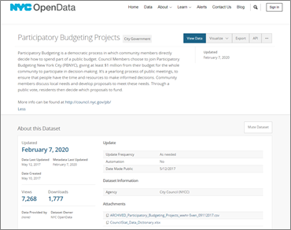
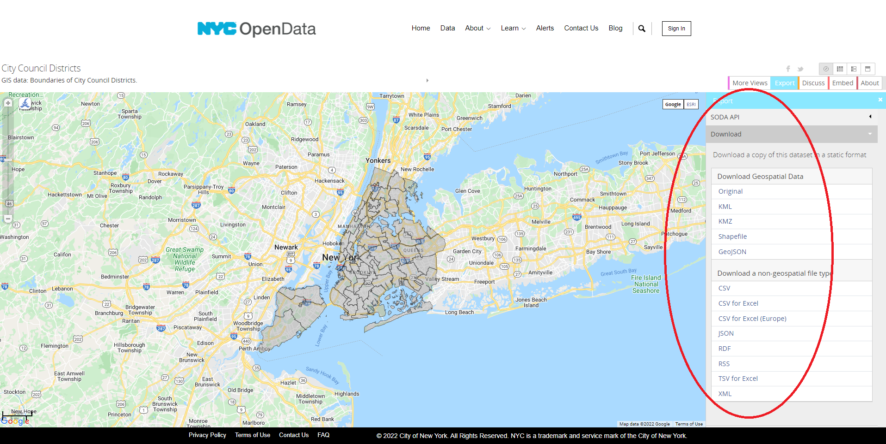
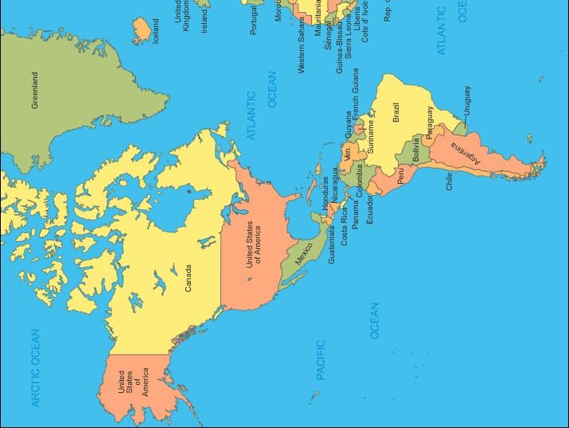

 <br> 
 
This week we are beginning to work with the *sf* package, which has emerged as the clear successor to the older *sp* package. **Note:** we are not even talking about *sp* objects because they are on the way out and it would only muddy the proverbial waters. Here are convenient links to this week's assigned readings: 

 * [Simple Features for R](https://r-spatial.github.io/sf/articles/sf1.html)
 * [Maps](https://ggplot2-book.org/maps.html)
 * [Manipulating Simple Features](https://r-spatial.github.io/sf/articles/sf4.html)


```{r label="Load R Packages", include= FALSE}

options(repos=c(CRAN="https://mirrors.nics.utk.edu/cran/")) 
# install.packages("devtools")
# install.packages("sf")

library(tidyverse)
library(sf)
library(jsonlite)
library(lubridate)
library(ggpubr)
library(viridis)
library(scales)
# devtools::install_github("hadley/emo")
library(emo)

```


We will briefly demonstrate some of the fucntionality you read about for today using a famailiar dataset with an emphasis on bringing in the geospatial component. Accompanying this document in the **./data/** folder, you will find a .csv file called “Participatory_Budgeting_Projects.csv”. This file was taken from the New York City open data portal and more information about its contents can be [found here](https://data.cityofnewyork.us/City-Government/Participatory-Budgeting-Projects/wwhr-5ven). You can see that this dataset was created in 2017 and last updated in early 2020. 

<center> {width=300px}</center>
 
<br> 

Take a few moments to re-acquaint yourself with the dataset by scrolling down the page and viewing the “Columns in this Dataset” and “Table Preview” sections in particular. Note that there are 20 columns or attributes in the dataset. 

<br>

```{r label="Read Tabular Data", message=FALSE, warning=FALSE}

nyc_ppb <- read_delim("./data/Participatory_Budgeting_Projects.csv", delim = ";")

# Use the dplyr::filter function to limit the data to 2017 and remove entries
# without cost information...
nyc_ppb_2017 <- nyc_ppb %>%
  filter(`Vote Year` == 2017) %>%
  filter(!is.na(Cost))

# Inspect the dimensions and structure of the resulting object...
dim(nyc_ppb_2017)
str(nyc_ppb_2017)

```

<br> 

Awesome, `r emo::ji("wow")` we now have the participatory budgeting data, but if we want to map it, we need a geospatial data layer that aligns with one of the attributes. Let's pull down this layer with NYC [city council district boundaries](https://data.cityofnewyork.us/City-Government/City-Council-Districts/yusd-j4xi). These are available in a variety of formats: 

<center> {width=800px}</center>

<br> 

```{r label="Get City Council District Boundaries", message=FALSE, warning=FALSE}

# Downloading the shapefile version is a bit of a hassle...
# First we download it...
download.file(url = "https://data.cityofnewyork.us/api/geospatial/yusd-j4xi?method=export&format=Shapefile", 
              destfile = "./data/nyc_council.zip",
              mode = "wb")

# Then we unzip it...
unzip(zipfile = "./data/nyc_council.zip", 
      exdir = "./data/nyc_council",
      overwrite = TRUE)

# Then we read it into an sf object...
city_council_shp <- st_read("./data/nyc_council")
class(city_council_shp)


# On the other hand, grabbing the GeoJSON version is simpler and is 
# generally the recommended approach...
city_council <- st_read("https://data.cityofnewyork.us/api/geospatial/yusd-j4xi?method=export&format=GeoJSON")
class(city_council)

```

<br> 

As you read, we can use the base R `plot` function to visualize *sf* objects, but we have to specify which attribute we want, so using `ggplot2::geom_sf` is less onerous `r emo::ji("chicken")`

```{r label="Plot City Council District Boundaries"}

# Using base R...
plot(city_council["coun_dist"])

# Using ggplot2...
ggplot(data = city_council, aes(fill=coun_dist)) +
  geom_sf() + 
  theme_void() + theme(legend.position="none")

```

<br> 

In the above code chunk, we use the `geom_sf` function to visualize the polygons that represent city council districts. Because the _coun_dist_ attribute is inside the `aes` function (i.e., the [aesthetic mappings](https://r4ds.had.co.nz/data-visualisation.html#aesthetic-mappings) that specify which data attributes should be represented by which design elements of the map or chart we are creating), it gets a legend by default. However, we have set the **legend.position** argument of the `ggplot2::theme` function to "none" in order to suppress it. 

<br> 

Now let's link the tabular data to the polygon layer for cryin' out loud... `r emo::ji("tired")` 

<br>

```{r label="Join Tabular and Geospatial Data"}

# First, sum the cost of winning proposals by city council district
nyc_ppb_2017_wins <- nyc_ppb_2017 %>%
  filter(Winner == 1) %>%
  group_by(`Council District`) %>%
  mutate(TotalCost = sum(Cost),
         TotalNum = n()) %>%
  summarise(`Council District`, TotalCost, TotalNum) %>%
  distinct()


# Use the dplyr::left_join function  to link the tabular participatory
# budgeting data to the council district boundaries so we can map it...
nyc_ppb_2017_wins_by_district <- left_join(city_council, nyc_ppb_2017_wins,  by = c("coun_dist" = "Council District"))


# This is a nice plot, but...
ggplot(data = nyc_ppb_2017_wins_by_district, aes(fill=TotalNum)) +
  geom_sf() + 
  theme_void()


# Let's replace the NA values with zero...
nyc_ppb_2017_wins_by_district_complete <- nyc_ppb_2017_wins_by_district %>%
  mutate(TotalNum = replace_na(TotalNum, 0),
         TotalCost = replace_na(TotalCost, 0))


# Then recreate it...
ggplot() +
  geom_sf(data = nyc_ppb_2017_wins_by_district_complete, aes(fill = TotalNum)) + 
  scale_fill_distiller(palette = "Reds", name = "Winning Projects", trans = "reverse") +
  theme_void() + 
  labs(title = "Participatory Budgeting Projects By Council Districts (2017)", 
       caption = "Note: 20 of 51 districts had no projects selected in 2017.")

```

<br> 

We can also create a `MULTIPOINT` *sf* object from tabular data. For folks who have used ArcGIS in the past, this is the equivalent of [mapping XY data](https://pro.arcgis.com/en/pro-app/3.0/help/mapping/layer-properties/add-x-y-coordinate-data-as-a-layer.htm) or creating a point layer from a table of latitude and longitude (or projected) coordinates. 

<br> 

The **nyc_ppb_2017_wins** tibble object has columns with latitude and longitude coordinates. We will use these to build and plot the location of each individual funded project. 

<br> 

The default coordinate system for data portals built using the Socrata platform is [EPSG:4326](https://spatialreference.org/ref/epsg/4326/) so we can assume that the latitude/longitude coordinates in our data are using this (unprojected) coordinate system.

<br>

```{r label="Distill Projects That Were Selected"}

# Create a point sf object...
funded_projects <- nyc_ppb_2017 %>%
  drop_na(Longitude) %>%
  st_as_sf(coords = c("Longitude", "Latitude"), crs = "EPSG:4326")


# Add it to our existing plot...
ggplot() +
  geom_sf(data = nyc_ppb_2017_wins_by_district_complete, aes(fill = TotalNum), na.rm = TRUE) + 
  geom_sf(data = funded_projects, color = "darkseagreen4") +
  scale_fill_distiller(palette = "Reds", name = "Winning Projects", trans = "reverse") +
  theme_void() + 
  labs(title = "Participatory Budgeting Projects By Council Districts (2017)", 
       caption = "Note: 20 of 51 districts had no projects selected in 2017.")


# Get an initial sense of the type and cost of these projects...
ggplot() +
  geom_sf(data = nyc_ppb_2017_wins_by_district, color = "grey20", fill = NA) + 
  geom_sf(data = funded_projects, aes(color = Category, size = Cost)) +
  theme_void() + 
  labs(title = "Participatory Budgeting Projects With Council Districts (2017)") 


```

<br> 

We use the `st_crs` function to display the coordinate system for a given *sf* object but we use the `st_transform` function to **change the coordinate system** of a given *sf* object. 

<br>

The code chunk below demonstrates how to create a brand new point *sf* object from a single pair of coordinates. These lat/lon coordinates represent the location of New York City's city hall building. Make sure you understand it, then proceed...

<br>

```{r label="Create Point Object From Scratch"}

ch_geometry = st_sfc(st_point(c(-74.00605901347289, 40.71308342109256)))

city_hall <- st_sf(Name = "City Hall", ch_geometry, crs = "EPSG:4326")


# Place it on the map for context...
ggplot() +
  geom_sf(data = nyc_ppb_2017_wins_by_district, color = "grey20", fill = NA) + 
  geom_sf(data = city_hall, color = "dodgerblue", size = 4, shape = 19) + 
  theme_void()


```

<br>

### **Your Turn** 

<br>

Insert code into the above code chunk (or insert a completely new code chunk) then answer the questions below: 

  + What is the coordinate system of the the **city_hall** object?
  + How many projects are within one mile of city hall? **Hint:** use the `st_join` function with the **join** argument set to _st_is_within_distance_ and the **dist** argument set to the appropriate distance in meters `r emo::ji("wink")`
  + Create a map with *ggplot2* (see the examples in "Distill Projects That Were Selected") that shows the city council boundaries, **all of the funded projects**, and the location of city hall.
  + Create another a map with *ggplot2* that shows **only** the funded projects **within 2 miles** of city hall.
    + Use `st_tranform`to project all three data layers to [UTM Zone 18 North](https://spatialreference.org/ref/epsg/32618/) 
    + Use the `st_join` function with the **join** argument set to _st_is_within_distance_ and the **dist** argument set to the appropriate distance to identify all funded projects within 2 miles or 3218.69 meters of city hall.
    + Use `dplyr::filter` to extract these features from the projected (UTM Zone 18N) version of the funded projects object.


<br> 

----

<br> 

Did you ever notice how if you take a map of the Americas and turn it sideways, it kinda looks like a duck? 

<br> 

<center> {width=800px}</center>

<br> 

<center> You have reached the end! `r emo::ji("bird")`  </center>

<br> 

