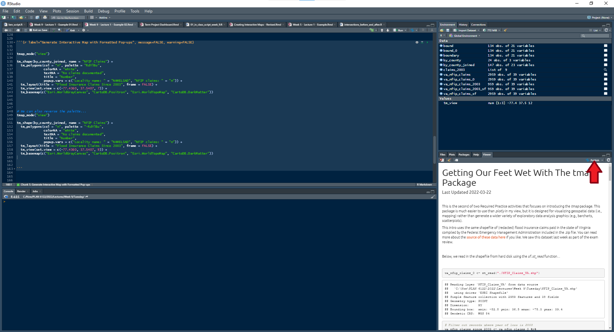
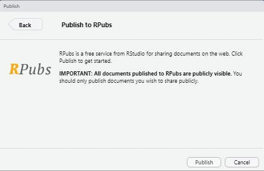
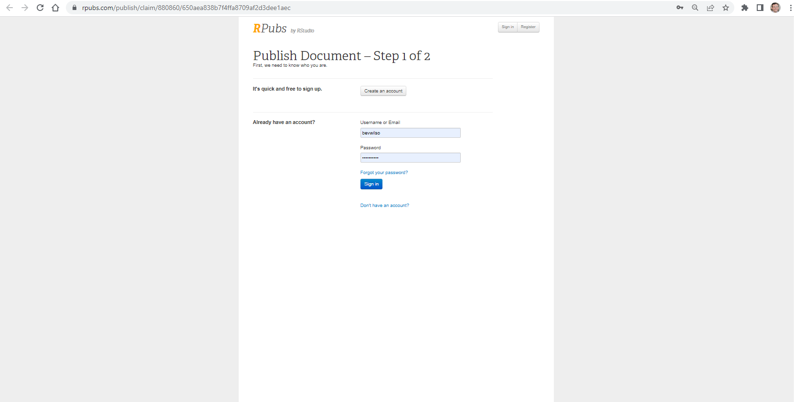
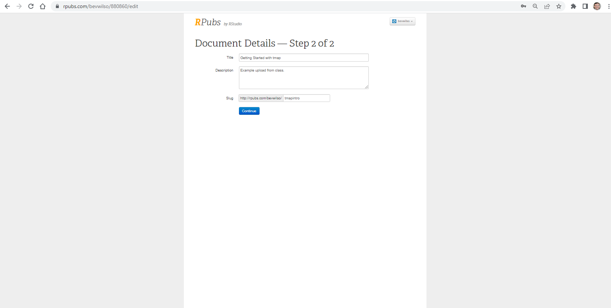
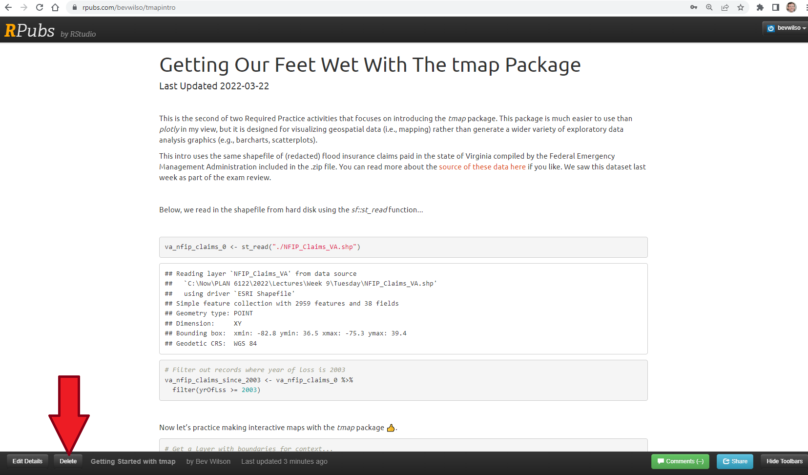

 <br> 
 
This is the second of two Required Practice activities for today. This one focuses on introducing the *tmap* package. This package is much easier to use than *plotly* in my view, but it is more specialized. The *tmap* package is designed for visualizing geospatial data (i.e., mapping) rather than for generating a wide variety of exploratory data analysis graphics (e.g., barcharts, scatterplots).

<br> 
 
```{r label="Load R Packages", include= FALSE}

options(repos=c(CRAN="https://mirrors.nics.utk.edu/cran/")) 
# install.packages("devtools")
# install.packages("plotly")

library(tidyverse)
library(sf)
library(jsonlite)
library(lubridate)
library(ggpubr)
library(viridis)
library(scales)
# devtools::install_github("hadley/emo")
library(emo)
library(plotly)
library(tmap)

```

This intro uses the same shapefile of (redacted) flood insurance claims paid in the state of Virginia compiled by the Federal Emergency Management Administration included in the .zip file. You can read more about the [source of these data here](https://www.fema.gov/openfema-data-page/fima-nfip-redacted-claims-v1) if you like. We saw this dataset last week as part of the exam review. 

<br>

Below, we read in the shapefile from hard disk using the *sf::st_read* function...

<br> 

```{r label="Read Shapefile of NFIP Claims", message=FALSE, warning=FALSE}

va_nfip_claims_0 <- st_read("./NFIP_Claims_VA.shp")

# Filter out records where year of loss is 2003
va_nfip_claims_since_2003 <- va_nfip_claims_0 %>%
  filter(yrOfLss >= 2003)


```

<br> 

Now let's practice making static **AND** interactive maps with the *tmap* package  `r emo::ji("thumb")`. 
<br>

```{r label="Create Static Map", message=FALSE, warning=FALSE}

# Get a layer with boundaries for context...
bound_0 <- st_read("https://opendata.arcgis.com/datasets/e3c8822a4adc4fc1a542a233893a46d4_0.geojson")
bound <- st_transform(bound_0, st_crs(va_nfip_claims_since_2003))

# Group and count by county (locality)
by_county <- va_nfip_claims_since_2003 %>%
  drop_na(amnPOBC) %>%
  group_by(contyCd) %>%
  count()


# Join to existing sf object for plotting...
# by_county_joined <- st_join(bound, by_county, left = TRUE)


# Repair faulty feature geometries in the boundary layer...
st_is_valid(bound, reason = TRUE)
boundary <- st_make_valid(bound)


# Try again with repaired sf object...
by_county_joined <- st_join(boundary, by_county, left = TRUE)


# Use the qtm function to peruse a basic map WITHOUT having to write much code...
qtm(by_county_joined, fill = "n")


# Set the mode to plot (i.e., static maps) and polish the map a bit...
tmap_mode("plot")

tm_shape(by_county_joined) + 
  tm_polygons("n", palette = "RdYlBu", 
              colorNA = "white",
              textNA = "No claims documented", 
              title = "Number") +
  tm_layout(title = "Flood Insurance Claims Since 2003", frame = FALSE)


```

<br> 

This is fine... I guess... `r emo::ji("sleepy")` but the strength of *tmap* is its ability to quickly spin up interactive maps! The first two lines of code in the chunk below display the basemap options that are available for interactive maps generated with the *tmap* package. 

<br> 

> <span style="color:dodgerblue"> I've offered my elderly neighbor $20 to let me try out her stair lift. </span>
> 
> <span style="color:forestgreen"> I think she's going to take me up on it. </span>
`r emo::ji("laughing")`

<br> 

```{r label="Generate Interactive Map", message=FALSE, warning=FALSE}

styles <- schema()$layout$layoutAttributes$mapbox$style$values
styles


tmap_mode("view")

tm_shape(by_county_joined, name = "NFIP Claims") + 
  tm_polygons(col = "n", palette = "RdYlBu", 
              colorNA = "white",
              textNA = "No claims documented", 
              title = "Number", 
              id = "NAME") +
  tm_layout(title = "Flood Insurance Claims Since 2003", frame = FALSE) +
  tm_basemap(c("Esri.WorldGrayCanvas", "CartoDB.Positron", "Esri.WorldTopoMap"))


```

<br> 

Note that by default, the pop-up that appears when we hover over or click on a polygon is the value we assigned to the **col** argument, but we can format these any way we like... now click a polygon instead of hovering over it `r emo::ji("mouse")` to see the difference.

<br>


```{r label="Generate Interactive Map with Formatted Pop-ups", message=FALSE, warning=FALSE}


tmap_mode("view") 

tm_shape(by_county_joined, name = "NFIP Claims") + 
  tm_polygons(col = "n", palette = "RdYlBu", 
              colorNA = "white",
              textNA = "No claims documented", 
              title = "Number",
              popup.vars = c("Locality name: " = "NAMELSAD", "NFIP claims: " = "n")) +
  tm_layout(title = "Flood Insurance Claims Since 2003", frame = FALSE) + 
  tm_view(set.view = c(-77.4360, 37.5407, 7)) + 
  tm_basemap(c("Esri.WorldGrayCanvas", "CartoDB.Positron", "Esri.WorldTopoMap", "CartoDB.DarkMatter"))


# We can also reverse the palette...
tmap_mode("view")

tm_shape(by_county_joined, name = "NFIP Claims") + 
  tm_polygons(col = "n", palette = "-RdYlBu", 
              colorNA = "white",
              textNA = "No claims documented", 
              title = "Number",
              popup.vars = c("Locality name: " = "NAMELSAD", "NFIP claims: " = "n")) +
  tm_layout(title = "Flood Insurance Claims Since 2003", frame = FALSE) +
  tm_view(set.view = c(-77.4360, 37.5407, 9)) +
  tm_basemap(c("Esri.WorldGrayCanvas", "CartoDB.Positron", "Esri.WorldTopoMap", "CartoDB.DarkMatter"))


```


If we want to access cool basemaps, it is best to sign up for MapBox token by [visiting this page](https://account.mapbox.com/auth/signup).

<br>


### **Your Turn** 
<br>

Insert a new code chunk that generates at least one static and at least one interactive map of your choice using *tmap*. This can be with the dataset we have here **OR** another dataset of your choosing. 

When you are done, knit your R Notebook to HTML, then publish the results to [RPubs](https://rpubs.com) by following the guidelines below: 

<br>
<center> {width=750px}</center>  
<br>

The above image shows where the **Publish** button is located in the **Viewer** pane. Click it and choose **Publish HTML**.

<br>
<center> {width=300px}</center>  
<br>

The next image shows that we are pushing this to RPubs and not to another platform.

<br>
<center> {width=600px}</center>  
<br>


<br>
<center> {width=600px}</center>  
<br>

Then, we sign in and give the file a name and a description as well as choosing the final bit of the URL.

<br>
<center> {width=600px}</center>  
<br>

Finally, if you need to remove something from RPubs, log in and use the **Delete** button shown here. 

**Note:** you may want to sign up for an account at the outset [here](https://rpubs.com/users/new). 


<br> 


----


<br> 

<center> You have reached the end! `r emo::ji("flex")` </center>

<br> 

