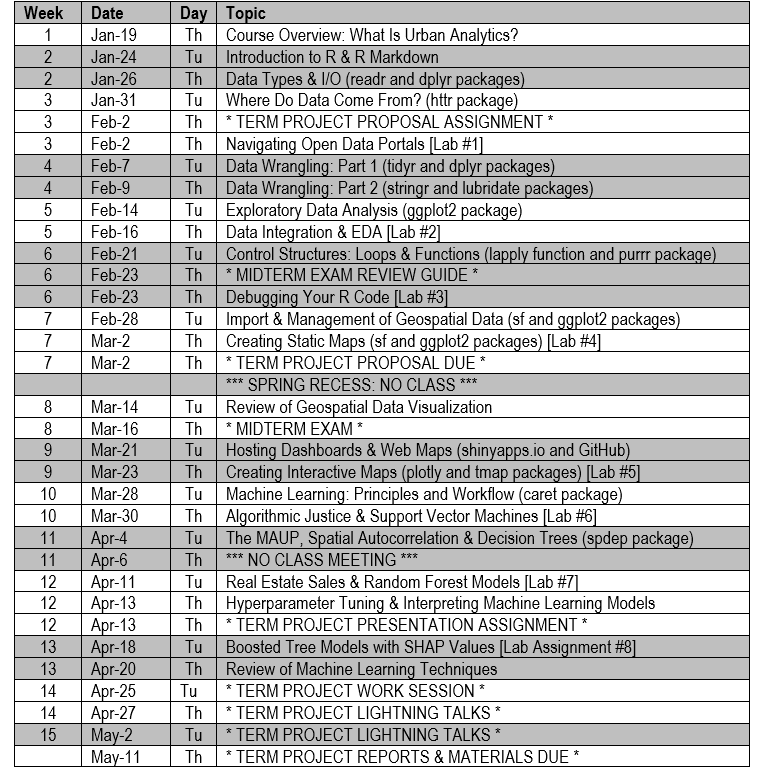

# PLAN 6122: Urban Analytics

  

This repo contains code and data used for Department of Urban and Environmental Planning course delivered during the spring of 2023 at the University of Virginia. 

## Description

This course introduces the principles and techniques of data science with an emphasis on geospatial data using examples and applications drawn from cities in the U.S. and around the world. It also introduces frameworks and several case studies for the ethical use and governance of data in the public realm. PLAN 6122 familiarizes students with the R programming language and RStudio environment; covers fundamentals such as data input/output, debugging, and looping; and builds proficiency in areas like data visualization, web-based mapping, and querying APIs. 
Each student will design and implement an individual term project that integrates the tools of data science with geospatial data to explore an issue or research question drawn from urban planning or public policy. Although prior experience with geospatial data or coding would be useful, neither is required. 

## Learning Objectives

PLAN 6122 focuses on applying the principles and techniques of data science to challenges faced by cities. Students who successfully complete this course will be able to:

  * Explain, students will be able to explain the aims of urban analytics;
  * Apply, students will apply concepts introduced in the readings and lectures to analyze datasets drawn from cities around the world;
  * Develop, students will begin developing core data science competencies such as data wrangling, visualization, analysis, and communication;
  * Visualize, students will learn to manipulate tabular and geospatial data to produce intelligible and useful graphics for inclusion in documents and dissemination on the web;
  * Synthesize, students will cultivate an ability to translate the results of visualization and analysis for use in decision-making and policy development;
  * Articulate, students will be able to interpret and critique data visualizations as well as explain the practical implications of their analyses in plain language;
  * Build, students will cultivate the technical and management skills needed to envision and execute urban analytics projects. 

## Instructional Methods

This is a fast-paced course intended to introduce students to the fundamental concepts and techniques of urban analytics. Because the substantive focus is on cities and urban analytics, geospatial data analysis figures prominently in the lecture and lab exercise materials. We begin an overview of the R language and RStudio environment, which will serve as the foundation for your work in this class. Students will build proficiency with R programming, data wrangling and visualization, static and interactive mapping, and fundamental machine learning techniques. Students are expected to also cultivate an ability to interpret and explain the implications of the visualization and analysis components of their work in plain language. Class meetings are generally divided into lecture (Tuesdays) and laboratory sessions (Thursdays) that focus on concepts and practical applications, respectively. Lab reports are due at the beginning of the subsequent class period and should be written independently. The term project for the course will focus on integrating the tools of data science with geospatial data to explore a specific real-world planning issue or research question. This is an individual project and students will define the scope of the project and identify specific deliverable(s) early in the semester. Reproducing an existing analysis or study using different data or an alternate study area is also acceptable for the term project. 

## Course Outline

## Readings & Lab Exercises

### Week 1

#### Lecture: Course Overview—What Is Urban Analytics? (1/19)

Themes and Topics: _cities, distributed governance, inference, prediction, data ethics_ 

  Goldsmith, S., & Kleiman, N. (2017). “The Pivot to a New Government Operating System.” In A New City O/S : The Power of Open, Collaborative, and Distributed Governance. Washington, DC: Brookings Press. (pp. 1-27)

  Gover, J.A. (2018). How to Do Data Analytics in Government. Government Technology. 
Available at https://www.govtech.com/data/how-to-do-data-analytics-in-government.html

#### Required Practice: Software Installation & Introduction to R (1/19)

  This Required Practice (at-home) assignment walks through the installation and key components of R and RStudio. These materials focus on becoming familiar with the user interface, how to access documentation, installing and loading packages, and interacting with the command line. We will begin working on it during class.

### Week 2

#### Lecture: Introduction to R & R Markdown (1/24)

Themes and Topics: *object-oriented programming, RStudio, R Markdown, readr, dplyr, tibble*

  RStudio, Inc. (2022). “What Is R Markdown?” Video (1:11). Available at https://player.vimeo.com/video/178485416

  Wickham, H. (2021). “R Markdown.” R for Data Science: Import, Tidy, Transform, Visualize, and Model Data. Available at https://r4ds.had.co.nz/r-markdown.html

  Wickham, H. (2021). “R Markdown Formats.” R for Data Science: Import, Tidy, Transform, Visualize, and Model Data. Available at https://r4ds.had.co.nz/r-markdown-formats.html

  Wickham, H. (2021). “Tibbles.” R for Data Science: Import, Tidy, Transform, Visualize, and Model Data. Available at https://r4ds.had.co.nz/tibbles.html

  Wickham, H. (2021). “Data Import.” R for Data Science: Import, Tidy, Transform, Visualize, and Model Data. Available at https://r4ds.had.co.nz/data-import.html

#### Lecture: Data Types & I/O (1/26)

Themes and Topics: _objects, data types, data structures, factor, list_ 

Freeman, M., & Ross, J. (2019). “The dplyr Library.” Technical Foundations of Informatics. Available at https://info201.github.io/dplyr.html

Wickham, H. (2021). “Vectors.” R for Data Science: Import, Tidy, Transform, Visualize, and Model Data. Available at https://r4ds.had.co.nz/vectors.html

### Week 3

#### Lecture: Where Do Data Come From? (1/31)

Themes and Topics:  _open data, passive sensing, data governance, privacy protections, HTTP_ 

Kitchin, R. (2016). The Ethics of Smart Cities and Urban Science. Philosophical Transactions of the Royal Society A: Mathematical, Physical and Engineering Sciences, 374(2083), 20160115.  https://royalsocietypublishing.org/doi/10.1098/rsta.2016.0115

Freeman, M., & Ross, J. (2019). “Accessing Web APIs.” Technical Foundations of Informatics. Available at https://info201.github.io/apis.html

OPTIONAL: 

Tarnoff, B. (2018). “The Data Is Ours!” Logic Magazine. Available at https://logicmag.io/scale/the-data-is-ours

#### Lab Exercise: Navigating Open Data Portals (2/2)

This session covers techniques for accessing a variety of data available on city open data portals from the RStudio environment. 

### Week 4

##### Lecture: Data Wrangling—Part 1 (2/7)

Themes and Topics:  *parsing, filtering, missing data, descriptive statistics, reshaping datasets, inner join*

Wickham, H. (2021). “Tidy Data.” R for Data Science: Import, Tidy, Transform, Visualize, and Model Data. Available at https://r4ds.had.co.nz/tidy-data.html

Wickham, H. (2021). “Relational Data.” R for Data Science: Import, Tidy, Transform, Visualize, and Model Data. Available at https://r4ds.had.co.nz/relational-data.html

#### Lecture: Data Wrangling—Part 2 (2/9)

Themes and Topics:  regular expressions, string matching, factors, POSIX format 

Wickham, H. (2021). “Strings.” R for Data Science: Import, Tidy, Transform, Visualize, and Model Data. Available at https://r4ds.had.co.nz/strings.html

Wickham, H. (2021). “Factors.” R for Data Science: Import, Tidy, Transform, Visualize, and Model Data. Available at https://r4ds.had.co.nz/factors.html

Wickham, H. (2021). “Dates and Times.” R for Data Science: Import, Tidy, Transform, Visualize, and Model Data. Available at https://r4ds.had.co.nz/dates-and-times.html

OPTIONAL: 

Venkatesh, C. (2021). “Boundaries and Look Arounds.” Handling Strings with R. Available at https://www.gastonsanchez.com/r4strings/boundaries.html

### Week 5

#### Lecture: Exploratory Data Analysis (2/14)

Themes and Topics:  *aesthetics, color scale, principles of visualization, Edward Tufte*

Freeman, M., & Ross, J. (2019). “The ggplot2 Library.” Technical Foundations of Informatics. Available at https://info201.github.io/ggplot2.html

Wickham, H. (2021). “Exploratory Data Analysis.” R for Data Science: Import, Tidy, Transform, Visualize, and Model Data. Available at https://r4ds.had.co.nz/exploratory-data-analysis.html

OPTIONAL: 

Chang, W. (2021). “Graphs.” R Graphics Cookbook. Available at http://www.cookbook-r.com/Graphs

#### Lab Exercise: Data Integration & EDA (2/16)
	
This lab exercise introduces basic data visualization graphics (e.g., histograms, scatterplots, dumbbell charts) and reinforces data acquisition using APIs.  

### Week 6

#### Lecture: Control Structures—Loops & Functions (2/21)

Themes and Topics: _iteration, function arguments, print statement, debugger, nested list_

Freeman, M., & Ross, J. (2019). “R Language Control Structures.” Technical Foundations of Informatics. Available at https://info201.github.io/control-structures.html#control-structures

Wickham, H. (2021). “Iteration.” R for Data Science: Import, Tidy, Transform, Visualize, and Model Data. Available at https://r4ds.had.co.nz/iteration.html

McPherson, J. (2021). “Debugging with RStudio.” Available at https://support.rstudio.com/hc/en-us/articles/200713843

OPTIONAL:
	
Wickham, H. (2019). “Functionals.” Advanced R, Second Edition. Available at https://adv-r.hadley.nz/functionals.html

#### Lab Exercise: Debugging Your R Code (2/23)
	
This lab exercise demonstrates how print statements and the RStudio debugger can be used to troubleshoot and correct issues with scripts.

### Week 7

#### Lecture: Import & Management of Geospatial Data (2/28)

Themes and Topics:  _coordinate system, projection, choropleth, legend, sf object_

Pebesma, E. (2021). “Simple Features for R.” Available at https://r-spatial.github.io/sf/articles/sf1.html

Wickham, H. (2021). “Maps.” ggplot2: Elegant Graphics for Data Analysis, 3rd Edition. Available at https://ggplot2-book.org/maps.html

Pebesma, E. (2021). “Manipulating Simple Features.” Available at https://r-spatial.github.io/sf/articles/sf4.html

#### Lab Exercise: Creating Static Maps (3/2)
	
This lab exercise emphasizes the creation of static choropleth maps with the ggplot2 and sf packages.  

### Week 8

#### Review of Geospatial Data Visualization (3/14)

Themes and Topics: *principles of figure design, raster data, extent, reproject, crop, mask, spatial resolution*

Davis, J. (2022). “Raster Spatial Analysis.” Introduction to Environmental Data Science. Available at https://bookdown.org/igisc/EnvDataSci/raster.html

**MIDTERM EXAM (3/16)**

The midterm exam will be administered during this session. No required readings. No Lab Exercise.
 
### Week 9

#### Lecture: Hosting Dashboards & Web Maps (3/21)

Themes and Topics:  _basemap, user interface, real-time data, cloud computing, tmap, GitHub_

Sievert, C. (2019). “Overview.” Interactive Web-Based Data Visualization with R, plotly, and shiny. Available at https://plotly-r.com/overview.html

Sievert, C. (2019). “Maps.” Interactive Web-Based Data Visualization with R, plotly, and shiny. Available at https://plotly-r.com/maps.html

Lovelace, R, Nowosad, J., & Muenchow, J. (2022). “Making Maps with R.” Geocomputation with R. Available at https://geocompr.robinlovelace.net/adv-map.html#adv-map

GitHub. (2017). “How GitHub Works.” Video (3:32) Available at https://www.youtube.com/watch?v=w3jLJU7DT5E

#### Lab Exercise: Creating Interactive Maps (3/23)
	
This lab exercise emphasizes the creation of interactive choropleth and bubble maps with the plotly and tmap packages.  

### Week 10

#### Lecture: Machine Learning: Principles & Workflow (3/28)

Themes and Topics:  _accuracy, generalizability, error, test set, cross validation, overfitting_

Starmer, J. (2018). “Machine Learning Fundamentals: Bias and Variance.” Video (6:35). Available at https://www.youtube.com/watch?v=EuBBz3bI-aA

Starmer, J. (2018). “Machine Learning Fundamentals: Cross Validation.” Video (6:04). Available at https://www.youtube.com/watch?v=fSytzGwwBVw

Starmer, J. (2018). “Support Vector Machines Part 1 (of 3): Main Ideas!!!” Video (20:31). Available at https://www.youtube.com/watch?v=efR1C6CvhmE

Steif, K. (2021). “People-Based ML Models: Algorithmic Fairness.” Public Policy Analytics: Code and Context for Data Science in Government.  (pp. 153-168). Available at https://urbanspatial.github.io/PublicPolicyAnalytics/people-based-ml-models-algorithmic-fairness.html **[read the chapter and we will walk through the code in class]**

#### Lab Exercise: Algorithmic Justice & Support Vector Machines (3/30) 

This lab exercise explores how classic machine learning algorithms like K-nearest neighbors and support vector machines can be applied to classification problems. It also highlights how algorithmic bias has the potential to skew criminal justice policy decisions (e.g., predicting recidivism).   

### Week 11

#### Lecture: The MAUP, Spatial Autocorrelation & Decision Trees (4/4)

Themes and Topics: _spatial autocorrelation, neighborhood effects, spatial lag, decision trees, recursive partitioning, bagging_

Starmer, J. (2018). “Decision and Classification Trees, Clearly Explained!!!” Video (18:07). Available at https://www.youtube.com/watch?v=_L39rN6gz7Y&t=0s

Starmer, J. (2018). “Regression Trees, Clearly Explained!!!” Video (22:32). Available at https://www.youtube.com/watch?v=g9c66TUylZ4

Steif, K. (2021). “Intro to Geospatial Machine Learning, Part 1.” Public Policy Analytics: Code and Context for Data Science in Government. (pp. 45-69). Available at https://urbanspatial.github.io/PublicPolicyAnalytics/intro-to-geospatial-machine-learning-part-1.html **[skim the chapter and we will walk through the code in class]**

Steif, K. (2021). “Intro to Geospatial Machine Learning, Part 2.” Public Policy Analytics: Code and Context for Data Science in Government. (pp. 71-86). Available at https://urbanspatial.github.io/PublicPolicyAnalytics/intro-to-geospatial-machine-learning-part-2.html **[skim the chapter and we will walk through the code in class]**

#### No Class Meeting (4/6) 

Please use this time to advance the term project work. 

### Week 12

#### Lab Exercise: Real Estate Sales & Random Forest Models (4/11) 

This lab exercise asks students to apply techniques from the Steif chapter to a different dataset and to discuss the policy implications of the results. 

#### Lecture: Hyperparameter Tuning & Interpreting Machine Learning Models (4/13)

Themes and Topics: *hyperparameters, tuning grid, fishnet, feature engineering, boosting*

Glander, S. (2020). “Hyperparameter Tuning With caret.” Video (3:52). Available at https://www.youtube.com/watch?v=xGZVxxvgzI4

Boehmke, B., & Greenwell, B. (2020). “Gradient Boosting.” Hands-On Machine Learning with R. Available at https://bradleyboehmke.github.io/HOML/gbm.html

Steif, K. (2021). “Geospatial Risk Modeling - Predictive Policing.” Public Policy Analytics: Code and Context for Data Science in Government. (pp. 87-127). Available at https://urbanspatial.github.io/PublicPolicyAnalytics/geospatial-risk-modeling-predictive-policing.html **[skim  the chapter and we will walk through the code in class]**

### Week 13

#### Lab Exercise: Boosted Tree Models with SHAP Values (4/18) 

This lab exercise applies a gradient boosted regression algorithm to the prediction of burglaries in Chicago using data presented in the Steif chapter from last session. It also demonstrates how SHAP values can be used to interpret machine learning results in a more intuitive and meaningful way.  

#### Lecture/Discussion: Review of Machine Learning Techniques (4/20) 

Babic, B. et al. (2021). “When Machine Learning Goes Off the Rails: A Guide to Managing the Risks.” Harvard Business Review. Available at https://hbr.org/2021/01/when-machine-learning-goes-off-the-rails

Hothorn, T. (2021). CRAN Task View: Machine Learning & Statistical Learning. Available at https://cran.r-project.org/web/views/MachineLearning.html

### Week 14

#### Term Project Work Session (4/25)

Please use this time to advance the term project work. 

**TERM PROJECT LIGHTNING TALKS—PART 1 (4/27)**

Students will present their work and findings to the class in a [lightning talk](https://medium.com/@benlidgey/what-is-a-lightning-talk-6344fe239e3e) format.

### Week 15 

**TERM PROJECT LIGHTNING TALKS—PART 2 (5/2)**

Students will present their work and findings to the class in a [lightning talk](https://medium.com/@benlidgey/what-is-a-lightning-talk-6344fe239e3e) format. 

### Week 16

**TERM PROJECT REPORTS & MATERIALS DUE (5/11)**

Please submit your final materials for the term project (via Collab) by midnight.

 
