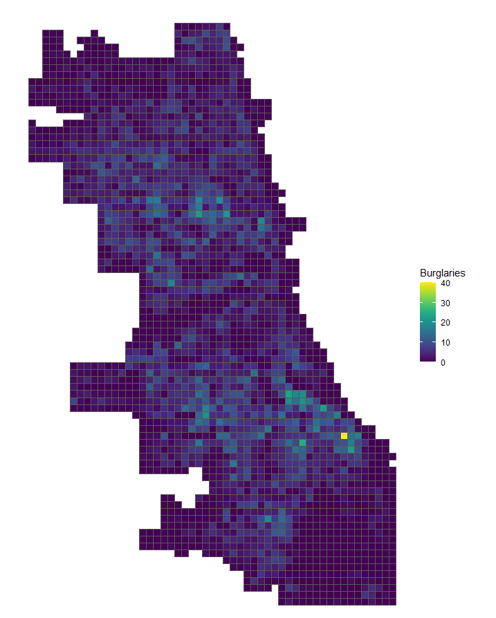
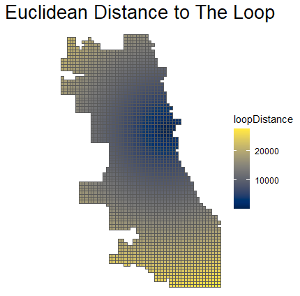

<br> 

The purpose of this notebook is to supplement the introduction to [SHapley Additive exPlanations (SHAP) values](https://en.wikipedia.org/wiki/Shapley_value) presented in class and in the recent Lab Assignment. The data used here is based on [Chapter 5 of the Steif text](https://urbanspatial.github.io/PublicPolicyAnalytics/geospatial-risk-modeling-predictive-policing.html) where a fishnet grid is overlaid on the city of Chicago and the goal is to predict the number of reported burglaries occurring within each of those grid cells. 

<br> 

<center> {width=650px} </center>

<br> 

After loading the necessary packages, we will read in a model fit using a **gbm** algorithm from the prior week's Required Practice example so that we do not have to retrain the same model and can instead move directly into generating and visualizing the SHAP values. 

<br> 

The _treeshap_ package is used here to [calculate the SHAP values themselves](https://github.com/ModelOriented/treeshap) and then the resulting object(s) are [visualized](https://cran.r-project.org/web/packages/shapviz/vignettes/basic_use.html) using the _shapviz_ package which is [available on the CRAN mirror sites](https://cran.r-project.org/web/packages/shapviz/index.html). You should review the documentation for these packages, but the main functions of interest are: 

   + [treeshap::gbm.unify](https://rdrr.io/github/ModelOriented/treeshap/man/gbm.unify.html): Convert your GBM model into a standarised representation.  
   + [treeshap::treeshap](https://rdrr.io/github/ModelOriented/treeshap/man/treeshap.html): Calculate SHAP values of a tree ensemble model.
   + [shapviz::sv_dependence](https://rdrr.io/cran/shapviz/man/sv_dependence.html): Scatterplot of the SHAP values of a feature against its feature values.       
   + [shapviz::sv_importance](https://rdrr.io/cran/shapviz/man/sv_importance.html): This function provides two types of SHAP importance plots&mdash;a bar plot and a beeswarm plot (sometimes called "SHAP summary plot"). 
      + The bar plot shows SHAP feature importances, calculated as the average absolute SHAP value per feature. 
      + The beeswarm plot displays SHAP values per feature, using min-max scaled feature values on the color axis.


```{r label="Load R Packages and Import Data", include= FALSE}

library(tidyverse)
library(sf)
library(treeshap)
library(shapviz)
# remotes::install_github("hadley/emo")
library(emo)


# Import the gbm model we trained and tested last week...
gbm_model <- base::readRDS("./data/gbm_model.rds")


# Import the datasets derived from Steif Chapter 5....
chicago_training_for_shap <- readr::read_csv("./data/chicago_training_for_shap.csv")

chicago_testing_for_shap <- readr::read_csv("./data/chicago_testing_for_shap.csv")


```

<br> 

# Generate SHAP Values

The code chunk below creates a "native" **gbm** object because the _treeshap_ package requires that our model be created with the _gbm_ package rather than the _caret_ package. Recall that caret support over 230 machine learning algorithms and acts as a "one-stop-shop" for applying these techniques but really "calls" a host of more specialized R packages in the background to achieve this... `r emo::ji("wink")` First, we recreate the same model, but using the _gbm_ package rather than the _caret_ package (and the original training data) to keep the _treeshap_ package happy `r emo::ji("smile")`

Then we have to [unify](https://rdrr.io/github/ModelOriented/treeshap/man/gbm.unify.html) the model&mdash;this is analogous to the way that raster layers must be converted to a data frame object in order display them with `ggplot2::geom_raster` Next, we use the `treeshap::treeshap` function to generate the SHAP values for the test set. 

<br>

```{r label="Get SHAP Values", warning = FALSE, message = FALSE}


# The treeshap package requires that our model be created with the gbm package that caret "calls" in the background...

gbm_model_for_shap <- gbm::gbm(countBurglaries ~ Abandoned_Buildings + Abandoned_Cars + Graffiti + Liquor_Retail + Sanitation + Street_Lights_Out + 
                                 Abandoned_Buildings_lag + Abandoned_Cars_lag + Graffiti_lag + Liquor_Retail_lag + Sanitation_lag + Street_Lights_Out_lag + 
                                 loopDistance + burglary.isSig,  
                               data = chicago_training_for_shap,
                               n.trees = gbm_model$bestTune$n.trees,
                               interaction.depth = gbm_model$bestTune$interaction.depth,
                               shrinkage = gbm_model$bestTune$shrinkage,
                               n.minobsinnode = gbm_model$bestTune$n.minobsinnode,
                               cv.folds = 10,
                               distribution = "gaussian")


# The treeshap package requires that our model be converted to a data.frame format...
unified_gbm_model <- gbm.unify(gbm_model_for_shap, chicago_testing_for_shap)


# Finally, generate them for the test set excluding the outcome to be predicted
# and the unique identifier for each fishnet cell...
treeshap_res <- treeshap(unified_gbm_model, chicago_testing_for_shap[, 2:16])

dplyr::slice_tail(treeshap_res$shaps, n = 12)


# Bring the fishnet cell identifier back in case we wanted to map 
# SHAP values later...
SHAP_tibble <- as_tibble(cbind(treeshap_res$shaps[, 1:14], treeshap_res$observations$uniqueID))

colnames(SHAP_tibble)[15] <- "uniqueID" 

str(SHAP_tibble)


```

<br> 

# Visualizing the SHAP Values

Conceptually, the SHAP values created above represent the contribution of **each individual feature** included in the model to the predicted number of burglaries within **each individual fishnet cell** which is pretty useful for peeking inside the "black box" of machine learning algorithms. 

<br> 

<center> {width=850px} </center>

<br> 

The code chunk below demonstrates how the _shapviz_ package can be used to visualize the SHAP values from a machine learning model to assist with interpretation `r emo::ji("bird")` The first plot displays the mean of all SHAP values in the Chicago test set for each feature in the model. This is another way to measure **feature importance** that is different from the `caret::varImp` function, which involves permuting the values of each feature and seeing how the mean squared error (MSE) changes&mdash;if the permutation does not change the model error very much, that feature is considered unimportant.

The second plot is called a waterfall plot and is **read from bottom to top** with the relative magnitude of each features contribution to the model prediction **for a single fishnet grid cell** indicated by the direction and size of the components. Here, we are visualizing the fourth fishnet grid cells. 

<br>

```{r fig.height=10, fig.width=16, label="Viz the Mean SHAPs", warning = FALSE, message = FALSE}


# Create a shapviz object from the SHAP values we generated with the treeshap package... note that the -1 drops the first column...
shp = shapviz::shapviz(treeshap_res, X_pred = data.matrix(chicago_testing_for_shap[, -1]), X = chicago_testing_for_shap)


# Plot the importance of features based on mean SHAP values...
sv_importance(shp, kind = 'bar', show_numbers = TRUE, max_display = 8, number_size = 6)


# Visualize the SHAP values for a single observation... the fourth one is shown below...
sv_waterfall(shp, row_id = 4)

```

<br> 

The _shapviz_ package also allows us to visualize individual SHAP values&mdash;for each fishnet grid cell and model feature combination. The `shapviz::sv_importance` function can produce bar charts and point-based "bee swarm" plots and the latter is demonstrated below. Here, each point on the chart is one SHAP value for an individual observation for the corresponding feature and the **contribution on average** to the prediction is indicated by the numbers shown on the left. If a majority of the points are clustered around zero, this would suggest a lower level of importance for a given feature. The color of the points give us an idea of what the original value of each observation was for each of the features in the model.     

<br> 

> <span style="color:dodgerblue"> What do you call a dinosaur that crashes its car? </span>
> 
> <span style="color:forestgreen"> Tyrannosaurus Wrecks. </span>
`r emo::ji("laughing")`

<br> 


```{r fig.height=10, fig.width=16, label="Viz Individual SHAPs", warning = FALSE, message = FALSE}


# Plot individual SHAP values...
sv_importance(shp, kind = 'beeswarm', show_numbers = TRUE, number_size = 6)

# Plot individual SHAP values with a different color palette  and use ?ggplot2::scale_color_viridis_c() 
# to explore these options in more detail...
sv_importance(shp, kind = 'beeswarm', show_numbers = TRUE, number_size = 6, 
              viridis_args = list(option = "viridis", alpha = 0.9, begin = 0.25, end = 0.9))


```

<br> 

The final type of plot that we will explore here is the SHAP values dependence plot. For example, how does distance to [The Loop](https://en.wikipedia.org/wiki/Chicago_Loop) influence the predicted number of burglaries? The color of the points in the dependence plot tells us something about how sanitation complaints are related to the distance to Chicago's downtown and the predicted number of burglaries from our model.

<br>

```{r fig.height=10, fig.width=16, label="Viz SHAP Dependence", warning = FALSE, message = FALSE}

# Standard dependence plot with sanitation calls as second feature...
sv_dependence(shp, v = "loopDistance", color_var = "Sanitation", alpha = 0.6, size = 2, pch = 17)


# Suppress the second feature and focus on the pattern...
sv_dependence(shp, v = "loopDistance", color_var = NULL, color = "green4", alpha = 0.6, size = 2, pch = 17)

```

<br> 

Recall the feature in the model that represents distance to downtown in meters...

<br> 

<center> {width=450px} </center>

<br> 

One of takeaways from above is that the closer a fishnet grid cell is to The Loop, the SHAP values tend to be higher and above zero. However, after 15,000 meters or about 9 miles they are all less than zero and exert a negative influence on the model's predicted number of burglaries `r emo::ji("police")`

----

<br>

<center> You have reached the end! </center>
<center> Celebrate! `r emo::ji("party")` </center>

<br> 

<center> <font size="2"> © Bev Wilson 2023 | Department of Urban + Environmental Planning | University of Virginia </font> </center>
<br>


